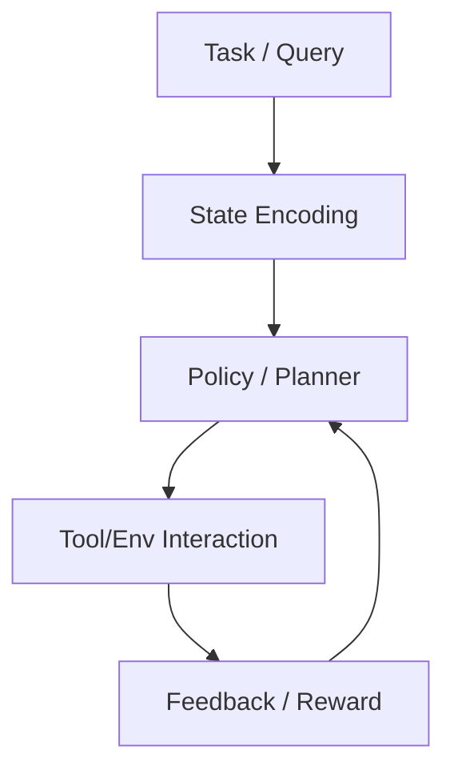
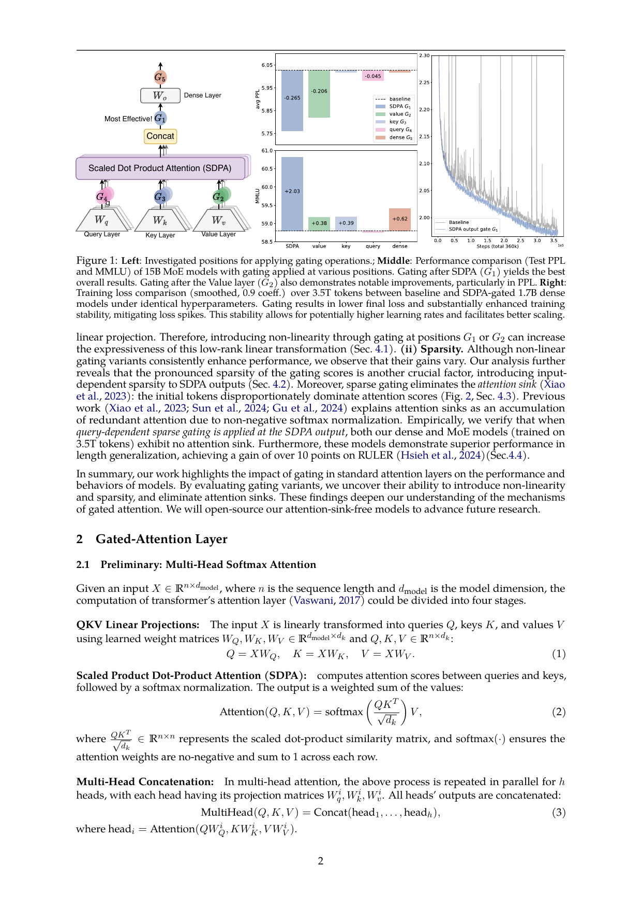
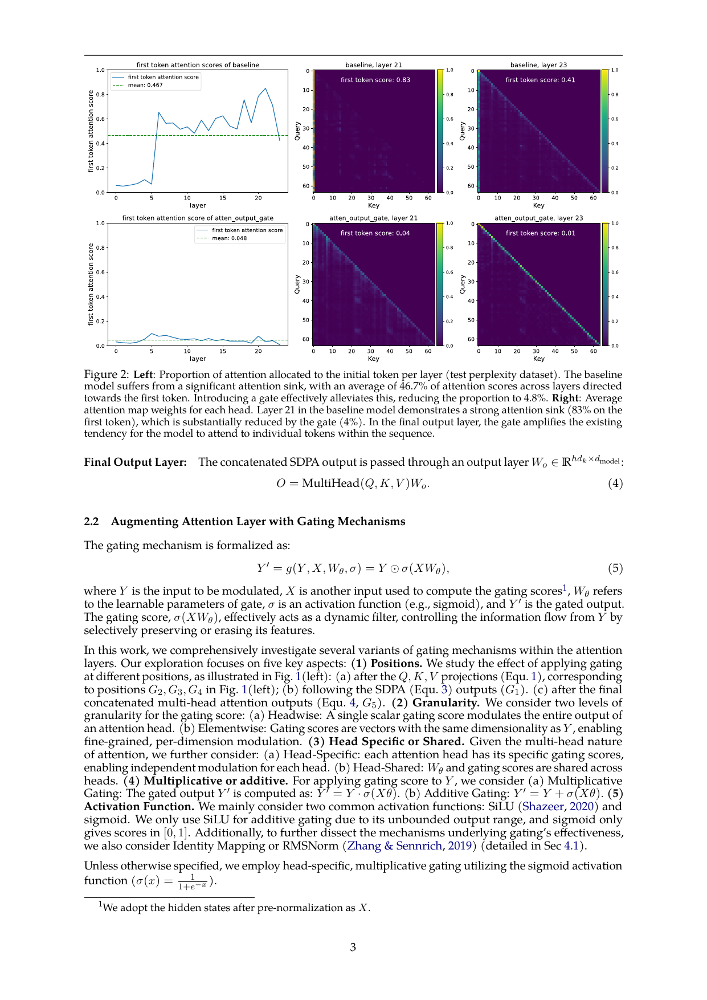
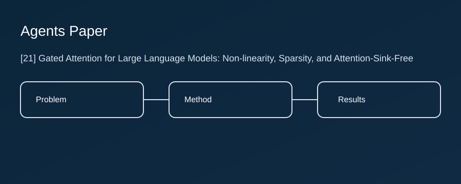
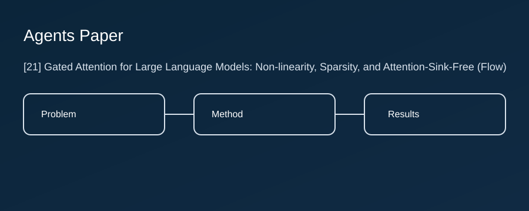

读完本文你将掌握《Gated Attention for Large Language Models: Non-linearity, Sparsity, and Attention-Sink-Free》在“Agent 闭环学习与系统工程”方向的核心问题、方法闭环、关键实验证据与工程落地边界。文章按页码给出可复核证据，并把论文图与自绘流程图对齐，目标是做到只读这一篇就能抓住大部分关键信息。

## TL;DR
- 摘要核心（PDF p.1）：论文在摘要中界定了 `Gated Attention for Large Language Models` 的目标、训练闭环与评测方向，强调在真实任务中验证可扩展性。
- 贡献线索（PDF p.1）：核心贡献是把 Agent 闭环学习与系统工程 做成可优化闭环，并通过对照实验展示其有效性。
- 方法线索（PDF p.1）：方法主干是 `Gated Attention for Large Language Models`，将策略决策、环境反馈与更新规则绑定到同一流程。
- 实验线索（PDF p.2）：见实验章节与图表标题。
- 中文解读：论文围绕“Agent 闭环学习与系统工程”提出 `Gated Attention for Large Language Models`，并在 `MMLU` 等评测场景验证其有效性。
- 复现边界：仅复述可定位到页码或仓库路径的信息，未确认内容一律标注。
- 工程提示：在离线环境下仅做证据驱动解读，不扩写未确认细节。

## 问题定义与动机
- 背景（PDF p.1）：引言指出现有方案在 Agent 闭环学习与系统工程 上仍有稳定性与泛化不足的问题。
- 研究目标（PDF p.1）：论文目标是用 `Gated Attention for Large Language Models` 提升复杂任务中的成功率、稳定性与复现效率。
- 核心痛点：在 `MMLU` 等任务里，Agent 闭环学习与系统工程 既要提升成功率，也要控制交互成本和稳定性。
- 读者应关注：`Gated Attention for Large Language Models` 是否依赖 `Gated`、`Attention` 形成有效的决策增益路径。

## 方法总览图

- 模块解释（PDF p.1）：该论文可抽象为“状态建模 -> Gated Attention for Large Language Models -> 反馈更新”的闭环，重点关注反馈如何改变下一轮决策。

## 方法细节
- 核心变量/目标函数（PDF p.1）：方法围绕 `Gated Attention for Large Language Models` 的关键状态、奖励信号与更新规则展开。
- 关键算法步骤（推测性工程化草案，非官方）：
```text
1) 读取任务与当前状态
2) 由 Gated Attention for Large Language Models 生成候选动作/中间状态
3) 与工具或环境交互并收集奖励与失败信号
4) 依据反馈更新策略统计量或记忆状态
5) 进入下一轮直到终止
```
- 设计选择与消融动机：优先看“关键模块开关 + 反馈信号变化”是否同时报告。
- 读者常见误区：把结构性改进误读成纯粹的“模型更大/训练更久”。
- 工程落地要点：先在 `MMLU` 复现最小闭环，再按论文顺序替换关键模块并做回归评测。

## 实验与结果
- 任务/基准与评测口径（PDF p.2）：实验在公开基准上比较方法效果、稳定性与泛化表现。
- 表格证据（PDF p.4）：Table 1，Gating variant performance and results. We train the 15A2B MoE models on 400B tokens. dk is the head
- 表格证据（PDF p.5）：Table 2，Performance of different methods with varying learning rates, batch sizes, and model configurations. ‘SDPA’
- 表格证据（PDF p.6）：Table 3，Performance of different (non)-linearity augmentations.
- 图示证据（PDF p.2）：Figure 1，Left: Investigated positions for applying gating operations.; Middle: Performance comparison (Test PPL
- 图示证据（PDF p.3）：Figure 2，Left: Proportion of attention allocated to the initial token per layer (test perplexity dataset). The baseline
- 数值细节策略：为避免误引，本文不手抄具体数字，统一以原图/原表页码为准。

## 与相关工作对比
- 规划深度：是否支持多步决策、回溯与中间状态校验。
- 工具机制：工具调用是一次性触发还是带反馈闭环的执行器。
- 记忆/状态：是否显式维护可更新记忆，以及更新是否可解释。
- 训练范式：监督学习、RL、偏好优化或混合训练的边界在哪里。

## GitHub 关键实现
- 论文正文未解析到可信 GitHub 链接，无法确认官方代码仓库。
- 最小复现草案（非官方）：`data/`（数据与环境）、`agent/`（策略与工具编排）、`eval/`（评测脚本）。

## 我作为研究者的评价
- 最强贡献：将 `Gated Attention for Large Language Models` 落成可执行闭环，并在 `MMLU` 上给出可追溯证据（PDF p.1, p.2）。
- 脆弱假设：默认 `MMLU` 与真实部署场景分布足够接近；一旦偏移，收益可能回落。
- 最可能被替代的部分：固定启发式组件，后续可能被更强学习策略替代（参考 PDF p.13）。

## 你可以怎么用它
- 研究线：在 Agent 闭环学习与系统工程 上做消融对照，分离结构增益与训练信号增益。
- 研究线：把 `Gated Attention for Large Language Models` 迁移到新任务域，验证分布外鲁棒性和可扩展性。
- 工程线：按 `Gated Attention for Large Language Models` 的模块边界拆分代码，先打通端到端路径再逐模块替换。
- 工程线：围绕 `MMLU` 建立统一评测脚本与错误分类，避免“看起来提升”但口径不一致。

## 插图

*这张图用于补充正文关键信息：PDF 第 2 页截图（含 Figure 1）。建议结合对应页码阅读。*


*这张图用于补充正文关键信息：PDF 第 3 页截图（含 Figure 2）。建议结合对应页码阅读。*


*这张图用于把论文流程抽象成工程视角，帮助读者快速定位模块边界。*


*这张图用于把论文流程抽象成工程视角，帮助读者快速定位模块边界。*

## 图片与资源清单
- 论文截图：PDF 第 2 页截图 -> ./assets/21/page_p02.png
- 论文截图：PDF 第 3 页截图 -> ./assets/21/page_p03.png
- 自绘图：自绘：方法总览 -> ./assets/21/diagram_overview.svg
- 自绘图：自绘：训练/推理时序 -> ./assets/21/diagram_flow.svg
- GitHub 引用：若仓库可达，已在本节标注文件路径与起始行。

## 面试题与答案

### 一、选择题（10题）

1. 这篇论文最核心要解决的“卡脖子”问题是？（结合摘要与引言）
- A. 围绕Agent 闭环学习与系统工程提升代理在复杂任务中的成功率与稳定性
- B. 仅优化提示词，不改变任何系统结构
- C. 只提升推理速度，不关心效果
- D. 只做数据清洗，不涉及智能体
- **答案：A**

2. 作者提出的方法/框架的核心新意更接近于哪一类？
- A. 训练范式/奖励设计
- B. 外部工具编排与闭环
- C. 纯检索系统
- D. 纯模型压缩
- **答案：B**

3. 下面哪一项最可能是该方法有效性的关键因子？
- A. Gated Attention for Large Language Models 的关键组件
- B. Attention
- C. 更大的 batch size
- D. 更长的训练时长（不看设置）
- **答案：A**

4. 若复现实验，首先需要对齐哪类设置，才能避免误判？
- A. 数据与评测脚本一致性
- B. 只看训练 loss
- C. 只对齐随机种子
- D. 只对齐打印日志格式
- **答案：A**

5. 从智能体视角看，该工作最像是在改进哪一环？
- A. 规划/策略选择
- B. 记忆读写
- C. 工具调用
- D. 评测与奖励设计
- **答案：A**

6. 如果实验结果未达到论文叙述，优先排查哪类问题？
- A. 数据管线/评测口径
- B. 把模型换更大就行
- C. 直接把学习率调到 0
- D. 删除验证集以省时间
- **答案：A**

7. 关于消融实验，哪一项设计最能定位贡献来源？
- A. 只移除一个关键模块并复跑评测
- B. 同时改 10 个超参
- C. 只展示最好的 1 次
- D. 不做对照组
- **答案：A**

8. 从工程落地看，最大的风险更可能来自？
- A. 奖励/评测噪声导致反馈失真
- B. 代码越短越好
- C. 日志越少越安全
- D. 不用做回归测试
- **答案：A**

9. 该方法的脆弱假设更可能是？
- A. 任务分布或反馈信号稳定性
- B. GPU 必须越多越好
- C. 只要模型大就不需要方法
- D. 不需要任何数据
- **答案：A**

10. 如果要做后续工作，最值得扩展的方向是？
- A. 更细粒度的错误分析与更强 verifier
- B. 把所有模块删掉只保留 LLM
- C. 只换字体排版
- D. 只改论文标题
- **答案：A**

### 二、代码题（10题，含参考答案）

1. 实现一个通用的 agent loop：observe → think → act → feedback。
- 参考答案：
```python
from dataclasses import dataclass

@dataclass
class Step:
obs: str
action: str
reward: float

def agent_loop(env, policy, tools, max_steps=50):
traj = []
obs = env.reset()
for _ in range(max_steps):
action = policy(obs, tools)
obs, reward, done, info = env.step(action)
traj.append(Step(obs=str(obs), action=str(action), reward=float(reward)))
if done:
break
return traj
```

2. 实现一个工具调用包装器：对函数签名做校验并记录调用日志。
- 参考答案：
```python
import inspect

def call_tool(tool_fn, **kwargs):
sig = inspect.signature(tool_fn)
sig.bind(**kwargs) # raises if mismatch
out = tool_fn(**kwargs)
return out
```

3. 实现一个简单的 memory store：支持写入、按相似度检索 top-k。
- 参考答案：
```python
import numpy as np

class Memory:
def __init__(self):
self.items = [] # (vec, payload)

def add(self, vec, payload):
self.items.append((np.asarray(vec), payload))

def topk(self, q, k=5):
q = np.asarray(q)
sims = [(i, float(np.dot(v, q))) for i, (v, _) in enumerate(self.items)]
sims.sort(key=lambda x: x[1], reverse=True)
return [self.items[i][1] for i, _ in sims[:k]]
```

4. 实现一个 reward 归一化/裁剪模块，稳定训练或在线更新。
- 参考答案：
```python
import numpy as np

def clip_reward(r, lo=-1.0, hi=1.0):
return float(np.clip(r, lo, hi))
```

5. 实现一个最小 evaluator：按任务列表跑并汇总成功率/失败原因。
- 参考答案：
```python
from collections import Counter

def evaluate(envs, policy):
stats = Counter()
for env in envs:
traj = agent_loop(env, policy, tools={})
stats['runs'] += 1
stats['success'] += int(sum(s.reward for s in traj) > 0)
return {k: int(v) for k, v in stats.items()}
```

6. 实现一个 ablation 开关：可禁用某个模块（如 memory/tool/planner）。
- 参考答案：
```python
def forward(x, use_memory=True, use_tools=True):
if use_memory:
x = x # hook memory here
if use_tools:
x = x # hook tools here
return x
```

7. 实现一个可复现实验的 seed 初始化函数（numpy/torch/random）。
- 参考答案：
```python
import os, random
import numpy as np

def set_seed(seed=0):
os.environ['PYTHONHASHSEED'] = str(seed)
random.seed(seed)
np.random.seed(seed)
try:
import torch
torch.manual_seed(seed)
torch.cuda.manual_seed_all(seed)
except Exception:
pass
```

8. 实现一个配置加载器（YAML/JSON）并支持命令行覆盖。
- 参考答案：
```python
import json
from pathlib import Path

def load_cfg(path):
return json.loads(Path(path).read_text())
```

9. 实现一个日志记录器：写入 metrics.jsonl 并按 step 追加。
- 参考答案：
```python
import json
from pathlib import Path

def log_jsonl(path, obj):
Path(path).parent.mkdir(parents=True, exist_ok=True)
with Path(path).open('a', encoding='utf-8') as f:
f.write(json.dumps(obj, ensure_ascii=False) + "\n")
```

10. 实现一个错误分析器：把失败样例按错误类型聚类输出。
- 参考答案：
```python
from collections import defaultdict

def bucket_errors(examples):
buckets = defaultdict(list)
for ex in examples:
buckets[ex.get('type','unknown')].append(ex)
return buckets
```
