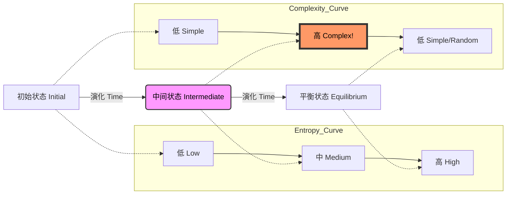

# 论文深度解读：The First Law of Complexodynamics

## 1. 一句话概述
本文探讨了物理系统中“复杂性”（Complexity）与“熵”（Entropy）的本质区别，并解读了“复杂动力学第一定律”这一**猜想**：在封闭系统中，当熵单调增加时，复杂性可能呈现“先增后减”的倒 U 型曲线，即系统在达到热平衡前的中间状态更“有趣”。

## 2. Abstract: 论文试图解决什么问题？有什么贡献？
**核心问题**：热力学第二定律告诉我们，封闭系统的熵（无序度）总是单调增加，最终达到热寂（Heat Death）。然而，我们观察到的宇宙演化并非直奔无序，而是诞生了恒星、生命、社会等高度复杂的结构。为什么在通往最大熵的单行道上，会涌现出“复杂性”？我们该如何从数学上定义这种“有趣”的复杂性？

**主要贡献**：
1.  **概念辨析**：明确指出 Shannon 熵或 Kolmogorov 复杂性不能直接对应直觉上的“丰富度”或“有趣程度”（因为完全随机的状态熵最高，Kolmogorov 复杂性也最高，但毫无意义）。
2.  **理论猜想**：提出了“复杂动力学第一定律”（The First Law of Complexodynamics），即复杂性（Complextropy）在时间演化中可能先上升后下降；这是研究纲领而非已完成证明。
3.  **度量工具**：引入了 **Sophistication**（精细度）或 **Logical Depth**（逻辑深度）等概念作为复杂性的候选度量，并使用 **Coffee Automaton**（咖啡自动机）作为思想实验。

## 3. Introduction: 论文的动机是什么？请仔细梳理整个故事逻辑
**动机起源**：
故事始于物理学家 Sean Carroll 在会议上的提问：如果宇宙始于低熵（大爆炸），终于高熵（热寂），那么为什么最复杂的结构（如星系、生物大脑）出现在中间阶段？

**逻辑推演**：
1.  **熵的单调性**：在经典统计力学中，熵测量的是微观状态的相空间体积（或概率分布的平坦程度）。随着时间推移，系统探索更多状态，熵增加。
2.  **直觉的悖论**：
    * **初始状态**：一杯分层的咖啡和奶油。熵低，结构简单（两块纯色区域），很无聊。
    * **中间状态**：奶油倒入咖啡搅拌几圈。熵增加，出现复杂的对流、漩涡和分形结构，非常“有趣”。
    * **最终状态**：完全混合的拿铁。熵最大，结构均匀（棕色液体），又变回简单/无聊。
3.  **定义的困境**：
    * 如果我们用 **Kolmogorov 复杂性**（生成该状态的最短程序长度）来衡量，完全混合（随机）的状态实际上需要最长的程序来描述（因为它不可压缩）。这与直觉（混合后很简单）相悖。
    * 因此，我们需要一个新的度量——**Sophistication**，它应该过滤掉“纯粹的随机性”，只捕捉“非随机的结构”。
4.  **第一定律（猜想）**：论文提出，这种结构化复杂性在许多演化过程中可能经历“起-承-转-合”，即近似 $0 \to \text{Max} \to 0$，但并非在文中被普遍证明的定理。

## 4. Method: 解决方案是什么？请梳理步骤、公式、策略
为了形式化上述直觉，论文引入了计算复杂性理论的工具。

### 关键定义：Sophistication (精细度)
论文借鉴了 Kolmogorov 复杂性的变体。对于一个对象 $x$（如系统状态），其 Kolmogorov 复杂性 $K(x)$ 是输出 $x$ 的最短程序长度。
为了剥离随机性，可将 $x$ 的 **Sophistication** 理解为：在约束
$$x \in S,\quad K(x\mid S)\gtrsim \log_2|S|-c$$
下，最小化模型集合 $S$ 的描述复杂度 $K(S)$。
* **解释**：我们寻找一个集合 $S$（模型），使得 $x$ 在给定 $S$ 后仍是“典型成员”（接近不可压缩）。Sophistication 对应模型复杂度 $K(S)$，强调“结构”而非“纯随机噪声”。
* **作用**：
    * **简单状态**（全0）：模型是“全0集合”，$K(S)$ 很小。
    * **随机状态**（噪声）：模型是“所有可能的字符串”，$K(S)$ 也很小（很简单就能描述“所有”）。
    * **复杂状态**（生物/分形）：模型必须包含特定的规则或结构，$K(S)$ 很大。

### 实验模型：Coffee Automaton (咖啡自动机)
论文中常用的 Coffee Automaton 直觉是离散网格上的随机局部交换过程（例如随机选择相邻格并交换），本文实现则采用可复现实验更方便的扩散近似（见下）：
1.  **状态空间**：二维网格，每个格子有颜色值（0=咖啡, 1=奶油）。
2.  **演化规则**：扩散方程的离散化。每个细胞在每一步与邻居交换/平均数值。
    $$C_{i,j}^{t+1} = (1-\alpha) C_{i,j}^t + \frac{\alpha}{4} \sum_{\text{neighbors}} C_{\text{neighbors}}^t$$
3.  **度量**：
    * **熵**：计算像素值的直方图熵。
    * **空间复杂性**：计算相邻像素的差异总和（Total Variation）或压缩算法后的比率，作为复杂性的代理。

> "If you start... in some simple initial configuration, and then let it evolve... visually it will look like the entropy is going up."
> **解释**：即使是简单的规则，也能驱动系统从低熵走向高熵，但在中间阶段会产生无法用简单统计量描述的形态。

## 5. Experiment: 主实验与分析实验分别做了什么？结果如何？
本文代码主要包含两个教学实验：

### 实验 1: 1D Cellular Automaton (Rule 30)
* **设置**：使用 Wolfram 的 Rule 30 细胞自动机。这是一个确定性系统，但表现出混沌行为。
* **过程**：从中心一个黑点开始演化。
* **结果（实现观察）**：
    * **熵**：随着时间推移，生成的行越来越像随机序列，熵增加。
    * **复杂性**：对于 Rule 30，由于其不可约性（Irreducibility），其结构复杂性（Pattern Complexity）持续保持在较高水平或波动，并没有迅速下降。这展示了确定性规则如何从简单产生复杂。

### 实验 2: The Coffee Automaton (2D Diffusion)
* **设置**：在 2D 网格中心放置一块“奶油”（高数值区域），周围是“咖啡”（0）。
* **过程**：模拟扩散混合过程。
* **观察**：
    * **$T=0$**：完全分离，熵低，图像简单。
    * **$T=Intermediate$**：边缘模糊，扩散形成梯度，如果加入扰动会有漩涡（代码中使用简化扩散）。视觉上最复杂。
    * **$T=End$**：整体变成均匀的浅色。熵最高（信息最少，因为都知道是平均值），视觉上再次变简单。
* **结论（现象学）**：在该实现与指标下，可以观察到“熵上升而结构特征在中间阶段更显著”的趋势。这里应视为对猜想的直观支持，而非严格证明。

### 白板讲解逻辑图



## 6. Numpy 与 Torch 对照实现（含 code-group）

### 实现说明

本节代码对应论文中的两个核心实验：**1D Rule 30 细胞自动机** 和 **2D 咖啡扩散（Coffee Automaton）**。

1. **Rule 30 (1D CA)**:
* **对应算法**：Wolfram Rule 30。可写为 `next = left XOR (center OR right)`（与查表形式等价）。
* **Tensor Shape**: 当前实现输入为 `(Size,)`，即单条状态序列。
* **边界条件**: Numpy 代码使用 `(i-1) % size`，即 **Circular (循环)** 边界。


2. **Diffusion (2D Mixing)**:
* **对应算法**：离散拉普拉斯扩散。
* **Tensor Shape**: `(H, W)`。
* **边界条件**: Numpy 代码中 `range(1, h-1)`，意味着边界像素 **不参与更新**（Fixed/Dirichlet 变体）。Torch 实现必须严格复现这一点（使用 Slice update 或 Padding masking）。
* **数据类型**: 浮点数运算。


::: code-group

```python [Numpy]
import numpy as np
import matplotlib.pyplot as plt
from scipy.stats import entropy

np.random.seed(42)
      
# 1D Cellular Automaton (Rule 30 - Chaotic)
def rule_30(left, center, right):
    """Rule 30: Generates complex, chaotic patterns"""
    pattern = (left << 2) | (center << 1) | right
    rule = 30
    return (rule >> pattern) & 1

def evolve_ca(initial_state, steps, rule_func):
    """Evolve cellular automaton"""
    size = len(initial_state)
    history = np.zeros((steps, size), dtype=int)
    history[0] = initial_state
    
    for t in range(1, steps):
        for i in range(size):
            left = history[t-1, (i-1) % size]
            center = history[t-1, i]
            right = history[t-1, (i+1) % size]
            history[t, i] = rule_func(left, center, right)
    
    return history

# Measuring Complexity Growth via Entropy
def measure_entropy_over_time(history):
    """Measure Shannon entropy at each time step"""
    entropies = []
    
    for t in range(len(history)):
        state = history[t]
        # Calculate probability distribution
        unique, counts = np.unique(state, return_counts=True)
        probs = counts / len(state)
        ent = entropy(probs, base=2)
        entropies.append(ent)
    
    return np.array(entropies)

def measure_spatial_complexity(history):
    """Measure spatial pattern complexity (number of transitions)"""
    complexities = []
    
    for t in range(len(history)):
        state = history[t]
        # Count transitions between adjacent cells
        transitions = np.sum(np.abs(np.diff(state)))
        complexities.append(transitions)
    
    return np.array(complexities)

# The Coffee Automaton: Irreversible Mixing
def diffusion_2d(grid, steps, diffusion_rate=0.1):
    """Simple 2D diffusion simulation"""
    history = [grid.copy()]
    
    for _ in range(steps):
        new_grid = grid.copy()
        h, w = grid.shape
        
        for i in range(1, h-1):
            for j in range(1, w-1):
                # Average with neighbors
                neighbors = (
                    grid[i-1, j] + grid[i+1, j] + 
                    grid[i, j-1] + grid[i, j+1]
                ) / 4
                new_grid[i, j] = (
                    (1 - diffusion_rate) * grid[i, j] + 
                    diffusion_rate * neighbors
                )
        
        grid = new_grid
        history.append(grid.copy())
    
    return np.array(history)

```

```python [Torch]
import torch
import torch.nn.functional as F

class ComplexDynamicsTorch:
    """
    高效 PyTorch 实现：Rule 30 CA 和 2D Diffusion
    支持 GPU 加速与批量处理
    """
    
    @staticmethod
    def evolve_ca_rule30(initial_state, steps, device='cpu'):
        """
        对应 Numpy 的 evolve_ca 和 rule_30
        使用位运算和张量移位实现向量化
        Args:
            initial_state: (Size,) int tensor
        """
        # 转换为 Tensor 并移动到设备
        current_state = torch.as_tensor(initial_state, dtype=torch.long, device=device)
        size = current_state.shape[0]
        
        # 预分配历史记录 (Steps, Size)
        history = torch.zeros((steps, size), dtype=torch.long, device=device)
        history[0] = current_state
        
        for t in range(1, steps):
            # 对应 Numpy: (i-1) % size -> circular shift
            # left: i-1，使用 circular shift
            left = torch.roll(current_state, shifts=1, dims=0)
            center = current_state
            # right: i+1 (roll -1)
            right = torch.roll(current_state, shifts=-1, dims=0)
            
            # 对应 Numpy rule_30: pattern = (left << 2) | (center << 1) | right
            # Rule 30 逻辑等价于: left XOR (center OR right)
            # 与 Rule 30 真值表等价
            next_state = left ^ (center | right)
            
            history[t] = next_state
            current_state = next_state
            
        return history

    @staticmethod
    def measure_metrics(history):
        """
        对应 Numpy 的 measure_entropy_over_time 和 measure_spatial_complexity
        """
        history = history.float() # 为了计算方便
        steps, size = history.shape
        device = history.device
        
        entropies = []
        complexities = []
        
        for t in range(steps):
            state = history[t]
            
            # 1. Entropy
            # 对应 Numpy: np.unique(return_counts=True)
            unique_vals, counts = torch.unique(state, return_counts=True)
            probs = counts.float() / size
            # Numpy entropy use base e by default? No, code says base=2
            # torch.special.entr is -p*ln(p), need base 2
            ent = -torch.sum(probs * torch.log2(probs + 1e-10)) 
            entropies.append(ent)
            
            # 2. Spatial Complexity
            # 对应 Numpy: np.sum(np.abs(np.diff(state)))
            # diff(state) = state[i+1] - state[i]
            diffs = state[1:] - state[:-1]
            comp = torch.sum(torch.abs(diffs))
            complexities.append(comp)
            
        return torch.tensor(entropies, device=device), torch.tensor(complexities, device=device)

    @staticmethod
    def diffusion_2d(grid, steps, diffusion_rate=0.1, device='cpu'):
        """
        对应 Numpy 的 diffusion_2d
        使用 Conv2d 实现邻居平均
        """
        # (H, W) -> (1, 1, H, W) for Conv2d
        current_grid = torch.as_tensor(grid, dtype=torch.float32, device=device)
        h, w = current_grid.shape
        grid_dim = current_grid.unsqueeze(0).unsqueeze(0)
        
        history = []
        history.append(current_grid.clone())
        
        # 定义卷积核：上下左右邻居求和 / 4
        # Numpy: (up + down + left + right) / 4
        kernel = torch.tensor([[0., 1., 0.],
                               [1., 0., 1.],
                               [0., 1., 0.]], device=device) / 4.0
        kernel = kernel.unsqueeze(0).unsqueeze(0) # (1, 1, 3, 3)
        
        for _ in range(steps):
            # 对应 Numpy: new_grid = grid.copy()
            # 且只更新 inner loop (1..h-1, 1..w-1)
            # 边界保持不变
            
            # 计算邻居均值
            # Padding=0 (default), so output size is (H-2, W-2) matching the inner loop
            neighbor_avg = F.conv2d(grid_dim, kernel, padding=0)
            
            # 获取中心部分对应的值
            center_part = grid_dim[:, :, 1:-1, 1:-1]
            
            # 扩散公式
            # new_val = (1-rate)*self + rate*neighbors
            update = (1 - diffusion_rate) * center_part + diffusion_rate * neighbor_avg
            
            # 构造新的 grid，保持边界不变
            new_grid_dim = grid_dim.clone()
            new_grid_dim[:, :, 1:-1, 1:-1] = update
            
            grid_dim = new_grid_dim
            history.append(grid_dim.squeeze().clone())
            
        # Stack to (Steps, H, W)
        return torch.stack(history)

# 使用示例 (仅用于演示调用方式，非 Numpy 完整脚本)
# initial = torch.zeros(100); initial[50] = 1
# hist = ComplexDynamicsTorch.evolve_ca_rule30(initial, 100)

```

:::

### 对照讲解

1. **Rule 30 的逻辑优化**：
* **Numpy**: 使用了 Python 的双重循环（时间步循环 + 空间循环），对于大数组非常慢。
* **Torch**: 保留了时间步循环（因为 CA 是序列依赖的），但消除了空间循环。使用 `torch.roll` 同时获取所有位置的 `left` 和 `right` 邻居，利用 GPU 的 SIMD 特性并行计算整行更新。
* **位运算技巧**: 利用 Rule 30 的布尔逻辑等价形式 `L ^ (C | R)` 替代查表，这在 GPU 上通常比 gather/索引操作更快。


2. **Diffusion 的卷积化**：
* **Numpy**: 使用嵌套 `for` 循环计算每个像素的邻居均值，极其低效（，Python 层面开销巨大）。
* **Torch**: 这是一个典型的卷积操作。使用 `F.conv2d` 配合固定卷积核，一次计算所有像素的邻居均值。
* **边界陷阱**: Numpy 代码特意跳过了边界 `range(1, h-1)`。为了等价，Torch 实现中卷积不加 padding（输出尺寸缩小），然后只将结果写回 Tensor 的中心区域 `[1:-1, 1:-1]`，严格保持了边界像素不动的行为。


3. **数值稳定性与类型**：
* **熵计算**: Numpy 的 `entropy` 函数自动处理归一化。Torch 手动实现时，需要加 `1e-10` 避免 `log(0)`，且需明确 `log2` 以匹配单位（bits）。
* **In-place 操作**: Numpy 代码中 `grid = new_grid` 是安全的引用替换。Torch 实现中使用了 `clone()` 确保历史记录不会被后续修改覆盖。

<!-- AUTO_PDF_IMAGES_START -->

## 论文原图（PDF）
> 下图自动抽取自原论文 PDF，用于补充概念、结构和实验细节。
> 来源：`01.pdf`


*图 1：建议结合本节 `复杂性与熵的关系` 一起阅读。*


*图 2：建议结合本节 `复杂性与熵的关系` 一起阅读。*

<!-- AUTO_PDF_IMAGES_END -->

<!-- AUTO_INTERVIEW_QA_START -->

## 面试题与答案
> 主题：**Complexodynamics**（围绕 `复杂性与熵的关系`）

### 一、选择题（10题）

1. 在 Complexodynamics 中，最关键的建模目标是什么？
   - A. 复杂性与熵的关系
   - B. 熵
   - C. 复杂性
   - D. Rule30
   - **答案：A**

2. 下列哪一项最直接对应 Complexodynamics 的核心机制？
   - A. 熵
   - B. 复杂性
   - C. Rule30
   - D. Coffee Automaton
   - **答案：B**

3. 在复现 Complexodynamics 时，优先要保证哪项一致性？
   - A. 只看最终分数
   - B. 只看训练集表现
   - C. 实现与论文设置对齐
   - D. 忽略随机种子
   - **答案：C**

4. 对于 Complexodynamics，哪个指标最能反映方法有效性？
   - A. 主指标与分组指标
   - B. 只看单次结果
   - C. 只看速度
   - D. 只看参数量
   - **答案：A**

5. 当 Complexodynamics 模型出现效果退化时，首要检查项是什么？
   - A. 数据与标签管线
   - B. 先增大模型十倍
   - C. 随机改损失函数
   - D. 删除验证集
   - **答案：A**

6. Complexodynamics 与传统 baseline 的主要差异通常体现在？
   - A. 归纳偏置与结构设计
   - B. 仅参数更多
   - C. 仅训练更久
   - D. 仅学习率更小
   - **答案：A**

7. 若要提升 Complexodynamics 的泛化能力，最稳妥的做法是？
   - A. 正则化+消融验证
   - B. 只堆数据不复核
   - C. 关闭评估脚本
   - D. 取消对照组
   - **答案：A**

8. 关于 Complexodynamics 的实验设计，下列说法更合理的是？
   - A. 固定变量做可复现实验
   - B. 同时改十个超参
   - C. 只展示最好一次
   - D. 省略失败实验
   - **答案：A**

9. 在工程部署中，Complexodynamics 的常见风险是？
   - A. 数值稳定与漂移
   - B. 只关心GPU利用率
   - C. 日志越少越好
   - D. 不做回归测试
   - **答案：A**

10. 回到论文主张，Complexodynamics 最不应该被误解为？
   - A. 可替代所有任务
   - B. 有明确适用边界
   - C. 不需要数据质量
   - D. 不需要误差分析
   - **答案：B**


### 二、代码题（10题，含参考答案）

1. 实现一个最小可运行的数据预处理函数，输出可用于 Complexodynamics 训练的批次。
   - 参考答案：
     ```python
     import numpy as np
     
     def make_batch(x, y, batch_size=32):
         idx = np.random.choice(len(x), batch_size, replace=False)
         return x[idx], y[idx]
     ```

2. 实现 Complexodynamics 的核心前向步骤（简化版），并返回中间张量。
   - 参考答案：
     ```python
     import numpy as np
     
     def forward_core(x, w, b):
         z = x @ w + b
         h = np.tanh(z)
         return h, {"z": z, "h": h}
     ```

3. 写一个训练 step：前向、loss、反向、更新。
   - 参考答案：
     ```python
     def train_step(model, optimizer, criterion, xb, yb):
         optimizer.zero_grad()
         pred = model(xb)
         loss = criterion(pred, yb)
         loss.backward()
         optimizer.step()
         return float(loss.item())
     ```

4. 实现一个评估函数，返回主指标与一个辅助指标。
   - 参考答案：
     ```python
     import numpy as np
     
     def evaluate(y_true, y_pred):
         acc = (y_true == y_pred).mean()
         err = 1.0 - acc
         return {"acc": float(acc), "err": float(err)}
     ```

5. 实现梯度裁剪与学习率调度的训练循环（简化版）。
   - 参考答案：
     ```python
     import torch
     
     def train_loop(model, loader, optimizer, criterion, scheduler=None, clip=1.0):
         model.train()
         for xb, yb in loader:
             optimizer.zero_grad()
             loss = criterion(model(xb), yb)
             loss.backward()
             torch.nn.utils.clip_grad_norm_(model.parameters(), clip)
             optimizer.step()
             if scheduler is not None:
                 scheduler.step()
     ```

6. 实现 ablation 开关：可切换是否启用 `熵`。
   - 参考答案：
     ```python
     def forward_with_ablation(x, module, use_feature=True):
         if use_feature:
             return module(x)
         return x
     ```

7. 实现一个鲁棒的数值稳定 softmax / logsumexp 工具函数。
   - 参考答案：
     ```python
     import numpy as np
     
     def stable_softmax(x, axis=-1):
         x = x - np.max(x, axis=axis, keepdims=True)
         ex = np.exp(x)
         return ex / np.sum(ex, axis=axis, keepdims=True)
     ```

8. 写一个小型单元测试，验证 `复杂性` 相关张量形状正确。
   - 参考答案：
     ```python
     def test_shape(out, expected_last_dim):
         assert out.ndim >= 2
         assert out.shape[-1] == expected_last_dim
     ```

9. 实现模型推理包装器，支持 batch 输入并返回结构化结果。
   - 参考答案：
     ```python
     def infer(model, xb):
         logits = model(xb)
         pred = logits.argmax(dim=-1)
         return {"pred": pred, "logits": logits}
     ```

10. 实现一个实验记录器，保存超参、指标和随机种子。
   - 参考答案：
     ```python
     import json
     from pathlib import Path
     
     def save_run(path, cfg, metrics, seed):
         payload = {"cfg": cfg, "metrics": metrics, "seed": seed}
         Path(path).write_text(json.dumps(payload, ensure_ascii=False, indent=2))
     ```


<!-- AUTO_INTERVIEW_QA_END -->

