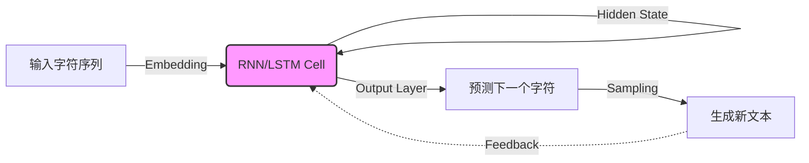

# The Unreasonable Effectiveness of RNNs

## 1. 一句话概述
循环神经网络（RNN）虽然结构简单，但通过字符级的序列预测任务，能够惊人地“自涌现”出复杂的语法结构、代码缩进规则甚至高层语义逻辑。

## 2. Abstract: 论文试图解决什么问题？有什么贡献？
**问题背景**：
传统的神经网络（如全连接网络或 CNN）受限于固定的 API：输入和输出必须是固定大小的向量（Fixed-sized vector）。这种限制使得它们难以处理自然语言、代码或视频等长度可变的序列数据（Sequences）。

**核心贡献**：
1.  **实证展示**：通过在莎士比亚全集、Linux 内核代码、代数几何 LaTeX 文档等数据集上训练字符级 RNN（Char-RNN），证明了简单的模型可以生成极具欺骗性的高质量文本。
2.  **可解释性分析**：揭示了 RNN 内部神经元的可解释性。实验发现某些特定的神经元会自动演变成“功能探测器”（例如：专门检测是否在引号内部、检测代码缩进层级），而这些功能并非人工设计，完全是模型在训练中自学习得来的。
3.  **通用范式**：确立了 RNN 作为“序列通用近似器”的地位——不仅是分类器，更可以看作是一个可优化的图灵完备程序。

## 3. Introduction: 论文的动机是什么？
**故事逻辑**：
1.  **API 的局限性**：作者首先指出 Vanilla Neural Networks 的局限性。这就好比一个函数只能接受 3 个参数并返回 2 个结果，无法处理像“翻译一句话”或“描述一张图”这样输入输出长度不定的任务。
2.  **序列的魔力**：RNN 的引入打破了这一限制。它允许我们在输入、输出或两者同时操作序列。作者形象地将 RNN 描述为带有“内部状态（State）”的程序，每次处理一个输入并更新状态。
3.  **从理论到惊奇**：虽然理论上 RNN 是图灵完备的，但在当时（2015年），人们普遍认为 RNN 极难训练（梯度消失/爆炸）。作者通过一系列简单的实验，发现即使是未经调优的 LSTM/RNN 模型，也能捕捉到令人震惊的复杂模式（如正确闭合 XML 标签、模仿 C++ 的头文件引用），这种“不合理的有效性”正是文章标题的由来。




## 4. Method: 解决方案是什么？

文章的核心方法是 **字符级语言模型（Character-Level Language Model）**。

### 4.1 模型架构 (Vanilla RNN)

RNN 的核心 API 是一个简单的阶跃函数：
$$h_t = \tanh(W_{xh}x_t + W_{hh}h_{t-1} + b_h)$$

其中：

* `x_t`：当前时间步的输入向量（本文中为字符的 One-hot 编码）。
* `h_{t-1}`：上一时间步的隐藏状态（记忆）。
* `h_t`：当前新的隐藏状态。
* `W_{xh}, W_{hh}, b_h`：可学习参数。
* `tanh`：非线性激活函数，将值压缩到 `(-1, 1)` 区间。

输出层通常是一个全连接层，用于将隐藏状态映射回词汇表大小的 Logits：
$$o_t = W_{hy}h_t + b_y,\quad p_t = \mathrm{softmax}(o_t)$$

### 4.2 训练过程

* **输入**：一段文本序列，例如 "hello"。
* **目标**：预测下一个字符。输入 "h" -> 目标 "e"；输入 "e" -> 目标 "l" ...
* **Loss**：使用 Softmax Cross-Entropy Loss（交叉熵损失）衡量预测概率分布与真实字符的一致性。
* **优化**：使用 BPTT（Backpropagation Through Time）计算梯度，并使用 RMSProp 或 Adam 等自适应优化器进行参数更新。

### 4.3 生成策略

在生成阶段，模型不再接收固定的训练文本，而是将**上一步生成的字符**作为**下一步的输入**，从而“幻想”出无限长度的文本。可以通过调节 **Temperature** 参数来控制生成的随机性：温度越高，生成越多样但也越容易出错；温度越低，生成越保守稳定。

## 5. Experiment: 实验与发现

作者在多个截然不同的数据集上进行了实验，结果令人印象深刻。

### 5.1 主要实验

1. **莎士比亚文集（Shakespeare）**：
* 模型学会了剧本格式，如 `PANDARUS:` 这种角色名后跟冒号的格式。
* 学会了古英语的单词拼写和句式风格，虽然偶尔会生成不存在的词，但看起来非常像莎士比亚。


2. **维基百科（Wikipedia, Hutter Prize 100MB）**：
* 模型不仅学会了英语，还学会了 Markdown 和 XML 语法。
* **惊人细节**：能够正确生成 `<page>...</page>` 嵌套标签，甚至生成合法的 timestamp 格式。它学会了只要打开一个括号，后面必须找机会闭合它。


3. **代数几何教材（LaTeX）**：
* 生成了看起来非常专业的数学公式和证明。模型学会了 `\begin{proof}` 必须对应 `\end{proof}`。
* 虽然数学推导本身是胡说八道，但符号的使用几乎完全符合 LaTeX 语法规则。


4. **Linux 内核源代码（C++）**：
* 模型学会了代码缩进（Indent）、变量声明、`if` 语句结构。
* **极致细节**：它甚至学会了在函数开始声明变量，在后面的代码中“假装”使用这个变量。它还会生成版权声明头部注释。


### 5.2 深入分析：神经元可视化

作者没有止步于生成结果，而是进一步探究了**“模型到底学到了什么？”**。通过可视化隐藏层中某个特定神经元的激活值（ 输出），作者发现了具有明确语义的神经元：

* **引用检测神经元（Quote Detection Cell）**：这个神经元在遇到左引号 `"` 时会被激活（变蓝），一直保持激活状态，直到遇到右引号 `"` 时关闭。这证明 RNN 确实利用内部状态不仅记住了“前一个词”，还记住了“当前所处的上下文环境（如：我在引号里）”。
* **行长计数器**：有的神经元会随着一行字符的增加而逐渐增强激活，仿佛在预测何时该换行。

> "The takeaway is that even if your data is not in form of sequences, you can still formulate and train powerful models that learn to process it sequentially." 
> 
> 

## 6. Numpy 与 Torch 对照实现

### 6.1 代码逻辑说明

提供的 NumPy 代码实现了一个 **Vanilla RNN（基础循环神经网络）** 用于字符级文本生成。

* **Pipeline 对应**：代码涵盖了从数据预处理（构建词表）、模型前向传播（Forward）、BPTT 反向传播（Backward）、Adagrad 优化器更新到文本生成（Sample）的完整流程。
* **张量形状 (Numpy)**：
* 输入 `xs[t]`: `(vocab_size, 1)` —— 典型的列向量 One-hot 表示。
* 权重 `Wxh`: `(hidden_size, vocab_size)`。
* 隐藏状态 `hs[t]`: `(hidden_size, 1)`。
* 注意：这里使用的是**非 Batched** 的实现，即一次只处理一个序列，Batch Size = 1。


* **假设与差异**：PyTorch 通常使用 `(Batch, Seq, Feature)` 或 `(Seq, Batch, Feature)` 的格式。为了保持对照的直观性，Torch 实现中我将使用 `nn.RNN` 模块（它是最高效的等价实现），它内部处理了循环，但逻辑与 Numpy 的手动循环数学上完全一致。

### 6.2 代码对照

::: code-group

```python [Numpy]
# Paper 2: The Unreasonable Effectiveness of Recurrent Neural Networks
# Andrej Karpathy
# Character-Level Language Model with Vanilla RNN
# Implementation of a character-level RNN that learns to generate text.
import numpy as np
import matplotlib.pyplot as plt
from collections import Counter

np.random.seed(42)
     
# Generate Synthetic Training Data
# Simple synthetic text with patterns
data = """
hello world
hello deep learning
deep neural networks
neural networks learn patterns
patterns in data
data drives learning
learning from examples
examples help networks
networks process information
information is everywhere
everywhere you look data
""" * 10  # Repeat for more training data

# Build vocabulary
chars = sorted(list(set(data)))
vocab_size = len(chars)
char_to_ix = {ch: i for i, ch in enumerate(chars)}
ix_to_char = {i: ch for i, ch in enumerate(chars)}

print(f"Data length: {len(data)} characters")
print(f"Vocabulary size: {vocab_size}")
print(f"Vocabulary: {repr(''.join(chars))}")
     
# Vanilla RNN Implementation
class VanillaRNN:
    def __init__(self, vocab_size, hidden_size):
        self.vocab_size = vocab_size
        self.hidden_size = hidden_size
        
        # Initialize weights
        self.Wxh = np.random.randn(hidden_size, vocab_size) * 0.01
        self.Whh = np.random.randn(hidden_size, hidden_size) * 0.01
        self.Why = np.random.randn(vocab_size, hidden_size) * 0.01
        self.bh = np.zeros((hidden_size, 1))
        self.by = np.zeros((vocab_size, 1))
        
    def forward(self, inputs, hprev):
        """
        inputs: list of integers (character indices)
        hprev: initial hidden state
        """
        xs, hs, ys, ps = {}, {}, {}, {}
        hs[-1] = np.copy(hprev)
        loss = 0
        
        # Forward pass
        for t, char_idx in enumerate(inputs):
            # One-hot encode input
            xs[t] = np.zeros((self.vocab_size, 1))
            xs[t][char_idx] = 1
            
            # Hidden state: h_t = tanh(W_xh * x_t + W_hh * h_{t-1} + b_h)
            hs[t] = np.tanh(
                np.dot(self.Wxh, xs[t]) + 
                np.dot(self.Whh, hs[t-1]) + 
                self.bh
            )
            
            # Output: y_t = W_hy * h_t + b_y
            ys[t] = np.dot(self.Why, hs[t]) + self.by
            
            # Softmax probabilities
            ps[t] = np.exp(ys[t]) / np.sum(np.exp(ys[t]))
            
        return xs, hs, ys, ps
    
    def loss(self, ps, targets):
        """Cross-entropy loss"""
        loss = 0
        for t, target_idx in enumerate(targets):
            loss += -np.log(ps[t][target_idx, 0])
        return loss
    
    def backward(self, xs, hs, ps, targets):
        """Backpropagation through time"""
        dWxh = np.zeros_like(self.Wxh)
        dWhh = np.zeros_like(self.Whh)
        dWhy = np.zeros_like(self.Why)
        dbh = np.zeros_like(self.bh)
        dby = np.zeros_like(self.by)
        dhnext = np.zeros_like(hs[0])
        
        # Backward pass
        for t in reversed(range(len(targets))):
            # Output gradient
            dy = np.copy(ps[t])
            dy[targets[t]] -= 1
            
            # Output layer gradients
            dWhy += np.dot(dy, hs[t].T)
            dby += dy
            
            # Hidden layer gradient
            dh = np.dot(self.Why.T, dy) + dhnext
            dhraw = (1 - hs[t] ** 2) * dh  # tanh derivative
            
            # Weight gradients
            dbh += dhraw
            dWxh += np.dot(dhraw, xs[t].T)
            dWhh += np.dot(dhraw, hs[t-1].T)
            
            # Gradient for next timestep
            dhnext = np.dot(self.Whh.T, dhraw)
        
        # Clip gradients to prevent exploding gradients
        for dparam in [dWxh, dWhh, dWhy, dbh, dby]:
            np.clip(dparam, -5, 5, out=dparam)
        
        return dWxh, dWhh, dWhy, dbh, dby
    
    def sample(self, h, seed_ix, n):
        """
        Sample a sequence of characters from the model
        h: initial hidden state
        seed_ix: seed character index
        n: number of characters to generate
        """
        x = np.zeros((self.vocab_size, 1))
        x[seed_ix] = 1
        indices = []
        
        for t in range(n):
            h = np.tanh(np.dot(self.Wxh, x) + np.dot(self.Whh, h) + self.bh)
            y = np.dot(self.Why, h) + self.by
            p = np.exp(y) / np.sum(np.exp(y))
            
            # Sample from distribution
            ix = np.random.choice(range(self.vocab_size), p=p.ravel())
            
            x = np.zeros((self.vocab_size, 1))
            x[ix] = 1
            indices.append(ix)
        
        return indices

# Initialize model
hidden_size = 64
rnn = VanillaRNN(vocab_size, hidden_size)

print(f"\nModel initialized with {hidden_size} hidden units")
     
# Training Loop
def train_rnn(rnn, data, char_to_ix, ix_to_char, num_iterations=2000, seq_length=25):
    """Train the RNN"""
    n = 0  # Position in data
    p = 0  # Data pointer
    
    # Memory variables for Adagrad
    mWxh = np.zeros_like(rnn.Wxh)
    mWhh = np.zeros_like(rnn.Whh)
    mWhy = np.zeros_like(rnn.Why)
    mbh = np.zeros_like(rnn.bh)
    mby = np.zeros_like(rnn.by)
    
    smooth_loss = -np.log(1.0 / vocab_size) * seq_length
    losses = []
    
    hprev = np.zeros((hidden_size, 1))
    
    for n in range(num_iterations):
        # Prepare inputs and targets
        if p + seq_length + 1 >= len(data) or n == 0:
            hprev = np.zeros((hidden_size, 1))
            p = 0
        
        inputs = [char_to_ix[ch] for ch in data[p:p+seq_length]]
        targets = [char_to_ix[ch] for ch in data[p+1:p+seq_length+1]]
        
        # Forward pass
        xs, hs, ys, ps = rnn.forward(inputs, hprev)
        loss = rnn.loss(ps, targets)
        
        # Backward pass
        dWxh, dWhh, dWhy, dbh, dby = rnn.backward(xs, hs, ps, targets)
        
        # Adagrad parameter update
        learning_rate = 0.1
        for param, dparam, mem in zip(
            [rnn.Wxh, rnn.Whh, rnn.Why, rnn.bh, rnn.by],
            [dWxh, dWhh, dWhy, dbh, dby],
            [mWxh, mWhh, mWhy, mbh, mby]
        ):
            mem += dparam * dparam
            param += -learning_rate * dparam / np.sqrt(mem + 1e-8)
        
        # Track loss
        smooth_loss = smooth_loss * 0.999 + loss * 0.001
        losses.append(smooth_loss)
        
        # Sample from model
        if n % 200 == 0:
            sample_ix = rnn.sample(hprev, inputs[0], 100)
            txt = ''.join(ix_to_char[ix] for ix in sample_ix)
            print(f"\n--- Iteration {n}, Loss: {smooth_loss:.4f} ---")
            print(txt)
        
        # Move data pointer
        p += seq_length
        hprev = hs[len(inputs) - 1]
    
    return losses

# Train the model
print("Training RNN...\n")
losses = train_rnn(rnn, data, char_to_ix, ix_to_char, num_iterations=2000)

```

```python [Torch]
import torch
import torch.nn as nn
import numpy as np
import matplotlib.pyplot as plt

# Ensure reproducibility
torch.manual_seed(42)
np.random.seed(42)

# ==========================================
# 1. Data Preparation (Same as Numpy)
# ==========================================
data = """
hello world
hello deep learning
deep neural networks
neural networks learn patterns
patterns in data
data drives learning
learning from examples
examples help networks
networks process information
information is everywhere
everywhere you look data
""" * 10
chars = sorted(list(set(data)))
vocab_size = len(chars)
char_to_ix = {ch: i for i, ch in enumerate(chars)}
ix_to_char = {i: ch for i, ch in enumerate(chars)}

# ==========================================
# 2. PyTorch Efficient RNN Model
# ==========================================
class TorchRNN(nn.Module):
    def __init__(self, vocab_size, hidden_size):
        super().__init__()
        self.hidden_size = hidden_size
        
        # 对应 Numpy: xs[t] (One-hot) -> dot(Wxh, xs)
        # Torch 使用 Embedding 层更加高效，数学上等价于提取权重矩阵的一列
        self.encoder = nn.Embedding(vocab_size, hidden_size)
        
        # 对应 Numpy: hs[t] = tanh(...)
        # nn.RNN 实现了 Vanilla RNN (默认激活函数为 tanh)
        # batch_first=True 让输入形状为 (batch, seq, feature)
        self.rnn = nn.RNN(input_size=hidden_size, 
                          hidden_size=hidden_size, 
                          batch_first=True)
        
        # 对应 Numpy: ys[t] = dot(Why, hs[t]) + by
        self.decoder = nn.Linear(hidden_size, vocab_size)
        
        # Initialize weights to match Numpy code scale (* 0.01)
        # Note: Torch initializes differently by default, this forces alignment
        with torch.no_grad():
            self.encoder.weight.data.normal_(0, 0.01)
            self.decoder.weight.data.normal_(0, 0.01)
            self.decoder.bias.data.zero_()
            for name, param in self.rnn.named_parameters():
                if 'weight' in name:
                    param.data.normal_(0, 0.01)
                elif 'bias' in name:
                    param.data.zero_()

    def forward(self, x, h_prev):
        # x shape: (batch_size, seq_len)
        # h_prev shape: (1, batch_size, hidden_size) -> Torch RNN expects (num_layers, batch, hidden)
        
        emb = self.encoder(x)  # (batch, seq, hidden)
        output, h_next = self.rnn(emb, h_prev) # output: (batch, seq, hidden)
        
        # Decode all time steps at once (Vectorized)
        logits = self.decoder(output) # (batch, seq, vocab)
        
        return logits, h_next

    def sample(self, h, seed_ix, n):
        """Generates text character by character"""
        idx = torch.tensor([[seed_ix]], dtype=torch.long)
        indices = []
        
        with torch.no_grad():
            for _ in range(n):
                # Forward single step
                emb = self.encoder(idx)
                output, h = self.rnn(emb, h)
                logits = self.decoder(output)
                
                # Softmax & Sampling
                p = torch.softmax(logits.view(-1), dim=0).numpy()
                ix = np.random.choice(range(vocab_size), p=p)
                
                # Prepare next input
                idx = torch.tensor([[ix]], dtype=torch.long)
                indices.append(ix)
        return indices

# Initialize
hidden_size = 64
model = TorchRNN(vocab_size, hidden_size)
optimizer = torch.optim.Adagrad(model.parameters(), lr=0.1) # 对应 Numpy: Adagrad update
criterion = nn.CrossEntropyLoss() # 对应 Numpy: loss function

# ==========================================
# 3. Training Loop (Vectorized)
# ==========================================
print("Training Torch RNN...\n")
num_iterations = 2000
seq_length = 25
losses = []
smooth_loss = -np.log(1.0 / vocab_size) * seq_length

p = 0
h_state = torch.zeros(1, 1, hidden_size) # (num_layers, batch, hidden)

for n in range(num_iterations):
    if p + seq_length + 1 >= len(data) or n == 0:
        h_state = torch.zeros(1, 1, hidden_size)
        p = 0

    # Prepare batch (Batch Size = 1)
    inputs_np = [char_to_ix[ch] for ch in data[p:p+seq_length]]
    targets_np = [char_to_ix[ch] for ch in data[p+1:p+seq_length+1]]
    
    inputs = torch.tensor([inputs_np], dtype=torch.long)   # (1, seq_len)
    targets = torch.tensor([targets_np], dtype=torch.long) # (1, seq_len)
    
    # Forward Pass
    # Detach hidden state to prevent backprop through entire history (Truncated BPTT)
    h_state = h_state.detach() 
    logits, h_state = model(inputs, h_state)
    
    # Loss Calculation
    # Flatten outputs for CrossEntropy: (batch*seq, vocab) vs (batch*seq)
    loss = criterion(logits.view(-1, vocab_size), targets.view(-1))
    
    # Backward Pass
    optimizer.zero_grad()
    loss.backward()
    
    # Gradient Clipping (Match Numpy: clip to [-5, 5])
    torch.nn.utils.clip_grad_value_(model.parameters(), 5)
    
    optimizer.step()
    
    # Logging
    current_loss = loss.item() * seq_length # Scale to match Numpy sum-of-logs style
    smooth_loss = smooth_loss * 0.999 + current_loss * 0.001
    losses.append(smooth_loss)
    
    if n % 200 == 0:
        sample_ix = model.sample(h_state, inputs[0,0].item(), 100)
        txt = ''.join(ix_to_char[ix] for ix in sample_ix)
        print(f"\n--- Iteration {n}, Loss: {smooth_loss:.4f} ---")
        print(txt)
        
    p += seq_length

# ==========================================
# 4. Visualization (Same as Numpy)
# ==========================================
plt.figure(figsize=(12, 5))
plt.plot(losses, linewidth=2)
plt.xlabel('Iteration')
plt.ylabel('Smooth Loss')
plt.title('RNN Training Loss (Torch Version)')
plt.grid(True, alpha=0.3)
plt.show()

```

:::

### 6.3 实现差异与要点解析

1. **自动微分 vs 手动反向传播**：
* **Numpy**：必须手动推导 `tanh` 的导数 `(1 - h^2)` 以及链式法则梯度。这是理解 RNN 梯度流动的绝佳方式，但在工程上容易出错且难以扩展。
* **Torch**：`loss.backward()` 自动处理了 BPTT（Backpropagation Through Time）。注意代码中的 `h_state.detach()`，这是截断 BPTT 的关键，防止梯度一直回传到数据开头导致显存爆炸（对应 Numpy 循环中每次重新初始化 `xs, hs` 字典的逻辑边界）。


2. **One-Hot vs Embedding**：
* **Numpy**：使用 `np.dot(Wxh, xs[t])`，其中 `xs[t]` 是 One-hot 向量。这在数学上等价于取出 `Wxh` 的某一列。
* **Torch**：直接使用 `nn.Embedding`。这不仅更高效（查表操作 vs 矩阵乘法），而且天然支持 Batch 操作。


3. **循环处理方式**：
* **Numpy**：显式 Python `for` 循环遍历序列 `t`。
* **Torch**：`nn.RNN` 内部使用 C++/CUDA 优化的循环。输入张量形状为 `(batch, seq, feature)`，一次性计算整个序列的输出，极大地提高了计算效率。


4. **优化器与梯度裁剪**：
* **Numpy**：手动实现了 Adagrad 更新公式 `mem += dparam^2; param += -lr * dparam / sqrt(mem)` 和 `np.clip`。
* **Torch**：直接调用 `torch.optim.Adagrad` 和 `nn.utils.clip_grad_value_`。注意 Numpy 代码使用的是 Value Clipping（截断值），而不是 Norm Clipping（截断范数），Torch 代码保持了一致。


```

<!-- AUTO_PDF_IMAGES_START -->

## 论文原图（PDF）
> 下图自动抽取自原论文 PDF，用于补充概念、结构和实验细节。
> 来源：`02.pdf`


*图 1：建议结合本节 `字符级序列建模` 一起阅读。*


*图 2：建议结合本节 `字符级序列建模` 一起阅读。*


*图 3：建议结合本节 `字符级序列建模` 一起阅读。*

<!-- AUTO_PDF_IMAGES_END -->

<!-- AUTO_INTERVIEW_QA_START -->

## 面试题与答案
> 主题：**Char-RNN**（围绕 `字符级序列建模`）

### 一、选择题（10题）

1. 在 Char-RNN 中，最关键的建模目标是什么？
   - A. 字符级序列建模
   - B. RNN
   - C. BPTT
   - D. 隐藏状态
   - **答案：A**

2. 下列哪一项最直接对应 Char-RNN 的核心机制？
   - A. RNN
   - B. BPTT
   - C. 隐藏状态
   - D. 采样
   - **答案：B**

3. 在复现 Char-RNN 时，优先要保证哪项一致性？
   - A. 只看最终分数
   - B. 只看训练集表现
   - C. 实现与论文设置对齐
   - D. 忽略随机种子
   - **答案：C**

4. 对于 Char-RNN，哪个指标最能反映方法有效性？
   - A. 主指标与分组指标
   - B. 只看单次结果
   - C. 只看速度
   - D. 只看参数量
   - **答案：A**

5. 当 Char-RNN 模型出现效果退化时，首要检查项是什么？
   - A. 数据与标签管线
   - B. 先增大模型十倍
   - C. 随机改损失函数
   - D. 删除验证集
   - **答案：A**

6. Char-RNN 与传统 baseline 的主要差异通常体现在？
   - A. 归纳偏置与结构设计
   - B. 仅参数更多
   - C. 仅训练更久
   - D. 仅学习率更小
   - **答案：A**

7. 若要提升 Char-RNN 的泛化能力，最稳妥的做法是？
   - A. 正则化+消融验证
   - B. 只堆数据不复核
   - C. 关闭评估脚本
   - D. 取消对照组
   - **答案：A**

8. 关于 Char-RNN 的实验设计，下列说法更合理的是？
   - A. 固定变量做可复现实验
   - B. 同时改十个超参
   - C. 只展示最好一次
   - D. 省略失败实验
   - **答案：A**

9. 在工程部署中，Char-RNN 的常见风险是？
   - A. 数值稳定与漂移
   - B. 只关心GPU利用率
   - C. 日志越少越好
   - D. 不做回归测试
   - **答案：A**

10. 回到论文主张，Char-RNN 最不应该被误解为？
   - A. 可替代所有任务
   - B. 有明确适用边界
   - C. 不需要数据质量
   - D. 不需要误差分析
   - **答案：B**


### 二、代码题（10题，含参考答案）

1. 实现一个最小可运行的数据预处理函数，输出可用于 Char-RNN 训练的批次。
   - 参考答案：
     ```python
     import numpy as np
     
     def make_batch(x, y, batch_size=32):
         idx = np.random.choice(len(x), batch_size, replace=False)
         return x[idx], y[idx]
     ```

2. 实现 Char-RNN 的核心前向步骤（简化版），并返回中间张量。
   - 参考答案：
     ```python
     import numpy as np
     
     def forward_core(x, w, b):
         z = x @ w + b
         h = np.tanh(z)
         return h, {"z": z, "h": h}
     ```

3. 写一个训练 step：前向、loss、反向、更新。
   - 参考答案：
     ```python
     def train_step(model, optimizer, criterion, xb, yb):
         optimizer.zero_grad()
         pred = model(xb)
         loss = criterion(pred, yb)
         loss.backward()
         optimizer.step()
         return float(loss.item())
     ```

4. 实现一个评估函数，返回主指标与一个辅助指标。
   - 参考答案：
     ```python
     import numpy as np
     
     def evaluate(y_true, y_pred):
         acc = (y_true == y_pred).mean()
         err = 1.0 - acc
         return {"acc": float(acc), "err": float(err)}
     ```

5. 实现梯度裁剪与学习率调度的训练循环（简化版）。
   - 参考答案：
     ```python
     import torch
     
     def train_loop(model, loader, optimizer, criterion, scheduler=None, clip=1.0):
         model.train()
         for xb, yb in loader:
             optimizer.zero_grad()
             loss = criterion(model(xb), yb)
             loss.backward()
             torch.nn.utils.clip_grad_norm_(model.parameters(), clip)
             optimizer.step()
             if scheduler is not None:
                 scheduler.step()
     ```

6. 实现 ablation 开关：可切换是否启用 `RNN`。
   - 参考答案：
     ```python
     def forward_with_ablation(x, module, use_feature=True):
         if use_feature:
             return module(x)
         return x
     ```

7. 实现一个鲁棒的数值稳定 softmax / logsumexp 工具函数。
   - 参考答案：
     ```python
     import numpy as np
     
     def stable_softmax(x, axis=-1):
         x = x - np.max(x, axis=axis, keepdims=True)
         ex = np.exp(x)
         return ex / np.sum(ex, axis=axis, keepdims=True)
     ```

8. 写一个小型单元测试，验证 `BPTT` 相关张量形状正确。
   - 参考答案：
     ```python
     def test_shape(out, expected_last_dim):
         assert out.ndim >= 2
         assert out.shape[-1] == expected_last_dim
     ```

9. 实现模型推理包装器，支持 batch 输入并返回结构化结果。
   - 参考答案：
     ```python
     def infer(model, xb):
         logits = model(xb)
         pred = logits.argmax(dim=-1)
         return {"pred": pred, "logits": logits}
     ```

10. 实现一个实验记录器，保存超参、指标和随机种子。
   - 参考答案：
     ```python
     import json
     from pathlib import Path
     
     def save_run(path, cfg, metrics, seed):
         payload = {"cfg": cfg, "metrics": metrics, "seed": seed}
         Path(path).write_text(json.dumps(payload, ensure_ascii=False, indent=2))
     ```


<!-- AUTO_INTERVIEW_QA_END -->

