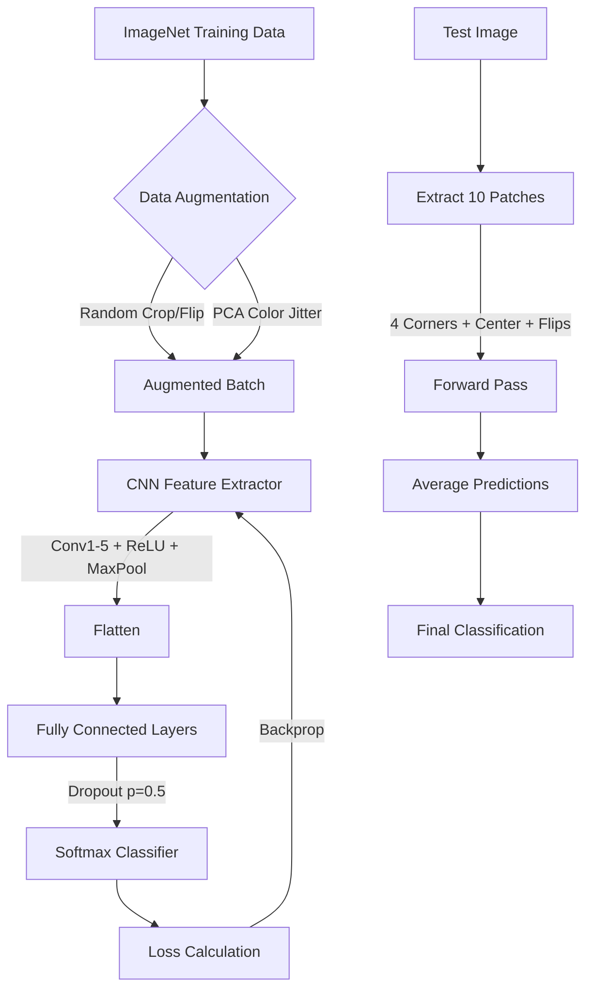

# 深度学习的“寒武纪大爆发”：AlexNet 论文精读与复现

## 1. 一句话概述

AlexNet 是 2012 年 ImageNet 竞赛（ILSVRC）的冠军模型，它首次证明了**深层卷积神经网络（CNN）配合大规模数据**（ImageNet）与**GPU 算力**，能够在复杂视觉任务上彻底击败传统手工特征方法，开启了现代深度学习的黄金时代 。

## 2. Abstract: 论文试图解决什么问题？有什么贡献？

在 AlexNet 之前，目标识别主要依赖传统机器学习方法。论文摘要明确指出了其核心突破：

1. 
**大规模训练**：在 ImageNet 的 120 万张高分辨率图像上训练了一个大型深度卷积神经网络，用于区分 1000 个类别 。


2. 
**性能飞跃**：在测试集上实现了 top-1 错误率 37.5% 和 top-5 错误率 17.0%，远超当时的 state-of-the-art（此前最佳方法的 top-5 错误率为 26.2%）。


3. 
**架构创新**：网络包含 6000 万参数和 65 万个神经元，由 5 个卷积层和 3 个全连接层组成 。


4. 
**技术组合**：引入了 ReLU 非饱和神经元、高效的 GPU 卷积实现、Dropout 正则化方法来防止过拟合 。


## 3. Introduction: 论文的动机是什么？

论文的 Introduction 像讲故事一样梳理了深度学习爆发的三个必要条件：

* 
**小数据集的局限性**：直到近期，标记图像数据集都相对较小（如 NORB, Caltech-101/256, CIFAR-10，仅数万张图片）。简单的识别任务在这些数据集上已经解决得很好（如 MNIST 错误率 < 0.3%）。


* 
**现实世界的复杂性**：现实中的物体表现出巨大的变异性（光照、姿态、遮挡），识别它们需要更大的训练集 。ImageNet 的出现（1500 万张标记图像，2.2 万个类别）解决了数据饥渴问题 。


* 
**模型的容量需求**：要从数百万张图片中学习，模型必须有巨大的学习容量（learning capacity）。


* 
**CNN 的优势**：卷积神经网络（CNNs）通过利用图像的统计平稳性和像素局部依赖性，相比同等大小的标准前馈神经网络，参数更少，更易于训练 。


* 
**算力的突破**：尽管 CNN 很高效，但在高分辨率图像上大规模应用仍然昂贵。幸运的是，当时的 GPU（如 GTX 580）配合高度优化的 2D 卷积实现，使得训练这种大模型成为可能 。


> 核心逻辑：大数据 (ImageNet) + 高容量模型 (CNN) + 强算力 (GPU) = 突破性结果。

## 4. Method: 解决方案是什么？

AlexNet 的架构设计在当时极具开创性，包含多个关键组件：

### 4.1 网络架构 (The Architecture)

网络总共 8 层：前 5 层为卷积层，后 3 层为全连接层 。

* 
**输入**： 的图像（论文中提到预处理为 256x256 后裁剪）。


* **卷积层设计**：
* 第一层使用了  的大卷积核，步长为 4，这在今天是罕见的，但在当时为了捕捉大尺寸图像的低频特征非常有效 。


* 第二、四、五层卷积层仅连接到同一 GPU 上的前一层特征图（分组卷积的雏形）。


* 
**输出**：最后经过 1000 维的 Softmax 输出类别概率 。


### 4.2 关键技术创新

**A. ReLU 非线性激活 (ReLU Nonlinearity)**
传统神经元使用  或 sigmoid，这些是饱和函数，梯度消失问题严重。AlexNet 引入了**整流线性单元 (ReLU)**：


论文指出，使用 ReLU 的深度卷积网络训练速度比使用 tanh 的网络快几倍 。在 CIFAR-10 上达到 25% 错误率时，ReLU 网络比 tanh 网络快 6 倍 。

**B. 局部响应归一化 (Local Response Normalization, LRN)**
虽然 ReLU 不需要输入归一化来防止饱和，但作者发现局部归一化有助于泛化 。
公式如下：


* 
**含义**： 是神经元激活值， 是归一化后的值。它模拟了生物神经元的“侧抑制”机制，让响应大的神经元抑制周围神经元，增强竞争 。


* 
**结果**：该机制将 top-1 和 top-5 错误率分别降低了 1.4% 和 1.2% 。


* *注：现代网络（如 ResNet）多使用 Batch Normalization，LRN 已较少使用，但在当时是重要创新。*

**C. 重叠池化 (Overlapping Pooling)**
传统池化是不重叠的（`stride = kernel size`）。AlexNet 使用 `stride=2`、`kernel size=3x3`，即池化窗口有重叠。这使得 top-1 和 top-5 错误率分别降低了 0.4% 和 0.3%，且更难过拟合。

**D. 防止过拟合策略**
由于模型有 6000 万参数，过拟合是主要挑战 。

1. **数据增强 (Data Augmentation)**：
* 
**几何变换**：从 `256x256` 图像中随机裁剪 `224x224` patches，并进行水平翻转。这使训练集有效扩大了 2048 倍。


* 
**颜色变换**：对 RGB 像素值进行 PCA，根据特征值添加随机扰动，模拟光照强度和颜色的变化 。


2. **Dropout**：
* 在全连接层使用，以 0.5 的概率将神经元输出置为 0 。


* 这迫使网络学习更鲁棒的特征，不依赖于特定的神经元共适应（co-adaptation）。


### 4.3 训练与评测逻辑流程 (Mermaid)



## 5. Experiment: 实验与结果

### 5.1 主实验结果 (ILSVRC-2010 & 2012)

* 
**ILSVRC-2010**：AlexNet 取得了 **37.5% top-1** 和 **17.0% top-5** 的错误率 。相比之下，之前的最佳方法（Sparse coding）分别为 47.1% 和 28.2% 。


* 
**ILSVRC-2012**：单个 CNN 模型达到了 18.2% 的 top-5 错误率；集成 7 个模型后，错误率降至 **15.3%** 。作为对比，第二名（SIFT + FVs）的错误率高达 26.2% 。


### 5.2 定性分析 (Qualitative Evaluations)

* 
**卷积核可视化**：论文展示了第一层学习到的 96 个卷积核。GPU 1 学习到的核主要是颜色无关的（高频灰度纹理），而 GPU 2 学习到的主要是颜色相关的 。这种分工是网络自发形成的。


* 
**特征相似性**：通过计算最后一层隐藏层（4096 维）特征向量的欧氏距离，作者展示了网络认为“相似”的图片。即使像素层面差异很大（如不同姿态的大象），语义上也被判定为相似 。


### 5.3 深度对性能的影响

作者做了一个消融实验：移除任何一个卷积层都会导致性能下降。例如，移除中间任何一层，top-1 性能会损失约 2% 。这证明了**深度（Depth）**对于获得高性能至关重要 。

## 6. Numpy 与 Torch 对照实现

### 6.1 代码对应关系与说明

提供的 Numpy 代码实现了一个**简化的 AlexNet**（针对 32x32 小图，类似 CIFAR-10 任务），而非论文中原始的 ImageNet 架构（224x224）。这是非常合理的教学简化。

* **对应模块**：
* `conv2d`: 对应论文 Section 3.5 的卷积操作（虽然论文用 GPU 高效实现，代码用 Python 循环演示原理）。
* `relu` & `max_pool2d`: 对应 Section 3.1 和 3.4。
* `AlexNetSimplified`: 对应整体架构，但通道数和层数进行了缩减（3 层卷积 vs 论文 5 层）。
* `forward`: 实现了 Conv -> ReLU -> Pool -> Flatten -> FC -> Dropout -> FC 的完整前向传播。


* **数据形状**：
* Numpy 代码输入假定为单张图片 `(3, 32, 32)` 或 `(C, H, W)`。
* 权重初始化使用了 `randn * 0.01`，与论文 Section 5 提到的 `0.01` 标准差高斯初始化一致 。


* **关键差异**：
* Numpy 版 `conv2d` 使用了显式的 4 重循环，极其缓慢，仅作原理演示。
* Numpy 版 `forward` 处理的是单样本（Batch Size = 1）。
* Numpy 版手动管理权重（`self.conv1_filters` 等），PyTorch 使用 `nn.Parameter` 或 `nn.Conv2d` 管理。


### 6.2 代码对照 (Code Group)

::: code-group

```python [Numpy]
import numpy as np
import matplotlib.pyplot as plt
from scipy.signal import correlate2d

np.random.seed(42)
      
# Convolutional Layer Implementation
# The core building block of CNNs

def relu(x):
    return np.maximum(0, x)

def conv2d(input_image, kernel, stride=1, padding=0):
    """
    2D Convolution operation
    
    input_image: (H, W) or (C, H, W)
    kernel: (out_channels, in_channels, kH, kW)
    """
    if len(input_image.shape) == 2:
        input_image = input_image[np.newaxis, :, :]
    
    in_channels, H, W = input_image.shape
    out_channels, _, kH, kW = kernel.shape
    
    # Add padding
    if padding > 0:
        input_padded = np.pad(input_image, 
                             ((0, 0), (padding, padding), (padding, padding)), 
                             mode='constant')
    else:
        input_padded = input_image
    
    # Output dimensions
    out_H = (H + 2*padding - kH) // stride + 1
    out_W = (W + 2*padding - kW) // stride + 1
    
    output = np.zeros((out_channels, out_H, out_W))
    
    # Perform convolution
    for oc in range(out_channels):
        for i in range(out_H):
            for j in range(out_W):
                h_start = i * stride
                w_start = j * stride
                
                # Extract patch
                patch = input_padded[:, h_start:h_start+kH, w_start:w_start+kW]
                
                # Convolve with kernel
                output[oc, i, j] = np.sum(patch * kernel[oc])
    
    return output

def max_pool2d(input_image, pool_size=2, stride=2):
    """
    Max pooling operation
    """
    C, H, W = input_image.shape
    
    out_H = (H - pool_size) // stride + 1
    out_W = (W - pool_size) // stride + 1
    
    output = np.zeros((C, out_H, out_W))
    
    for c in range(C):
        for i in range(out_H):
            for j in range(out_W):
                h_start = i * stride
                w_start = j * stride
                
                pool_region = input_image[c, h_start:h_start+pool_size, 
                                         w_start:w_start+pool_size]
                output[c, i, j] = np.max(pool_region)
    
    return output

# Test convolution
test_image = np.random.randn(1, 8, 8)
test_kernel = np.random.randn(3, 1, 3, 3) * 0.1

conv_output = conv2d(test_image, test_kernel, stride=1, padding=1)
print(f"Input shape: {test_image.shape}")
print(f"Kernel shape: {test_kernel.shape}")
print(f"Conv output shape: {conv_output.shape}")

pooled = max_pool2d(conv_output, pool_size=2, stride=2)
print(f"After max pooling: {pooled.shape}")
      
# AlexNet Architecture (Simplified)
# Original: 227x227x3 → 5 conv layers → 3 FC layers → 1000 classes
# Our simplified version for 32x32 images

class AlexNetSimplified:
    def __init__(self, num_classes=10):
        """
        Simplified AlexNet for 32x32 images (like CIFAR-10)
        
        Architecture:
        - Conv1: 3x3x3 -> 32 filters
        - MaxPool
        - Conv2: 32 -> 64 filters
        - MaxPool
        - Conv3: 64 -> 128 filters
        - FC layers
        """
        # Conv layers
        self.conv1_filters = np.random.randn(32, 3, 3, 3) * 0.01
        self.conv1_bias = np.zeros(32)
        
        self.conv2_filters = np.random.randn(64, 32, 3, 3) * 0.01
        self.conv2_bias = np.zeros(64)
        
        self.conv3_filters = np.random.randn(128, 64, 3, 3) * 0.01
        self.conv3_bias = np.zeros(128)
        
        # FC layers (after conv: 128 * 4 * 4 = 2048)
        self.fc1_weights = np.random.randn(2048, 512) * 0.01
        self.fc1_bias = np.zeros(512)
        
        self.fc2_weights = np.random.randn(512, num_classes) * 0.01
        self.fc2_bias = np.zeros(num_classes)
    
    def forward(self, x, use_dropout=False, dropout_rate=0.5):
        """
        Forward pass
        x: (3, 32, 32) image
        """
        # Conv1 + ReLU + MaxPool
        conv1 = conv2d(x, self.conv1_filters, stride=1, padding=1)
        conv1 += self.conv1_bias[:, np.newaxis, np.newaxis]
        conv1 = relu(conv1)
        pool1 = max_pool2d(conv1, pool_size=2, stride=2)  # 32 x 16 x 16
        
        # Conv2 + ReLU + MaxPool
        conv2 = conv2d(pool1, self.conv2_filters, stride=1, padding=1)
        conv2 += self.conv2_bias[:, np.newaxis, np.newaxis]
        conv2 = relu(conv2)
        pool2 = max_pool2d(conv2, pool_size=2, stride=2)  # 64 x 8 x 8
        
        # Conv3 + ReLU + MaxPool
        conv3 = conv2d(pool2, self.conv3_filters, stride=1, padding=1)
        conv3 += self.conv3_bias[:, np.newaxis, np.newaxis]
        conv3 = relu(conv3)
        pool3 = max_pool2d(conv3, pool_size=2, stride=2)  # 128 x 4 x 4
        
        # Flatten
        flattened = pool3.reshape(-1)
        
        # FC1 + ReLU + Dropout
        fc1 = np.dot(flattened, self.fc1_weights) + self.fc1_bias
        fc1 = relu(fc1)
        
        if use_dropout:
            dropout_mask = (np.random.rand(*fc1.shape) > dropout_rate).astype(float)
            fc1 = fc1 * dropout_mask / (1 - dropout_rate)
        
        # FC2 (output)
        output = np.dot(fc1, self.fc2_weights) + self.fc2_bias
        
        return output

# Create model
alexnet = AlexNetSimplified(num_classes=10)
print("AlexNet (simplified) created")

# Test forward pass
test_img = np.random.randn(3, 32, 32)
output = alexnet.forward(test_img)
print(f"Input: (3, 32, 32)")
print(f"Output: {output.shape} (class scores)")

```

```python [Torch]
import torch
import torch.nn as nn
import torch.nn.functional as F

# 设置随机种子以匹配 Numpy 行为（尽最大可能）
torch.manual_seed(42)

class AlexNetSimplifiedTorch(nn.Module):
    def __init__(self, num_classes=10):
        super(AlexNetSimplifiedTorch, self).__init__()
        
        # 对应 Numpy: Conv1 (3x3x3 -> 32 filters, stride=1, padding=1)
        self.conv1 = nn.Conv2d(in_channels=3, out_channels=32, kernel_size=3, stride=1, padding=1)
        
        # 对应 Numpy: Conv2 (32 -> 64 filters)
        self.conv2 = nn.Conv2d(in_channels=32, out_channels=64, kernel_size=3, stride=1, padding=1)
        
        # 对应 Numpy: Conv3 (64 -> 128 filters)
        self.conv3 = nn.Conv2d(in_channels=64, out_channels=128, kernel_size=3, stride=1, padding=1)
        
        # 对应 Numpy: Flatten 后尺寸 128 * 4 * 4 = 2048
        # FC1: 2048 -> 512
        self.fc1 = nn.Linear(2048, 512)
        
        # FC2: 512 -> num_classes
        self.fc2 = nn.Linear(512, num_classes)
        
        # 模拟 Numpy 代码中的初始化策略: Gaussian noise * 0.01, bias=0
        self._initialize_weights()

    def _initialize_weights(self):
        # 遍历所有模块，手动初始化以匹配 Numpy 代码的 "randn * 0.01"
        for m in self.modules():
            if isinstance(m, nn.Conv2d):
                nn.init.normal_(m.weight, mean=0, std=0.01)
                nn.init.constant_(m.bias, 0)
            elif isinstance(m, nn.Linear):
                nn.init.normal_(m.weight, mean=0, std=0.01)
                nn.init.constant_(m.bias, 0)

    def forward(self, x, use_dropout=False, dropout_rate=0.5):
        """
        x shape: (Batch, 3, 32, 32) 
        注意: PyTorch 默认需要 Batch 维度，若输入为 (3, 32, 32) 需 unsqueeze
        """
        # 对应 Numpy: conv1 -> add bias (auto) -> relu -> pool1 (size=2, stride=2)
        x = F.relu(self.conv1(x))
        x = F.max_pool2d(x, kernel_size=2, stride=2) # 32 -> 16
        
        # 对应 Numpy: conv2 -> relu -> pool2
        x = F.relu(self.conv2(x))
        x = F.max_pool2d(x, kernel_size=2, stride=2) # 16 -> 8
        
        # 对应 Numpy: conv3 -> relu -> pool3
        x = F.relu(self.conv3(x))
        x = F.max_pool2d(x, kernel_size=2, stride=2) # 8 -> 4
        
        # 对应 Numpy: Flatten
        x = torch.flatten(x, 1) # (Batch, 2048)
        
        # 对应 Numpy: FC1 -> ReLU
        x = F.relu(self.fc1(x))
        
        # 对应 Numpy: Dropout (if use_dropout)
        # 注意: Numpy 代码手动实现了 inverted dropout (/ (1-p))
        # PyTorch 的 F.dropout 在 training 模式下自动处理了 scaling
        if use_dropout:
            x = F.dropout(x, p=dropout_rate, training=True)
            
        # 对应 Numpy: FC2 (Output)
        x = self.fc2(x)
        
        return x

# 实例化模型
device = torch.device("cuda" if torch.cuda.is_available() else "cpu")
alexnet_torch = AlexNetSimplifiedTorch(num_classes=10).to(device)
print("AlexNet (Torch Optimized) created")

# 测试前向传播
# Numpy 输入是 (3, 32, 32)，Torch 需要 (1, 3, 32, 32)
test_img_torch = torch.randn(1, 3, 32, 32).to(device)

# 切换为 eval 模式 (除非显式测试 dropout)
alexnet_torch.eval() 
with torch.no_grad():
    output_torch = alexnet_torch(test_img_torch, use_dropout=False)

print(f"Input: {test_img_torch.shape}")
print(f"Output: {output_torch.shape} (class scores)")

# 简单验证 Dropout
print("With Dropout (training mode):")
alexnet_torch.train() # 启用 Dropout
output_drop = alexnet_torch(test_img_torch, use_dropout=True)
print(f"Output with dropout: {output_drop.shape}")

```

:::

### 6.3 对照讲解

1. **维度语义 (Tensor Semantics)**：
* **Numpy**: 示例代码主要处理 `(C, H, W)` 的 3D 数组（单样本）。卷积循环逻辑是 `output[oc, i, j] = sum(patch * kernel[oc])`。
* **Torch**: 强制使用 `(B, C, H, W)` 的 4D 张量。即使是单张图，也必须用 `unsqueeze(0)` 增加 Batch 维度。


2. **权重管理与初始化**:
* **Numpy**: 显式定义 `self.conv1_filters` 等变量。Numpy 代码中手动加 Bias (`conv1 += bias[:, np.newaxis, np.newaxis]`) 很容易出错（广播机制）。
* **Torch**: `nn.Conv2d` 将权重和偏置封装在内部。在 `_initialize_weights` 方法中，我专门写了代码来复现 Numpy 那种简单的 `Normal(0, 0.01)` 初始化，否则 Torch 默认使用 Kaiming 初始化。


3. **计算效率 (Loops vs Vectorization)**:
* **Numpy**: 使用 Python 4 重循环 (`for oc, i, j...`)，时间复杂度极高，仅适合理解卷积原理，无法用于实际训练。
* **Torch**: `nn.Conv2d` 调用底层 cuDNN 或 im2col 优化的 C++ 实现，全程向量化，速度快数千倍。


4. **Dropout 实现细节**:
* **Numpy**: 实现了 "Inverted Dropout" (`x * mask / (1-p)`)，这样测试时不需要缩放权重。
* **Torch**: `F.dropout` 内部也默认使用 Inverted Dropout 机制，但需要注意 `training=True/False` 标志的控制。我在代码中显式展示了这一点。

<!-- AUTO_PDF_IMAGES_START -->

## 论文原图（PDF）
> 下图自动抽取自原论文 PDF，用于补充概念、结构和实验细节。
> 来源：`07.pdf`


*图 1：建议结合本节 `深度卷积视觉分类` 一起阅读。*


*图 2：建议结合本节 `深度卷积视觉分类` 一起阅读。*


*图 3：建议结合本节 `深度卷积视觉分类` 一起阅读。*

<!-- AUTO_PDF_IMAGES_END -->

<!-- AUTO_INTERVIEW_QA_START -->

## 面试题与答案
> 主题：**AlexNet**（围绕 `深度卷积视觉分类`）

### 一、选择题（10题）

1. 在 AlexNet 中，最关键的建模目标是什么？
   - A. 深度卷积视觉分类
   - B. 卷积
   - C. ReLU
   - D. Dropout
   - **答案：A**

2. 下列哪一项最直接对应 AlexNet 的核心机制？
   - A. 卷积
   - B. ReLU
   - C. Dropout
   - D. 数据增强
   - **答案：B**

3. 在复现 AlexNet 时，优先要保证哪项一致性？
   - A. 只看最终分数
   - B. 只看训练集表现
   - C. 实现与论文设置对齐
   - D. 忽略随机种子
   - **答案：C**

4. 对于 AlexNet，哪个指标最能反映方法有效性？
   - A. 主指标与分组指标
   - B. 只看单次结果
   - C. 只看速度
   - D. 只看参数量
   - **答案：A**

5. 当 AlexNet 模型出现效果退化时，首要检查项是什么？
   - A. 数据与标签管线
   - B. 先增大模型十倍
   - C. 随机改损失函数
   - D. 删除验证集
   - **答案：A**

6. AlexNet 与传统 baseline 的主要差异通常体现在？
   - A. 归纳偏置与结构设计
   - B. 仅参数更多
   - C. 仅训练更久
   - D. 仅学习率更小
   - **答案：A**

7. 若要提升 AlexNet 的泛化能力，最稳妥的做法是？
   - A. 正则化+消融验证
   - B. 只堆数据不复核
   - C. 关闭评估脚本
   - D. 取消对照组
   - **答案：A**

8. 关于 AlexNet 的实验设计，下列说法更合理的是？
   - A. 固定变量做可复现实验
   - B. 同时改十个超参
   - C. 只展示最好一次
   - D. 省略失败实验
   - **答案：A**

9. 在工程部署中，AlexNet 的常见风险是？
   - A. 数值稳定与漂移
   - B. 只关心GPU利用率
   - C. 日志越少越好
   - D. 不做回归测试
   - **答案：A**

10. 回到论文主张，AlexNet 最不应该被误解为？
   - A. 可替代所有任务
   - B. 有明确适用边界
   - C. 不需要数据质量
   - D. 不需要误差分析
   - **答案：B**


### 二、代码题（10题，含参考答案）

1. 实现一个最小可运行的数据预处理函数，输出可用于 AlexNet 训练的批次。
   - 参考答案：
     ```python
     import numpy as np
     
     def make_batch(x, y, batch_size=32):
         idx = np.random.choice(len(x), batch_size, replace=False)
         return x[idx], y[idx]
     ```

2. 实现 AlexNet 的核心前向步骤（简化版），并返回中间张量。
   - 参考答案：
     ```python
     import numpy as np
     
     def forward_core(x, w, b):
         z = x @ w + b
         h = np.tanh(z)
         return h, {"z": z, "h": h}
     ```

3. 写一个训练 step：前向、loss、反向、更新。
   - 参考答案：
     ```python
     def train_step(model, optimizer, criterion, xb, yb):
         optimizer.zero_grad()
         pred = model(xb)
         loss = criterion(pred, yb)
         loss.backward()
         optimizer.step()
         return float(loss.item())
     ```

4. 实现一个评估函数，返回主指标与一个辅助指标。
   - 参考答案：
     ```python
     import numpy as np
     
     def evaluate(y_true, y_pred):
         acc = (y_true == y_pred).mean()
         err = 1.0 - acc
         return {"acc": float(acc), "err": float(err)}
     ```

5. 实现梯度裁剪与学习率调度的训练循环（简化版）。
   - 参考答案：
     ```python
     import torch
     
     def train_loop(model, loader, optimizer, criterion, scheduler=None, clip=1.0):
         model.train()
         for xb, yb in loader:
             optimizer.zero_grad()
             loss = criterion(model(xb), yb)
             loss.backward()
             torch.nn.utils.clip_grad_norm_(model.parameters(), clip)
             optimizer.step()
             if scheduler is not None:
                 scheduler.step()
     ```

6. 实现 ablation 开关：可切换是否启用 `卷积`。
   - 参考答案：
     ```python
     def forward_with_ablation(x, module, use_feature=True):
         if use_feature:
             return module(x)
         return x
     ```

7. 实现一个鲁棒的数值稳定 softmax / logsumexp 工具函数。
   - 参考答案：
     ```python
     import numpy as np
     
     def stable_softmax(x, axis=-1):
         x = x - np.max(x, axis=axis, keepdims=True)
         ex = np.exp(x)
         return ex / np.sum(ex, axis=axis, keepdims=True)
     ```

8. 写一个小型单元测试，验证 `ReLU` 相关张量形状正确。
   - 参考答案：
     ```python
     def test_shape(out, expected_last_dim):
         assert out.ndim >= 2
         assert out.shape[-1] == expected_last_dim
     ```

9. 实现模型推理包装器，支持 batch 输入并返回结构化结果。
   - 参考答案：
     ```python
     def infer(model, xb):
         logits = model(xb)
         pred = logits.argmax(dim=-1)
         return {"pred": pred, "logits": logits}
     ```

10. 实现一个实验记录器，保存超参、指标和随机种子。
   - 参考答案：
     ```python
     import json
     from pathlib import Path
     
     def save_run(path, cfg, metrics, seed):
         payload = {"cfg": cfg, "metrics": metrics, "seed": seed}
         Path(path).write_text(json.dumps(payload, ensure_ascii=False, indent=2))
     ```


<!-- AUTO_INTERVIEW_QA_END -->

