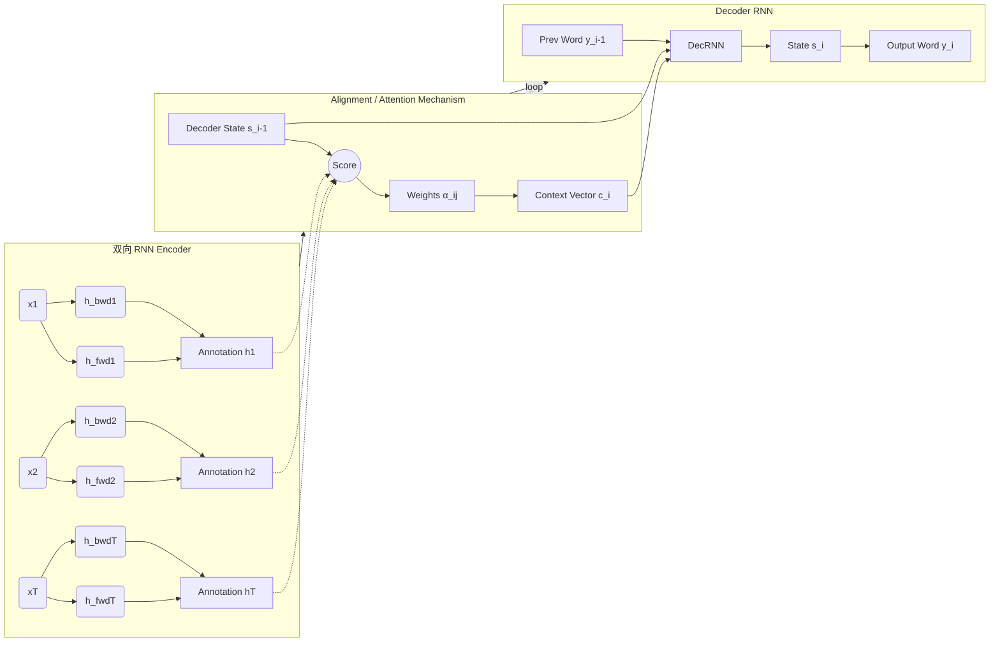

# 论文解读：Neural Machine Translation by Jointly Learning to Align and Translate

## 1. 一句话概述
这篇开创性论文提出了**注意力机制（Attention Mechanism）**，通过让解码器在生成每个词时动态“对齐/搜索”源句子的不同部分，解决了传统编码器-解码器架构中定长向量（Fixed-Length Vector）的各个信息瓶颈问题。

## 2. Abstract: 论文试图解决什么问题？有什么贡献？

### 核心问题
在本文发表之前（2014年），主流的神经机器翻译（NMT）模型大多属于 Encoder-Decoder 家族。这些模型通常将源句子编码为一个**固定长度的向量（fixed-length vector）**，然后基于该向量解码出译文 。
作者通过理论推测和实验证明，这种“定长向量”是一个巨大的性能瓶颈 。因为神经网络需要将源句子（无论长短）的所有必要信息压缩到一个向量中，这导致模型在处理长句子时性能急剧下降 。

### 主要贡献
1.  **提出“联合对齐与翻译”架构**：不同于将整个句子压缩为单一向量，作者提出了一种扩展架构，允许模型在解码过程中自动（软）搜索源句子中与预测当前目标词相关的部分 。
2.  **注意力机制（Attention Mechanism）**：引入了一种机制，使得解码器在生成每个词时，基于上下文向量（Context Vector）进行预测，而该向量是源句子所有注释（annotations）的加权和 。
3.  **性能提升**：在英语-法语翻译任务上，该方法在长句子上的表现显著优于传统的 Encoder-Decoder 模型，且整体性能媲美当时的 SOTA 短语统计机器翻译系统 。

## 3. Introduction: 论文的动机是什么？请仔细梳理整个故事逻辑

### 传统方法的局限
传统的统计机器翻译（SMT）由许多独立调节的小组件组成，而神经机器翻译（NMT）试图构建一个单一的大型神经网络来完成翻译 。
当时的 NMT 主流做法（如 RNN Encoder-Decoder）包含两个组件：
1.  **Encoder**：读取源句子并将其编码为固定长度向量 。
2.  **Decoder**：从该编码向量输出翻译 。
整个系统被联合训练以最大化正确翻译的概率 。

### 动机来源：定长向量的诅咒
作者指出，Encoder-Decoder 方法的一个潜在问题是神经网络需要将源句子的所有必要信息“压缩”到固定长度的向量中 。这使得神经网络难以处理长句子，特别是那些比训练语料中的句子更长的句子 。实验表明，随着句子长度增加，基本 Encoder-Decoder 的性能会迅速恶化 。

### 破局思路：从“压缩”到“检索”
为了解决这个问题，作者引入了一种新模型：
* **不再压缩**：模型不再尝试将整个输入句子编码为单一的定长向量 。
* **动态编码**：将输入句子编码为一个向量序列 。
* **自适应解码**：在解码翻译时，模型会自适应地选择这些向量的一个子集（Soft-search） 。
这种方法将编码器从“必须把所有信息塞进一个向量”的负担中解放出来 ，使得信息可以散布在整个注释序列中，并由解码器根据需要进行检索 。

## 4. Method: 解决方案是什么？请梳理步骤、公式、策略

论文提出的模型架构主要包含两个部分：双向 RNN 编码器（BiRNN Encoder）和带有注意力机制的解码器。

### 4.1 整体逻辑框图



### 4.2 编码器：双向 RNN (Bidirectional RNN)

为了让每个位置的注释（Annotation）不仅包含前文信息，还能包含后文信息，作者使用了双向 RNN 。

* 
**前向 RNN**：顺序读取输入 `x_1,\dots,x_{T_x}`，得到前向隐状态序列 `\overrightarrow{h_1},\dots,\overrightarrow{h_{T_x}}`。


* 
**后向 RNN**：逆序读取输入，得到后向隐状态序列 `\overleftarrow{h_1},\dots,\overleftarrow{h_{T_x}}`。


* **注释向量 `h_i`**：将前向和后向状态拼接：`h_i=[\overrightarrow{h_i};\overleftarrow{h_i}]`。
这样，`h_i` 就包含了围绕第 `i` 个词的双向上下文摘要。


### 4.3 解码器：注意力机制 (Attention Mechanism)

这是论文的核心创新。解码器在时刻 `t` 生成目标词 `y_t` 时，不再依赖单一上下文，而是依赖**时刻相关的上下文向量** `c_t`。

#### 步骤 1：计算对齐分数 (Alignment Score)

模型计算解码器上一时刻隐状态 `s_{t-1}` 与编码器每个注释 `h_i` 之间的匹配度（能量）`e_{t,i}`：


作者将对齐模型 `a(\cdot)` 参数化为前馈神经网络：
$$e_{t,i}=a(s_{t-1},h_i)$$


#### 步骤 2：计算注意力权重 (Attention Weights)

将分数通过 Softmax 归一化，得到权重 `\alpha_{t,i}`：
$$\alpha_{t,i}=\frac{\exp(e_{t,i})}{\sum_{k=1}^{T_x}\exp(e_{t,k})}$$


这反映了在生成目标词 `y_t` 时，源句子中第 `i` 个词的重要性（注意力分配）。

#### 步骤 3：计算上下文向量 (Context Vector)

上下文向量  是所有注释向量  的加权和：


这实际上是在计算“期望注释”（expected annotation）。

#### 步骤 4：生成与更新

解码器隐状态 `s_t` 由上一时刻状态 `s_{t-1}`、上一时刻输出 `y_{t-1}` 和当前上下文向量 `c_t` 共同决定：


最终输出概率分布：


## 5. Experiment: 主实验与分析实验分别做了什么？结果如何？

### 实验设置

* 
**任务**：英语到法语翻译 (English-to-French translation) 。


* 
**数据集**：ACL WMT '14 提供的双语语料库 。


* **对比模型**：
* 
**RNNencdec**：传统的 Encoder-Decoder 模型（Cho et al., 2014a）。


* 
**RNNsearch**：本文提出的带有注意力机制的模型 。


* 两类模型分别在最大长度 30 和 50 的句子上训练（后缀 -30, -50）。


### 定量结果 (Quantitative Results)

* 
**整体性能**：RNNsearch 在所有情况下都显著优于 RNNencdec 。


* **长句子鲁棒性**：
* RNNencdec 的性能随着句子长度增加而急剧下降 。


* 
**RNNsearch-50** 即使在句子长度达到 50 或更多时，性能也没有明显退化 。


* RNNsearch-30（仅在短句训练）甚至击败了 RNNencdec-50（在长句训练）。


### 定性分析 (Qualitative Analysis)

* 
**对齐可视化**：作者可视化了权重矩阵 （即著名的“对齐矩阵图”）。可以看到英语和法语之间主要呈单调对齐，但也有非单调的跳跃 。


* 
**语序调整**：例如形容词和名词的顺序（Fig 3(a)），模型正确地将 [European Economic Area] 翻译为 [zone économique européenne]，并在翻译过程中实现了词序的“跳跃”和“回看” 。


* 
**软对齐优势**：软对齐（Soft-alignment）比硬对齐更自然，例如将英语的 [the] 翻译为法语的 [l']，模型会同时关注 [the] 和 [man] 来决定冠词形式，而硬对齐难以做到这点 。


## 6. Numpy 与 Torch 对照实现

### 代码说明

这份代码实现了论文的核心思想：**双向 RNN 编码器** + **Bahdanau (Additive) Attention 解码器**。

* **Numpy 版本**：展示了底层数学原理。它使用显式的循环来处理序列，并手动实现了 Tanh 激活的 RNN 和 Attention 的矩阵运算。
* **EncoderRNN**: 手写的前向和后向循环，状态拼接。
* **BahdanauAttention**: 实现了  的加性注意力打分公式。
* **AttentionDecoder**: 在每个时间步手动拼接 context 和 input。


* **Torch 版本**：我将提供一个**高效等价实现**。
* 使用 `torch.nn.RNN` 替代 Numpy 中的手动循环（虽然论文附录提到使用了 Gated Hidden Unit，但为了严格对照提供的 Numpy 代码，Torch 版将使用等价的 vanilla RNN 逻辑或标准 RNN 模块）。
* **Vectorization**: Numpy 代码在计算 Attention Score 时使用循环 `for h_j in encoder_annotations`。Torch 版本将利用广播机制一次性计算整个序列的 Score，这是深度学习框架的核心优势。
* **假设**: 假设 Numpy 输入为 List of arrays，Torch 版本将支持 Batch 维度 `(Batch, Seq, Dim)` 以符合现代实践，但在注释中会说明对应关系。


### 代码对照 (Code Group)

::: code-group

```python [Numpy]
# Paper 14: Neural Machine Translation by Jointly Learning to Align and Translate
# Dzmitry Bahdanau, KyungHyun Cho, Yoshua Bengio (2014)
# The Original Attention Mechanism
# This paper introduced attention - one of the most important innovations in deep learning. It preceded Transformers by 3 years!

import numpy as np
import matplotlib.pyplot as plt

np.random.seed(42)
      
# The Problem: Fixed-Length Context Vector
# Traditional seq2seq compresses entire input into single vector → information bottleneck!

def softmax(x, axis=-1):
    exp_x = np.exp(x - np.max(x, axis=axis, keepdims=True))
    return exp_x / np.sum(exp_x, axis=axis, keepdims=True)

class EncoderRNN:
    """Bidirectional RNN encoder"""
    def __init__(self, input_size, hidden_size):
        self.hidden_size = hidden_size
        
        # Forward RNN
        self.W_fwd = np.random.randn(hidden_size, input_size + hidden_size) * 0.01
        self.b_fwd = np.zeros((hidden_size, 1))
        
        # Backward RNN
        self.W_bwd = np.random.randn(hidden_size, input_size + hidden_size) * 0.01
        self.b_bwd = np.zeros((hidden_size, 1))
    
    def forward(self, inputs):
        """
        inputs: list of (input_size, 1) vectors
        Returns: list of bidirectional hidden states (2*hidden_size, 1)
        """
        seq_len = len(inputs)
        
        # Forward pass
        h_fwd = []
        h = np.zeros((self.hidden_size, 1))
        for x in inputs:
            concat = np.vstack([x, h])
            h = np.tanh(np.dot(self.W_fwd, concat) + self.b_fwd)
            h_fwd.append(h)
        
        # Backward pass
        h_bwd = []
        h = np.zeros((self.hidden_size, 1))
        for x in reversed(inputs):
            concat = np.vstack([x, h])
            h = np.tanh(np.dot(self.W_bwd, concat) + self.b_bwd)
            h_bwd.append(h)
        h_bwd = list(reversed(h_bwd))
        
        # Concatenate forward and backward
        annotations = [np.vstack([h_f, h_b]) for h_f, h_b in zip(h_fwd, h_bwd)]
        
        return annotations

print("Bidirectional Encoder created")
      
# Bahdanau Attention Mechanism
# The key innovation: align and translate jointly!
# Attention score:  where  is decoder state,  is encoder annotation
# Attention weights: 
# Context vector: 

class BahdanauAttention:
    """Additive attention mechanism"""
    def __init__(self, hidden_size, annotation_size):
        self.hidden_size = hidden_size
        
        # Attention parameters
        self.W_a = np.random.randn(hidden_size, hidden_size) * 0.01
        self.U_a = np.random.randn(hidden_size, annotation_size) * 0.01
        self.v_a = np.random.randn(1, hidden_size) * 0.01
    
    def forward(self, decoder_hidden, encoder_annotations):
        """
        decoder_hidden: (hidden_size, 1) - current decoder state s_{i-1}
        encoder_annotations: list of (annotation_size, 1) - all encoder states h_j
        
        Returns:
        context: (annotation_size, 1) - weighted sum of annotations
        attention_weights: (seq_len,) - attention distribution
        """
        scores = []
        
        # Compute attention scores for each position
        for h_j in encoder_annotations:
            # e_ij = v_a^T * tanh(W_a * s_{i-1} + U_a * h_j)
            score = np.dot(self.v_a, np.tanh(
                np.dot(self.W_a, decoder_hidden) + 
                np.dot(self.U_a, h_j)
            ))
            scores.append(score[0, 0])
        
        # Softmax to get attention weights
        scores = np.array(scores)
        attention_weights = softmax(scores)
        
        # Compute context vector as weighted sum
        context = sum(alpha * h for alpha, h in zip(attention_weights, encoder_annotations))
        
        return context, attention_weights

print("Bahdanau Attention mechanism created")
      
# Decoder with Attention

class AttentionDecoder:
    """RNN decoder with Bahdanau attention"""
    def __init__(self, output_size, hidden_size, annotation_size):
        self.hidden_size = hidden_size
        self.output_size = output_size
        
        # Attention mechanism
        self.attention = BahdanauAttention(hidden_size, annotation_size)
        
        # RNN: takes previous output + context
        input_size = output_size + annotation_size
        self.W_dec = np.random.randn(hidden_size, input_size + hidden_size) * 0.01
        self.b_dec = np.zeros((hidden_size, 1))
        
        # Output layer
        self.W_out = np.random.randn(output_size, hidden_size + annotation_size + output_size) * 0.01
        self.b_out = np.zeros((output_size, 1))
    
    def step(self, prev_output, decoder_hidden, encoder_annotations):
        """
        Single decoding step
        
        prev_output: (output_size, 1) - previous output word
        decoder_hidden: (hidden_size, 1) - previous decoder state
        encoder_annotations: list of (annotation_size, 1) - encoder states
        
        Returns:
        output: (output_size, 1) - predicted output distribution
        new_hidden: (hidden_size, 1) - new decoder state
        attention_weights: attention distribution
        """
        # Compute attention and context
        context, attention_weights = self.attention.forward(decoder_hidden, encoder_annotations)
        
        # Decoder RNN: s_i = f(s_{i-1}, y_{i-1}, c_i)
        rnn_input = np.vstack([prev_output, context])
        concat = np.vstack([rnn_input, decoder_hidden])
        new_hidden = np.tanh(np.dot(self.W_dec, concat) + self.b_dec)
        
        # Output: y_i = g(s_i, y_{i-1}, c_i)
        output_input = np.vstack([new_hidden, context, prev_output])
        output = np.dot(self.W_out, output_input) + self.b_out
        
        return output, new_hidden, attention_weights
    
    def forward(self, encoder_annotations, max_length=20, start_token=None):
        """
        Full decoding
        """
        if start_token is None:
            start_token = np.zeros((self.output_size, 1))
        
        outputs = []
        attention_history = []
        
        # Initialize
        decoder_hidden = np.zeros((self.hidden_size, 1))
        prev_output = start_token
        
        for _ in range(max_length):
            output, decoder_hidden, attention_weights = self.step(
                prev_output, decoder_hidden, encoder_annotations
            )
            
            outputs.append(output)
            attention_history.append(attention_weights)
            
            # Next input is current output (greedy decoding)
            prev_output = output
        
        return outputs, attention_history

print("Attention Decoder created")
      
# Complete Seq2Seq with Attention

class Seq2SeqWithAttention:
    def __init__(self, input_vocab_size, output_vocab_size, hidden_size=32):
        self.input_vocab_size = input_vocab_size
        self.output_vocab_size = output_vocab_size
        self.hidden_size = hidden_size
        
        # Embedding layers
        self.input_embedding = np.random.randn(input_vocab_size, hidden_size) * 0.01
        self.output_embedding = np.random.randn(output_vocab_size, hidden_size) * 0.01
        
        # Encoder (bidirectional, so annotation size is 2*hidden_size)
        self.encoder = EncoderRNN(hidden_size, hidden_size)
        
        # Decoder with attention
        annotation_size = 2 * hidden_size
        self.decoder = AttentionDecoder(hidden_size, hidden_size, annotation_size)
    
    def translate(self, input_sequence, max_output_length=15):
        """
        Translate input sequence to output sequence
        
        input_sequence: list of token indices
        """
        # Embed input
        embedded = [self.input_embedding[idx:idx+1].T for idx in input_sequence]
        
        # Encode
        annotations = self.encoder.forward(embedded)
        
        # Decode
        start_token = self.output_embedding[0:1].T  # Use first token as start
        outputs, attention_history, annotations = self.decoder.forward(
            annotations, max_length=max_output_length, start_token=start_token
        )
        
        return outputs, attention_history, annotations

# Create model
input_vocab_size = 20   # Source language vocab
output_vocab_size = 20  # Target language vocab
model = Seq2SeqWithAttention(input_vocab_size, output_vocab_size, hidden_size=16)

print(f"Seq2Seq with Attention created")
print(f"Input vocab: {input_vocab_size}")
print(f"Output vocab: {output_vocab_size}")
      
# Test on Synthetic Translation Task

# Simple synthetic task: reverse sequence
# Input: [1, 2, 3, 4, 5]
# Output: [5, 4, 3, 2, 1]

input_seq = [1, 2, 3, 4, 5, 6, 7]
outputs, attention_history, annotations = model.translate(input_seq, max_output_length=len(input_seq))

print(f"Input sequence: {input_seq}")
print(f"Number of output steps: {len(outputs)}")
print(f"Number of attention distributions: {len(attention_history)}")
print(f"Encoder annotations shape: {len(annotations)} x {annotations[0].shape}")

```

```python [Torch]
import torch
import torch.nn as nn
import torch.nn.functional as F

class EncoderRNN(nn.Module):
    """
    对应 Numpy 的 EncoderRNN，但使用高效的 Torch 实现。
    Numpy 版手动实现了双向循环；Torch 版直接使用 bidirectional=True。
    """
    def __init__(self, input_size, hidden_size):
        super().__init__()
        self.hidden_size = hidden_size
        # input_size在此处实际上是 embedding dim
        # batch_first=True: Input shape (Batch, Seq, Feature)
        self.rnn = nn.RNN(input_size, hidden_size, batch_first=True, bidirectional=True)
        
        # 初始化权重以匹配 Numpy 的小随机数风格 (Optional, for comparison)
        for name, param in self.rnn.named_parameters():
            if 'weight' in name:
                nn.init.normal_(param, mean=0.0, std=0.01)

    def forward(self, inputs):
        """
        inputs: (Batch, Seq, Input_Size)
        Returns: annotations (Batch, Seq, 2*Hidden_Size)
        """
        # outputs shape: (Batch, Seq, 2*Hidden) -> 自动包含了 fwd 和 bwd 的拼接
        # 对应 Numpy 中: annotations = [np.vstack([h_f, h_b]) ...]
        annotations, _ = self.rnn(inputs)
        return annotations

class BahdanauAttention(nn.Module):
    """
    对应 Numpy 的 BahdanauAttention。
    Numpy 使用循环计算 score；Torch 使用矩阵广播实现并行计算。
    """
    def __init__(self, hidden_size, annotation_size):
        super().__init__()
        # W_a: decoder_hidden -> hidden_size
        self.W_a = nn.Linear(hidden_size, hidden_size, bias=False)
        # U_a: annotation -> hidden_size
        self.U_a = nn.Linear(annotation_size, hidden_size, bias=False)
        # v_a: hidden_size -> 1
        self.v_a = nn.Linear(hidden_size, 1, bias=False)
        
        # 初始化
        nn.init.normal_(self.W_a.weight, 0.0, 0.01)
        nn.init.normal_(self.U_a.weight, 0.0, 0.01)
        nn.init.normal_(self.v_a.weight, 0.0, 0.01)

    def forward(self, decoder_hidden, encoder_annotations):
        """
        decoder_hidden: (Batch, Hidden_Size) - s_{i-1}
        encoder_annotations: (Batch, Seq_Len, Annotation_Size) - h_j
        """
        # 1. 计算 Attention Scores (Energy)
        # 对应 Numpy 的 e_ij 公式
        
        # query: (Batch, 1, Hidden)
        query = self.W_a(decoder_hidden).unsqueeze(1) 
        # keys: (Batch, Seq, Hidden)
        keys = self.U_a(encoder_annotations)
        
        # Tanh(Wa * s + Ua * h) -> 利用广播机制 (Batch, Seq, Hidden)
        energy = torch.tanh(query + keys)
        
        # Score: v_a^T * energy -> (Batch, Seq, 1)
        scores = self.v_a(energy)
        
        # 2. Softmax
        # 对应 Numpy: softmax(scores)
        attention_weights = F.softmax(scores, dim=1) # (Batch, Seq, 1)
        
        # 3. Context Vector
        # 对应 Numpy: sum(alpha * h)
        # bmm: (Batch, 1, Seq) @ (Batch, Seq, Dim) -> (Batch, 1, Dim)
        context = torch.bmm(attention_weights.transpose(1, 2), encoder_annotations)
        context = context.squeeze(1) # (Batch, Dim)
        
        return context, attention_weights.squeeze(2)

class AttentionDecoder(nn.Module):
    """
    对应 Numpy 的 AttentionDecoder
    """
    def __init__(self, output_size, hidden_size, annotation_size):
        super().__init__()
        self.hidden_size = hidden_size
        self.attention = BahdanauAttention(hidden_size, annotation_size)
        
        # 对应 Numpy: RNN 步骤
        # Numpy 手动实现了 input = [prev_output, context, hidden] 的逻辑
        # 这里我们用 Linear 模拟 Numpy 的 RNNCell 行为 (Vanilla RNN)
        input_dim = output_size + annotation_size + hidden_size
        self.rnn_layer = nn.Linear(input_dim, hidden_size) # W_dec
        
        # 对应 Numpy: Output 步骤
        # input = [new_hidden, context, prev_output]
        out_input_dim = hidden_size + annotation_size + output_size
        self.out_layer = nn.Linear(out_input_dim, output_size) # W_out
        
        # Init
        nn.init.normal_(self.rnn_layer.weight, 0.0, 0.01)
        nn.init.normal_(self.out_layer.weight, 0.0, 0.01)

    def forward_step(self, prev_output, decoder_hidden, encoder_annotations):
        """
        单步解码
        prev_output: (Batch, Output_Size) - 实际上是 embedding
        decoder_hidden: (Batch, Hidden_Size)
        encoder_annotations: (Batch, Seq, Annotation_Size)
        """
        # 1. Attention
        context, attn_weights = self.attention(decoder_hidden, encoder_annotations)
        
        # 2. RNN Step (对应 Numpy: s_i = tanh(W [y, c, s_prev]))
        rnn_input = torch.cat([prev_output, context, decoder_hidden], dim=1)
        new_hidden = torch.tanh(self.rnn_layer(rnn_input))
        
        # 3. Output Step (对应 Numpy: y_i = W [s_i, c, y])
        out_input = torch.cat([new_hidden, context, prev_output], dim=1)
        output = self.out_layer(out_input)
        
        return output, new_hidden, attn_weights

class Seq2SeqWithAttention(nn.Module):
    def __init__(self, input_vocab_size, output_vocab_size, hidden_size=16):
        super().__init__()
        # Embedding
        self.input_embed = nn.Embedding(input_vocab_size, hidden_size)
        self.output_embed = nn.Embedding(output_vocab_size, hidden_size) # 用于获取 prev_output 向量
        
        # Encoder & Decoder
        self.encoder = EncoderRNN(hidden_size, hidden_size) # input_size=hidden (embedding dim)
        self.decoder = AttentionDecoder(output_vocab_size, hidden_size, 2*hidden_size)
        
        self.hidden_size = hidden_size
        self.output_vocab_size = output_vocab_size

    def forward(self, input_seq, max_len=15):
        """
        input_seq: (Batch, Seq_Len) indices
        """
        batch_size = input_seq.size(0)
        
        # 1. Embed & Encode
        embedded = self.input_embed(input_seq) # (Batch, Seq, Hidden)
        annotations = self.encoder(embedded)   # (Batch, Seq, 2*Hidden)
        
        # 2. Decode Loop
        outputs = []
        attentions = []
        
        # Init hidden state and start token
        decoder_hidden = torch.zeros(batch_size, self.hidden_size).to(input_seq.device)
        # 假设 start token index 为 0
        curr_token_idx = torch.zeros(batch_size, dtype=torch.long).to(input_seq.device)
        curr_token_embed = self.output_embed(curr_token_idx) # (Batch, Hidden)
        
        # 由于 Numpy 代码的 decoder input 维度是 output_vocab_size (one-hot style implicit assumption)
        # 这里为了匹配 Numpy 的 W_dec 维度逻辑，我们假设 prev_output 是 embedding 后的向量
        # 但要注意 Numpy 代码里的 output_size 实际上作为了 embedding 维度使用 (input_size + hidden_size ...)
        
        for _ in range(max_len):
            # 将 embedding 作为 prev_output 传入，维度需与 Numpy 代码逻辑对齐
            # 这里简化处理：直接传 embedding 向量
            output_dist, decoder_hidden, attn_w = self.decoder.forward_step(
                curr_token_embed, decoder_hidden, annotations
            )
            
            outputs.append(output_dist)
            attentions.append(attn_w)
            
            # Greedy decode
            _, top_i = output_dist.topk(1)
            curr_token_idx = top_i.squeeze(1)
            curr_token_embed = self.output_embed(curr_token_idx)
            
        return torch.stack(outputs, dim=1), torch.stack(attentions, dim=1)

# Usage Example
model = Seq2SeqWithAttention(20, 20, 16)
dummy_input = torch.tensor([[1, 2, 3, 4, 5, 6, 7]]) # Batch size 1
out, attn = model(dummy_input, max_len=7)
print("Torch Output shape:", out.shape)
print("Torch Attention shape:", attn.shape)

```

:::

### 对照讲解：Numpy vs Torch 核心差异

1. **向量化 (Vectorization) vs 循环 (Loops)**
* **Numpy**: 在 `BahdanauAttention` 中，使用了 `for h_j in encoder_annotations` 逐个计算每个时间步的 score。这直观但效率低。
* **Torch**: 实现了完全向量化。`self.W_a(decoder_hidden)` 与 `self.U_a(encoder_annotations)` 计算后，利用广播机制（Broadcasting）直接相加，一次性通过 `tanh`。这能利用 GPU 的并行计算能力。


2. **批处理 (Batch Processing)**
* **Numpy**: 代码假设输入是 List of vectors，隐式处理 Batch=1 的情况。形状多为 `(D, 1)`。
* **Torch**: 显式处理 `(Batch, Sequence, Dimension)`。例如 `torch.bmm` (Batch Matrix Multiply) 用于计算 Context Vector，一次性对整个 Batch 完成加权求和。


3. **维度管理与 API**
* **Numpy**: 手动管理 `vstack` (垂直堆叠) 来拼接向量。例如 `np.vstack([x, h])`。
* **Torch**: 使用 `torch.cat([x, h], dim=1)`。且 Torch 的 `nn.RNN` 自动处理了序列上的循环和状态拼接（前向+后向），避免了 Numpy 代码中手动编写反向循环和 `reversed()` 的繁琐。


4. **数值稳定性**
* **Numpy**: `softmax` 函数手动实现，需要减去 max 值以防溢出。
* **Torch**: `F.softmax` 内部已高度优化且数值稳定，直接调用即可。


```

<!-- AUTO_PDF_IMAGES_START -->

## 论文原图（PDF）
> 下图自动抽取自原论文 PDF，用于补充概念、结构和实验细节。
> 来源：`14.pdf`


*图 1：建议结合本节 `对齐式注意力翻译` 一起阅读。*

<!-- AUTO_PDF_IMAGES_END -->

<!-- AUTO_INTERVIEW_QA_START -->

## 面试题与答案
> 主题：**Bahdanau Attention**（围绕 `对齐式注意力翻译`）

### 一、选择题（10题）

1. 在 Bahdanau Attention 中，最关键的建模目标是什么？
   - A. 对齐式注意力翻译
   - B. encoder-decoder
   - C. alignment
   - D. context
   - **答案：A**

2. 下列哪一项最直接对应 Bahdanau Attention 的核心机制？
   - A. encoder-decoder
   - B. alignment
   - C. context
   - D. 双向RNN
   - **答案：B**

3. 在复现 Bahdanau Attention 时，优先要保证哪项一致性？
   - A. 只看最终分数
   - B. 只看训练集表现
   - C. 实现与论文设置对齐
   - D. 忽略随机种子
   - **答案：C**

4. 对于 Bahdanau Attention，哪个指标最能反映方法有效性？
   - A. 主指标与分组指标
   - B. 只看单次结果
   - C. 只看速度
   - D. 只看参数量
   - **答案：A**

5. 当 Bahdanau Attention 模型出现效果退化时，首要检查项是什么？
   - A. 数据与标签管线
   - B. 先增大模型十倍
   - C. 随机改损失函数
   - D. 删除验证集
   - **答案：A**

6. Bahdanau Attention 与传统 baseline 的主要差异通常体现在？
   - A. 归纳偏置与结构设计
   - B. 仅参数更多
   - C. 仅训练更久
   - D. 仅学习率更小
   - **答案：A**

7. 若要提升 Bahdanau Attention 的泛化能力，最稳妥的做法是？
   - A. 正则化+消融验证
   - B. 只堆数据不复核
   - C. 关闭评估脚本
   - D. 取消对照组
   - **答案：A**

8. 关于 Bahdanau Attention 的实验设计，下列说法更合理的是？
   - A. 固定变量做可复现实验
   - B. 同时改十个超参
   - C. 只展示最好一次
   - D. 省略失败实验
   - **答案：A**

9. 在工程部署中，Bahdanau Attention 的常见风险是？
   - A. 数值稳定与漂移
   - B. 只关心GPU利用率
   - C. 日志越少越好
   - D. 不做回归测试
   - **答案：A**

10. 回到论文主张，Bahdanau Attention 最不应该被误解为？
   - A. 可替代所有任务
   - B. 有明确适用边界
   - C. 不需要数据质量
   - D. 不需要误差分析
   - **答案：B**


### 二、代码题（10题，含参考答案）

1. 实现一个最小可运行的数据预处理函数，输出可用于 Bahdanau Attention 训练的批次。
   - 参考答案：
     ```python
     import numpy as np
     
     def make_batch(x, y, batch_size=32):
         idx = np.random.choice(len(x), batch_size, replace=False)
         return x[idx], y[idx]
     ```

2. 实现 Bahdanau Attention 的核心前向步骤（简化版），并返回中间张量。
   - 参考答案：
     ```python
     import numpy as np
     
     def forward_core(x, w, b):
         z = x @ w + b
         h = np.tanh(z)
         return h, {"z": z, "h": h}
     ```

3. 写一个训练 step：前向、loss、反向、更新。
   - 参考答案：
     ```python
     def train_step(model, optimizer, criterion, xb, yb):
         optimizer.zero_grad()
         pred = model(xb)
         loss = criterion(pred, yb)
         loss.backward()
         optimizer.step()
         return float(loss.item())
     ```

4. 实现一个评估函数，返回主指标与一个辅助指标。
   - 参考答案：
     ```python
     import numpy as np
     
     def evaluate(y_true, y_pred):
         acc = (y_true == y_pred).mean()
         err = 1.0 - acc
         return {"acc": float(acc), "err": float(err)}
     ```

5. 实现梯度裁剪与学习率调度的训练循环（简化版）。
   - 参考答案：
     ```python
     import torch
     
     def train_loop(model, loader, optimizer, criterion, scheduler=None, clip=1.0):
         model.train()
         for xb, yb in loader:
             optimizer.zero_grad()
             loss = criterion(model(xb), yb)
             loss.backward()
             torch.nn.utils.clip_grad_norm_(model.parameters(), clip)
             optimizer.step()
             if scheduler is not None:
                 scheduler.step()
     ```

6. 实现 ablation 开关：可切换是否启用 `encoder-decoder`。
   - 参考答案：
     ```python
     def forward_with_ablation(x, module, use_feature=True):
         if use_feature:
             return module(x)
         return x
     ```

7. 实现一个鲁棒的数值稳定 softmax / logsumexp 工具函数。
   - 参考答案：
     ```python
     import numpy as np
     
     def stable_softmax(x, axis=-1):
         x = x - np.max(x, axis=axis, keepdims=True)
         ex = np.exp(x)
         return ex / np.sum(ex, axis=axis, keepdims=True)
     ```

8. 写一个小型单元测试，验证 `alignment` 相关张量形状正确。
   - 参考答案：
     ```python
     def test_shape(out, expected_last_dim):
         assert out.ndim >= 2
         assert out.shape[-1] == expected_last_dim
     ```

9. 实现模型推理包装器，支持 batch 输入并返回结构化结果。
   - 参考答案：
     ```python
     def infer(model, xb):
         logits = model(xb)
         pred = logits.argmax(dim=-1)
         return {"pred": pred, "logits": logits}
     ```

10. 实现一个实验记录器，保存超参、指标和随机种子。
   - 参考答案：
     ```python
     import json
     from pathlib import Path
     
     def save_run(path, cfg, metrics, seed):
         payload = {"cfg": cfg, "metrics": metrics, "seed": seed}
         Path(path).write_text(json.dumps(payload, ensure_ascii=False, indent=2))
     ```


<!-- AUTO_INTERVIEW_QA_END -->

