# 15. Identity Mappings in Deep Residual Networks (Pre-activation ResNet)

## 1. 一句话概述

这篇论文是对 ResNet 架构的深度理论分析与改进，通过推导证明了**“恒等映射（Identity Mapping）”**是残差块中快捷连接（Skip Connection）的最佳形式，并提出将 BN 和 ReLU 移至卷积之前的**“预激活（Pre-activation）”**结构，从而使得训练超过 1000 层的超深网络更加容易且泛化能力更强。

## 2. Abstract: 论文试图解决什么问题？有什么贡献？

**试图解决的问题**：
尽管 Deep Residual Networks (ResNets)  已经能够训练非常深的网络，但在极端深度（如 1000 层以上）下，训练难度仍然存在，且原有结构中的 ReLU 激活函数可能阻碍梯度的“顺畅”传播。作者希望分析残差块背后的传播公式，找到一种能让信号在正向和反向传播中都畅通无阻的结构。

**主要贡献**：

1. 
**理论推导**：通过分析残差单元的数学形式，揭示了当快捷连接和相加后的激活函数均为**恒等映射**时，信号可以直接从任意一个块传播到另一个块 。


2. 
**结构改进**：提出了**Pre-activation Residual Unit**（预激活残差单元），将 BN 和 ReLU 移到权重层之前，去除了相加后的 ReLU，从而创造了一条“干净”的信息通路 。


3. 
**实验验证**：在 CIFAR-10 上成功训练了 **1001 层**的 ResNet，达到了 4.62% 的错误率，优于原始 ResNet-110 和 ResNet-1202，且在 ImageNet 上使用 ResNet-200 取得了比原始 ResNet-152 更好的结果，证明了该结构能减少过拟合 。


## 3. Introduction: 论文的动机是什么？

### 3.1 原始 ResNet 的局限性

在原始 ResNet 中，残差单元的形式为 ，其中  是恒等映射，但输出还要经过 ，这里  是 ReLU 。
虽然这种结构已经极大地加深了网络，但作者通过实验和分析发现，相加后的 ReLU 激活函数实际上阻碍了梯度的反向传播，使其无法做到真正的“恒等”传递。当层数增加到 1000 层时，这种阻碍效应会累积，导致训练困难 。

### 3.2 创造“直接”传播路径

论文的核心动机是创建一个“直接”的路径（direct path），让信息不仅能在残差单元内部传播，还能贯穿整个网络 。
作者通过数学推导发现，只有当 （快捷连接）和 （相加后的操作）**都是恒等映射**时，信号才能在正向和反向传播中直接在单元间传递 。这促使作者重新设计残差单元，移除了主路径上的阻碍（ReLU），提出了 Pre-activation 结构。

### 3.3 深度维度的进一步挖掘

通过这些改进，作者展示了深度学习在“深度”这一维度上仍有巨大的挖掘空间。实验表明，使用新结构的 1001 层网络比 100 层网络更容易优化，且泛化性能更好，这表明过深的原始 ResNet 出现的性能下降主要是优化问题而非过拟合问题 。

## 4. Method: 解决方案是什么？

### 4.1 深度残差网络的传播分析

论文首先定义了通用的残差单元公式：


其中  是第  个单元的输入， 是权重， 是残差函数， 是相加后的激活函数（原始 ResNet 中为 ReLU）。

#### 正向传播的展开

如果  且  也是恒等映射（），则递归代入可得：


这表明，任意深层单元  的特征  可以表示为浅层单元  的特征  加上一系列残差函数的和 。这与传统“平原网络”（Plain Network）的矩阵连乘形式（）形成了鲜明对比 。

#### 反向传播的梯度特性

根据链式法则，损失函数  对  的梯度为：


这个公式揭示了梯度的两个组成部分 ：

1. ****：这一项表明梯度可以直接通过快捷连接无损地传回任何浅层单元，不经过任何权重层。
2. ****：这一项通过权重层传播。
公式中的“1”保证了梯度不会因为权重极小而消失 。这证明了保持快捷连接“干净”（无操作）的重要性。


### 4.2 恒等快捷连接的重要性（Ablation Analysis）

为了验证上述推导，作者分析了如果 （即引入缩放因子）会发生什么。此时反向传播的第一项变为 。

* 如果 ，梯度会指数爆炸。
* 如果 ，梯度会指数消失，阻断来自 Shortcut 的信号 。
作者测试了 Constant Scaling、Gating（门控）、 Convolution、Dropout 等多种快捷连接形式，发现**恒等映射（Identity Mapping）**效果最好，误差最低，训练最容易 。


### 4.3 提出的新结构：预激活（Pre-activation）

既然  必须是恒等映射，那么  也应该是恒等映射。原始 ResNet 中  是 ReLU，这使得梯度在负半轴被截断。
为了实现 ，作者将激活函数（BN 和 ReLU）视为权重层的“预处理”（Pre-activation），而不是“后处理”（Post-activation）。

* **Original Unit**: Weight  BN  ReLU  Weight  BN  Add  ReLU
* **Pre-activation Unit**: BN  ReLU  Weight  BN  ReLU  Weight  Add

如下图逻辑所示：

```mermaid
graph TD
    subgraph "Original Residual Unit"
    A1[Input x] --> B1[Weight]
    B1 --> C1[BN]
    C1 --> D1[ReLU]
    D1 --> E1[Weight]
    E1 --> F1[BN]
    A1 -->|Identity Path| G1[Addition]
    F1 --> G1
    G1 --> H1[ReLU]
    H1 --> I1[Output]
    style H1 fill:#f9f,stroke:#333,stroke-width:2px
    end

    subgraph "Pre-activation Residual Unit (Proposed)"
    A2[Input x] --> B2[BN]
    B2 --> C2[ReLU]
    C2 --> D2[Weight]
    D2 --> E2[BN]
    E2 --> F2[ReLU]
    F2 --> G2[Weight]
    A2 -->|Clean Identity Path| H2[Addition]
    G2 --> H2
    H2 --> I2[Output]
    style H2 fill:#bbf,stroke:#333,stroke-width:2px
    end

```



这种设计有两个好处：

1. 
**易于优化**：移除了 Shortcut 路径上的 ReLU，使得梯度流更加顺畅 。


2. 
**减少过拟合**：BN 层的这种放置方式起到了更好的正则化作用 。


## 5. Experiment: 实验与分析

### 5.1 Shortcut 连接类型的消融实验

在 CIFAR-10 上使用 ResNet-110 进行对比实验，测试了不同的 Shortcut 形式（见 Table 1）：

* **Original** (Identity): 6.61% 错误率。
* **Constant Scaling (0.5)**: 收敛差，错误率 12.35%。
* 
**Exclusive Gating**: 只有当初始化偏置极其精细（）时才能收敛到 8.70%，否则失败 。


* 
**1x1 Conv Shortcut**: 12.22%，参数更多但效果更差，说明优化难度增加 。
**结论**：保持 Shortcut 为纯净的恒等映射对于深层网络至关重要。


### 5.2 激活函数位置的消融实验

在确定 Shortcut 为恒等映射后，作者研究了激活函数的位置（见 Table 2）：

* **Original**: BN after Add, ReLU after Add。
* 
**BN after Add**: 效果变差（8.17%），因为 BN 破坏了 Shortcut 的信号幅度 。


* 
**ReLU before Add**: 导致残差函数输出非负，限制了表达能力，效果变差（7.84%）。


* 
**Full Pre-activation**: 效果最佳（6.37%），且在 ResNet-164 上达到 5.46% 。


### 5.3 极深网络的主实验 (CIFAR-10/100)

作者构建了 **1001 层** 的 ResNet（ResNet-1001）：

* **Original ResNet-1001**: 训练困难，初期 loss 下降缓慢，最终错误率 7.61%。
* 
**Pre-act ResNet-1001**: 训练迅速，最终错误率 **4.92%**（CIFAR-10）和 **22.71%**（CIFAR-100），显著优于基线 。
这证明了 Pre-activation 结构成功解决了超深网络的优化难题。


### 5.4 ImageNet 实验

在 ImageNet 2012 数据集上：

* **ResNet-152**: Pre-act 版本与原始版本性能相当，因为 152 层尚未达到优化瓶颈。
* 
**ResNet-200**: Pre-act 版本错误率降低了 1.1%（21.8%  20.7%），并且在训练误差稍高的情况下测试误差更低，证明了其**正则化效应**减少了过拟合 。


---

## 6. Numpy 与 Torch 对照实现

### 6.1 代码对应关系与说明

提供的 Numpy 代码对应论文 **Method (Section 3 & 4)** 中的核心概念：**Original Residual Block** 与 **Pre-activation Residual Block** 的结构对比，以及**梯度流（Gradient Flow）**的模拟分析。

* **对应模块**：
* `OriginalResidualBlock`: 对应论文 Fig. 1(a) 和 Fig 4(a)。结构为 `Conv-BN-ReLU-Conv-BN-Add-ReLU`。
* `PreActivationResidualBlock`: 对应论文 Fig. 1(b) 和 Fig 4(e)。结构为 `BN-ReLU-Conv-BN-ReLU-Conv-Add`。
* `compute_gradient_flow`: 对应论文公式 (5) 的分析，模拟梯度经过多层时的衰减情况。


* **关键张量 Shape**：
* Numpy 代码是一个简化的 **1D 实现**。输入 `x` 的 shape 为 `(dim,)`（例如 `(8,)`）。
* 权重 `W1`, `W2` 为 `(dim, dim)`，操作为矩阵乘法 `np.dot`。这在深度学习中等价于**全连接层（Linear Layer）**而非卷积层。
* **Assumption**: 虽然论文讨论的是 CNN，但 Numpy 代码用全连接层演示原理。Torch 实现将保留这一逻辑（使用 `nn.Linear`），但会增加 **Batch 维度** `(N, dim)` 以符合 PyTorch 标准和 BN 的工作原理。


* **差异说明**：
* Numpy 的 `batch_norm_1d` 实际上是在**特征维度**上做归一化（类似 LayerNorm），因为输入只有 `(dim,)`。
* Torch 实现中，我将使用标准的 `nn.BatchNorm1d`。为了使其工作，输入必须有 Batch 维度（如 `(1, dim)`），且在训练模式下需要多于一个样本，或者我们强制使用 `track_running_stats=False` 来模拟单样本行为。为了最接近论文的“Batch Norm”本意，Torch 版将构建标准的 `(N, C)` 输入。


### 6.2 代码对照（Numpy vs Torch）

::: code-group

```python [Numpy]
import numpy as np
import matplotlib.pyplot as plt

np.random.seed(42)

# Original ResNet Block
# x → Conv → BN → ReLU → Conv → BN → (+) → ReLU → output
#     ↓                             ↑
#     └──────────── identity ────────────┘

def relu(x):
    return np.maximum(0, x)

def batch_norm_1d(x, gamma=1.0, beta=0.0, eps=1e-5):
    """Simplified batch normalization for 1D"""
    mean = np.mean(x)
    var = np.var(x)
    x_normalized = (x - mean) / np.sqrt(var + eps)
    return gamma * x_normalized + beta

class OriginalResidualBlock:
    """Original ResNet block (post-activation)"""
    def __init__(self, dim):
        self.dim = dim
        # Two layers
        self.W1 = np.random.randn(dim, dim) * 0.01
        self.W2 = np.random.randn(dim, dim) * 0.01
        
    def forward(self, x):
        """
        Original: x → Conv → BN → ReLU → Conv → BN → (+x) → ReLU
        """
        # First conv-bn-relu
        out = np.dot(self.W1, x)
        out = batch_norm_1d(out)
        out = relu(out)
        
        # Second conv-bn
        out = np.dot(self.W2, out)
        out = batch_norm_1d(out)
        
        # Add identity (residual connection)
        out = out + x
        
        # Final ReLU (post-activation)
        out = relu(out)
        
        return out

# Test
original_block = OriginalResidualBlock(dim=8)
x = np.random.randn(8)
output_original = original_block.forward(x)

print(f"Input: {x[:4]}...")
print(f"Original ResNet output: {output_original[:4]}...")

# Pre-activation ResNet Block
# x → BN → ReLU → Conv → BN → ReLU → Conv → (+) → output
#     ↓                                  ↑
#     └──────────── identity ─────────────────┘
# Key difference: Activation BEFORE convolution, clean identity path!

class PreActivationResidualBlock:
    """Pre-activation ResNet block (improved)"""
    def __init__(self, dim):
        self.dim = dim
        self.W1 = np.random.randn(dim, dim) * 0.01
        self.W2 = np.random.randn(dim, dim) * 0.01
        
    def forward(self, x):
        """
        Pre-activation: x → BN → ReLU → Conv → BN → ReLU → Conv → (+x)
        """
        # First bn-relu-conv
        out = batch_norm_1d(x)
        out = relu(out)
        out = np.dot(self.W1, out)
        
        # Second bn-relu-conv
        out = batch_norm_1d(out)
        out = relu(out)
        out = np.dot(self.W2, out)
        
        # Add identity (NO activation after!)
        out = out + x
        
        return out

# Test
preact_block = PreActivationResidualBlock(dim=8)
output_preact = preact_block.forward(x)

print(f"\nPre-activation ResNet output: {output_preact[:4]}...")
print(f"\nKey difference: Clean identity path (no ReLU after addition)")

```

```python [Torch]
import torch
import torch.nn as nn
import torch.nn.functional as F

# 设置随机种子以保证结果可复现
torch.manual_seed(42)

class OriginalResidualBlockTorch(nn.Module):
    """
    Original ResNet block (post-activation) implementation in PyTorch.
    Structure: x -> [Linear->BN->ReLU] -> [Linear->BN] -> Add -> ReLU
    """
    def __init__(self, dim):
        super().__init__()
        # 对应 Numpy: self.W1 = np.random.randn(dim, dim) * 0.01
        self.fc1 = nn.Linear(dim, dim, bias=False) # BN通常不需要bias
        self.bn1 = nn.BatchNorm1d(dim)
        
        # 对应 Numpy: self.W2 = np.random.randn(dim, dim) * 0.01
        self.fc2 = nn.Linear(dim, dim, bias=False)
        self.bn2 = nn.BatchNorm1d(dim)
        
        # 初始化权重以匹配 Numpy 的小权重初始化 (* 0.01)
        nn.init.normal_(self.fc1.weight, std=0.01)
        nn.init.normal_(self.fc2.weight, std=0.01)

    def forward(self, x):
        # x shape: (Batch, Dim)
        identity = x
        
        # First layer: Conv -> BN -> ReLU
        out = self.fc1(x)
        out = self.bn1(out)
        out = F.relu(out)
        
        # Second layer: Conv -> BN
        out = self.fc2(out)
        out = self.bn2(out)
        
        # Add identity (residual connection)
        out = out + identity
        
        # Final ReLU (post-activation) - The problematic part
        out = F.relu(out)
        
        return out

class PreActivationResidualBlockTorch(nn.Module):
    """
    Pre-activation ResNet block implementation in PyTorch.
    Structure: x -> [BN->ReLU->Linear] -> [BN->ReLU->Linear] -> Add
    """
    def __init__(self, dim):
        super().__init__()
        # Pre-act结构中 BN 是第一步
        self.bn1 = nn.BatchNorm1d(dim)
        self.fc1 = nn.Linear(dim, dim, bias=False)
        
        self.bn2 = nn.BatchNorm1d(dim)
        self.fc2 = nn.Linear(dim, dim, bias=False)
        
        nn.init.normal_(self.fc1.weight, std=0.01)
        nn.init.normal_(self.fc2.weight, std=0.01)

    def forward(self, x):
        # x shape: (Batch, Dim)
        identity = x
        
        # First layer: BN -> ReLU -> Conv
        # 对应 Numpy: out = batch_norm_1d(x); out = relu(out); out = np.dot...
        out = self.bn1(x)
        out = F.relu(out)
        out = self.fc1(out)
        
        # Second layer: BN -> ReLU -> Conv
        out = self.bn2(out)
        out = F.relu(out)
        out = self.fc2(out)
        
        # Add identity (NO activation after!) - The clean path
        out = out + identity
        
        return out

# --- Test Implementation ---
dim = 8
batch_size = 2 # 使用 Batch > 1 以让 BatchNorm1d 正常工作

# 模拟输入数据 (Batch, Dim)
x_torch = torch.randn(batch_size, dim)

# 1. Original Block Test
orig_block = OriginalResidualBlockTorch(dim)
orig_block.eval() # 设为 eval 模式以使用 running stats (虽然初始化为默认)
with torch.no_grad():
    out_orig = orig_block(x_torch)

print(f"Input (first sample): {x_torch[0, :4]}...")
print(f"Original Torch output: {out_orig[0, :4]}...")

# 2. Pre-activation Block Test
preact_block = PreActivationResidualBlockTorch(dim)
preact_block.eval()
with torch.no_grad():
    out_preact = preact_block(x_torch)

print(f"\nPre-activation Torch output: {out_preact[0, :4]}...")
print(f"\nCheck: Is last operation ReLU? Original has min value {out_orig.min():.4f} (should be >=0)")
print(f"Check: Pre-act has min value {out_preact.min():.4f} (can be <0)")

```

:::

### 6.3 对照讲解

1. **BN 的实现差异**：
* **Numpy**: 代码中的 `batch_norm_1d` 计算的是 `np.mean(x)`。因为 `x` 是形状 `(dim,)` 的向量，这是在**特征维度**上求均值（所有特征通道减去同一个均值），这在数学上其实是 **Layer Normalization** 或 Instance Normalization 的变体，而非标准的 Batch Normalization（BN 通常在 batch 维度归一化）。
* **Torch**: 我使用了 `nn.BatchNorm1d`。这要求输入必须有 Batch 维度 `(N, C)`。为了让代码运行，我在测试时构造了 `batch_size=2` 的数据。这是 ResNet 论文中实际使用的配置。


2. **结构顺序的本质变化**：
* **Original**: 核心是 `ReLU(Identity + Residual)`。这导致输出永远是非负的。如果这一层输出作为下一层的 Identity 输入，那么下一层的 Identity 路径只能传递正值，这在极深网络中会导致信号偏移和梯度阻断。
* **Pre-activation**: 核心是 `Identity + Residual`。最后的加法后面**没有** ReLU。这意味着输出值可以是负数，且梯度可以通过 `Identity` 路径无损回传（因为加法的导数是 1，没有 ReLU 的导数干扰）。


3. **易错点提示**：
* **第一个 BN 的位置**：在 Pre-act 结构中，如果这是网络的第一层，输入通常是原始图片。直接对原始图片做 BN+ReLU 可能会丢失信息。因此论文中提到，第一层通常保持 `Conv-BN-ReLU` 结构，或者仅在后续的 Residual Block 中使用 Pre-activation。
* **Dropout**: Numpy 代码分析提到 Dropout 在 Shortcut 上会导致梯度消失（期望值为 0.5）。因此在实现 ResNet 时，**绝对不要**在 Shortcut 路径上使用 Dropout。
* **Bias**: 在 PyTorch 中，如果 Conv/Linear 层后面紧接 BN 层，通常设置 `bias=False`，因为 BN 的  参数会抵消 Bias 的作用，加了Bias只会浪费参数。我在 Torch 代码中显式设置了 `bias=False`。