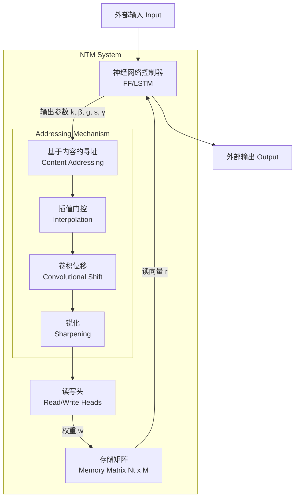

# Neural Turing Machines (NTM) 论文深度解读与复现

## 1. 一句话概述

**Neural Turing Machines (NTM)** 是一种将神经网络控制器与外部可微存储器相结合的计算架构，通过引入注意力机制实现的读写操作，使其能够通过梯度下降算法学习简单的算法程序（如复制、排序）。

## 2. Abstract: 论文试图解决什么问题？有什么贡献？

### 2.1 核心问题：现代机器学习的“记忆”缺失

在本文发表之前（2014年），机器学习领域（尤其是递归神经网络 RNN）虽然在序列建模上表现出色，但缺乏复杂的逻辑流控制（logical flow control）和外部存储能力。标准的 RNN 依赖内部隐藏状态（Hidden State）来维持上下文，这类似于一种“隐式记忆”。然而，这种机制难以处理这就如同让一台计算机只有 CPU 寄存器而没有 RAM，极大地限制了其解决算法任务的能力。

> "Despite its wide-ranging success in modelling complicated data, modern machine learning has largely neglected the use of logical flow control and external memory."
> **解读**：作者指出，尽管 ML 在模式识别上很强，但忽略了计算机科学中两个最根本的要素：逻辑控制和外部存储（即冯·诺依曼架构的核心）。

### 2.2 核心贡献：可微的冯·诺依曼架构

Graves 等人提出了一种类比图灵机或冯·诺依曼架构的系统，但关键在于它是**端到端可微（differentiable end-to-end）**的。

1. **架构创新**：将神经网络（作为控制器）与一个巨大的、可寻址的存储矩阵耦合。
2. **训练机制**：通过定义“模糊”的读写操作（基于注意力机制），使得读写过程对内存地址可导，从而可以使用标准的梯度下降（如 BPTT）进行训练。
3. **实验验证**：证明了 NTM 可以从输入输出示例中推断出简单的算法（如复制序列、优先级排序），并且具备超出训练长度的**泛化能力**。

## 3. Introduction: 论文的动机是什么？逻辑梳理

### 3.1 认知科学的启发：工作记忆

论文首先从认知心理学切入，引入了“工作记忆（Working Memory）”的概念。人类在进行各种思维活动时，通过“中央执行系统”对存储在短时记忆缓冲区的信息进行规则操作。

> "In computational terms, these rules are simple programs, and the stored information constitutes the arguments of these programs."
> **解读**：如果把神经网络看作是大脑皮层，那么 NTM 试图引入海马体或前额叶皮层的功能——快速绑定变量（Rapidly-created variables）并对其进行操作。

### 3.2 现有 RNN 的局限性

虽然理论上 RNN 是图灵完备的（Turing-Complete），但在实践中，让 RNN 模拟复杂程序非常困难。标准的 LSTM 虽然引入了门控机制来改善记忆，但其记忆容量仍然受限于隐藏层神经元的数量，且缺乏结构化的寻址能力。

> "Yet what is possible in principle is not always what is simple in practice."
> **解读**：理论上的可能性不代表工程上的可行性。NTM 旨在通过显式的架构设计（分离计算与存储），降低学习算法任务的难度。

### 3.3 NTM 的设计哲学

NTM 的设计可以看作是**可微的图灵机**。

* **图灵机**：有限状态控制器 + 无限磁带 + 读写头（硬性、离散的移动）。
* **NTM**：神经网络控制器 + 固定大小矩阵 + 读写头（软性、连续的注意力分布）。

关键的“软化”在于：图灵机每一时刻只能读写一个离散位置，而 NTM 通过注意力权重在所有位置上进行加权读写。这使得损失函数可以反向传播通过“读写头”，指导控制器如何移动焦点。

## 4. Method: 解决方案是什么？

NTM 的核心由两个部分组成：**控制器（Controller）和存储器（Memory）**。两者通过**读写头（Heads）**交互。



### 4.1 读操作 (Reading)

假设存储矩阵为 `M_t`（大小 `N x M`），在 `t` 时刻，读写头产生归一化权重向量 `w_t`（长度为 `N`，满足 `\sum_i w_t(i)=1`）。读出向量 `r_t` 是所有存储位置的加权和：


> "which is clearly differentiable with respect to both the memory and the weighting."
> **解读**：这就是注意力机制的标准形式。如果  集中在某个位置，就是“精确读取”；如果分散，就是“模糊读取”。

### 4.2 写操作 (Writing)

写操作借鉴了 LSTM 的设计，分为**擦除（Erase）**和**添加（Add）**两步，以保持信息的稳定性。

1. **擦除**：基于擦除向量  和权重 ，决定在每个位置保留多少信息。


> **解读**：当权重  和擦除信号  都为 1 时，该位置的信息被清零。


2. **添加**：将新的添加向量  写入。


> **解读**：这是加性更新。通过这两步，NTM 可以模拟重写（先擦后加）或累加（只加不擦）。


### 4.3 寻址机制 (Addressing Mechanisms)

这是 NTM 最精妙的部分。控制器如何产生权重 ？论文提出了一套包含四个阶段的寻址系统，结合了“内容寻址”和“位置寻址”。

#### 第一步：基于内容的寻址 (Content-Based Addressing)

寻找与查询向量（Key）相似的记忆内容。使用余弦相似度  和强度参数 ：


> "The content-based system produces a normalised weighting... based on the similarity."
> **解读**：这允许控制器通过“值”来查找信息（例如：“查找值为 x 的位置”），类似于哈希表的查找。

#### 第二步：插值 (Interpolation)

控制器可能不想基于内容查找，而是想保持上一步的焦点（用于后续的位移）。引入插值门 ：


> **解读**： 时完全忽略当前内容匹配，沿用上一时刻权重，这对顺序操作至关重要。

#### 第三步：卷积位移 (Convolutional Shift)

为了实现“磁带”式的顺序移动（如读取下一个位置），引入位移权重 （分布在 -1, 0, 1 之间）。通过循环卷积实现焦点的移动：


> "For example, if the current weighting focuses entirely on a single location, a rotation of 1 would shift the focus to the next location."
> **解读**：这赋予了 NTM 像图灵机一样“左移”或“右移”的能力，是实现循环和序列处理的关键。

#### 第四步：锐化 (Sharpening)

卷积操作会导致权重随着时间变得模糊（弥散）。使用参数  进行锐化：


> **解读**：这能将模糊的分布重新聚焦，防止长时间运行后焦点丢失。

## 5. Experiment: 主实验与分析

### 5.1 复制任务 (Copy Task)

* **任务**：向网络展示一个随机二进制向量序列，随后要求网络重现该序列。
* **设置**：训练长度 1-20，测试长度 120。
* **结果**：
* NTM 学习速度明显快于 LSTM。
* **泛化性**：NTM 在长度 20 训练后，能完美复制长度 120 的序列；而 LSTM 在超过 20 后迅速失败。


> "NTM continues to copy as the length increases, while LSTM rapidly degrades beyond length 20."


* **机制分析**：通过观察读写头权重（Figure 6），发现 NTM 确实学会了类似程序员写的 `while` 循环：先初始化指针，每读/写一步，指针加 1。

### 5.2 重复复制 (Repeat Copy)

* **任务**：输入一个序列和一个标量（重复次数 ），输出该序列  次。
* **结果**：NTM 能够完美学习嵌套函数（Nested function），即在主循环中调用“复制子程序”。
* **缺陷**：虽然能泛化到更多次数，但在计数非常大时无法准确预测结束标记。这是因为标量数值表示难以精确外推。

### 5.3 联想回忆 (Associative Recall)

* **任务**：输入一系列 (Item, Context) 对。查询时给一个 Item，要求输出其后的 Item（类似链表跳转）。
* **结果**：NTM 学习速度极快（约 30k episode），而 LSTM 一百万次也未收敛到零误差。
* **意义**：证明 NTM 能利用内容寻址模拟“指针”和“间接寻址”（Indirection）。

### 5.4 动态 N-Grams 与 优先级排序

* **Dynamic N-Grams**：测试 NTM 是否能作为可重写的查找表来统计频率。结果显示 NTM 能够通过计数模拟最优贝叶斯估计器。
* **Priority Sort**：输入带优先级的向量，要求按优先级排序输出。NTM 优于 LSTM，且观察到它学会了利用优先级来决定写入位置（类似哈希映射），然后顺序读出。

## 6. Numpy 与 Torch 对照实现

### 6.1 代码对应关系说明

提供的 Numpy 代码实现了一个简化版的 NTM 核心组件，主要包含以下模块：

* **Memory 类**：对应论文 3.1 和 3.2 节，实现了  矩阵的初始化、`read`（公式 2）和 `write`（公式 3, 4）。
* **寻址函数**：
* `content_addressing`：对应公式 5, 6（基于内容的注意力）。
* `interpolation`：对应公式 7（门控插值）。
* `convolutional_shift`：对应公式 8（循环卷积）。
* `sharpening`：对应公式 9（锐化分布）。


* **NTMHead 类**：封装了控制器输出到寻址参数（）的映射，并串联了整个寻址流水线（Figure 2）。

**关于数据的假设：**

* **Input Shape**: Numpy 代码是 **Unbatched** 的。例如 `weights` 形状为 `(num_slots,)`。
* **PyTorch 实现策略**: 下方的 Torch 实现将被设计为 **支持 Batch**，即形状为 `(batch_size, num_slots, ...)`，这是深度学习框架的标准用法。我会通过广播机制（Broadcasting）和 `torch.matmul` / `F.conv1d` 来实现高效并行计算。

### 6.2 代码对照 (Code Group)

::: code-group

```python [Numpy]
import numpy as np
import matplotlib.pyplot as plt

np.random.seed(42)
     
# External Memory Matrix
class Memory:
    def __init__(self, num_slots, slot_size):
        """
        External memory bank
        
        num_slots: Number of memory locations (N)
        slot_size: Size of each memory vector (M)
        """
        self.num_slots = num_slots
        self.slot_size = slot_size
        
        # Initialize memory to small random values
        self.memory = np.random.randn(num_slots, slot_size) * 0.01
    
    def read(self, weights):
        """
        Read from memory using attention weights
        
        weights: (num_slots,) attention distribution
        Returns: (slot_size,) weighted combination of memory rows
        """
        return np.dot(weights, self.memory)
    
    def write(self, weights, erase_vector, add_vector):
        """
        Write to memory using erase and add operations
        
        weights: (num_slots,) where to write
        erase_vector: (slot_size,) what to erase
        add_vector: (slot_size,) what to add
        """
        # Erase: M_t = M_{t-1} * (1 - w_t ⊗ e_t)
        erase = np.outer(weights, erase_vector)
        self.memory = self.memory * (1 - erase)
        
        # Add: M_t = M_t + w_t ⊗ a_t
        add = np.outer(weights, add_vector)
        self.memory = self.memory + add
    
    def get_memory(self):
        return self.memory.copy()

# Test memory
memory = Memory(num_slots=8, slot_size=4)
print(f"Memory initialized: {memory.num_slots} slots × {memory.slot_size} dimensions")
print(f"Memory shape: {memory.memory.shape}")
     
# Content-Based Addressing
# Attend to memory locations based on content similarity
def cosine_similarity(u, v):
    """Cosine similarity between vectors"""
    return np.dot(u, v) / (np.linalg.norm(u) * np.linalg.norm(v) + 1e-8)

def softmax(x, beta=1.0):
    """Softmax with temperature beta"""
    x = beta * x
    exp_x = np.exp(x - np.max(x))
    return exp_x / np.sum(exp_x)

def content_addressing(memory, key, beta):
    """
    Content-based addressing
    
    memory: (num_slots, slot_size)
    key: (slot_size,) query vector
    beta: sharpness parameter (> 0)
    
    Returns: (num_slots,) attention weights
    """
    # Compute cosine similarity with each memory row
    similarities = np.array([
        cosine_similarity(key, memory[i]) 
        for i in range(len(memory))
    ])
    
    # Apply softmax with sharpness
    weights = softmax(similarities, beta=beta)
    
    return weights

# Test content addressing
key = np.random.randn(memory.slot_size)
beta = 2.0

weights = content_addressing(memory.memory, key, beta)
print(f"\nContent-based addressing:")
print(f"Key shape: {key.shape}")
print(f"Attention weights: {weights}")
print(f"Sum of weights: {weights.sum():.4f}")

# Visualize
plt.figure(figsize=(10, 4))
plt.bar(range(len(weights)), weights)
plt.xlabel('Memory Slot')
plt.ylabel('Attention Weight')
plt.title('Content-Based Addressing Weights')
plt.show()
     
# Location-Based Addressing
# Shift attention based on relative positions (for sequential access)
def interpolation(weights_content, weights_prev, g):
    """
    Interpolate between content and previous weights
    
    g: gate in [0, 1]
      g=1: use only content weights
      g=0: use only previous weights
    """
    return g * weights_content + (1 - g) * weights_prev

def convolutional_shift(weights, shift_weights):
    """
    Rotate attention weights by shift distribution
    
    shift_weights: distribution over [-1, 0, +1] shifts
    """
    num_slots = len(weights)
    shifted = np.zeros_like(weights)
    
    # Apply each shift
    for shift_idx, shift_amount in enumerate([-1, 0, 1]):
        rolled = np.roll(weights, shift_amount)
        shifted += shift_weights[shift_idx] * rolled
    
    return shifted

def sharpening(weights, gamma):
    """
    Sharpen attention distribution
    
    gamma >= 1: larger values = sharper distribution
    """
    weights = weights ** gamma
    return weights / (np.sum(weights) + 1e-8)

# Test location-based operations
weights_prev = np.array([0.05, 0.1, 0.2, 0.3, 0.2, 0.1, 0.04, 0.01])
weights_content = content_addressing(memory.memory, key, beta=2.0)

# Interpolation
g = 0.7  # Favor content
weights_gated = interpolation(weights_content, weights_prev, g)

# Shift
shift_weights = np.array([0.1, 0.8, 0.1])  # Mostly stay, little shift
weights_shifted = convolutional_shift(weights_gated, shift_weights)

# Sharpen
gamma = 2.0
weights_sharp = sharpening(weights_shifted, gamma)

# Visualize addressing pipeline
fig, axes = plt.subplots(2, 3, figsize=(15, 8))

axes[0, 0].bar(range(len(weights_prev)), weights_prev)
axes[0, 0].set_title('Previous Weights')
axes[0, 0].set_ylim(0, 0.5)

axes[0, 1].bar(range(len(weights_content)), weights_content)
axes[0, 1].set_title('Content Weights')
axes[0, 1].set_ylim(0, 0.5)

axes[0, 2].bar(range(len(weights_gated)), weights_gated)
axes[0, 2].set_title(f'Gated (g={g})')
axes[0, 2].set_ylim(0, 0.5)

axes[1, 0].bar(range(len(shift_weights)), shift_weights, color='orange')
axes[1, 0].set_title('Shift Distribution')
axes[1, 0].set_xticks([0, 1, 2])
axes[1, 0].set_xticklabels(['-1', '0', '+1'])

axes[1, 1].bar(range(len(weights_shifted)), weights_shifted, color='green')
axes[1, 1].set_title('After Shift')
axes[1, 1].set_ylim(0, 0.5)

axes[1, 2].bar(range(len(weights_sharp)), weights_sharp, color='red')
axes[1, 2].set_title(f'Sharpened (γ={gamma})')
axes[1, 2].set_ylim(0, 0.5)

plt.tight_layout()
plt.show()
print(f"\nAddressing pipeline complete!")
     
# Complete NTM Head (Read/Write)
class NTMHead:
    def __init__(self, memory_slots, memory_size, controller_size):
        self.memory_slots = memory_slots
        self.memory_size = memory_size
        
        # Parameters produced by controller
        # Key for content addressing
        self.W_key = np.random.randn(memory_size, controller_size) * 0.1
        
        # Strength (beta)
        self.W_beta = np.random.randn(1, controller_size) * 0.1
        
        # Gate (g)
        self.W_g = np.random.randn(1, controller_size) * 0.1
        
        # Shift weights
        self.W_shift = np.random.randn(3, controller_size) * 0.1
        
        # Sharpening (gamma)
        self.W_gamma = np.random.randn(1, controller_size) * 0.1
        
        # For write head: erase and add vectors
        self.W_erase = np.random.randn(memory_size, controller_size) * 0.1
        self.W_add = np.random.randn(memory_size, controller_size) * 0.1
        
        # Previous weights
        self.weights_prev = np.ones(memory_slots) / memory_slots
    
    def address(self, memory, controller_output):
        """
        Compute addressing weights from controller output
        """
        # Content addressing
        key = np.tanh(np.dot(self.W_key, controller_output))
        beta = np.exp(np.dot(self.W_beta, controller_output))[0] + 1e-4
        weights_content = content_addressing(memory, key, beta)
        
        # Interpolation
        g = 1 / (1 + np.exp(-np.dot(self.W_g, controller_output)))[0]  # sigmoid
        weights_gated = interpolation(weights_content, self.weights_prev, g)
        
        # Shift
        shift_logits = np.dot(self.W_shift, controller_output)
        shift_weights = softmax(shift_logits)
        weights_shifted = convolutional_shift(weights_gated, shift_weights)
        
        # Sharpen
        gamma = np.exp(np.dot(self.W_gamma, controller_output))[0] + 1.0
        weights = sharpening(weights_shifted, gamma)
        
        self.weights_prev = weights
        return weights
    
    def read(self, memory, weights):
        """Read from memory"""
        return memory.read(weights)
    
    def write(self, memory, weights, controller_output):
        """Write to memory"""
        erase = 1 / (1 + np.exp(-np.dot(self.W_erase, controller_output)))  # sigmoid
        add = np.tanh(np.dot(self.W_add, controller_output))
        memory.write(weights, erase, add)

print("NTM Head created with full addressing mechanism")
     
# Test Task: Copy Sequence
# Classic NTM task: copy a sequence from input to output
# Simple copy task
memory = Memory(num_slots=8, slot_size=4)
controller_size = 16
head = NTMHead(memory.num_slots, memory.slot_size, controller_size)

# Input sequence
sequence = [
    np.array([1, 0, 0, 0]),
    np.array([0, 1, 0, 0]),
    np.array([0, 0, 1, 0]),
    np.array([0, 0, 0, 1]),
]

# Write phase: store sequence in memory
memory_states = [memory.get_memory()]
write_weights_history = []

for i, item in enumerate(sequence):
    # Simulate controller output (random for demo)
    controller_out = np.random.randn(controller_size)
    
    # Get write weights
    weights = head.address(memory.memory, controller_out)
    write_weights_history.append(weights)
    
    # Write to memory
    head.write(memory, weights, controller_out)
    memory_states.append(memory.get_memory())

# Visualize write process
fig, axes = plt.subplots(1, len(sequence) + 1, figsize=(16, 4))

# Initial memory
axes[0].imshow(memory_states[0], cmap='RdBu', aspect='auto')
axes[0].set_title('Initial Memory')
axes[0].set_ylabel('Memory Slot')
axes[0].set_xlabel('Dimension')

# After each write
for i in range(len(sequence)):
    axes[i+1].imshow(memory_states[i+1], cmap='RdBu', aspect='auto')
    axes[i+1].set_title(f'After Write {i+1}')
    axes[i+1].set_xlabel('Dimension')

plt.tight_layout()
plt.suptitle('Memory Evolution During Write', y=1.05)
plt.show()

# Show write attention patterns
write_weights = np.array(write_weights_history).T

plt.figure(figsize=(10, 6))
plt.imshow(write_weights, cmap='viridis', aspect='auto')
plt.colorbar(label='Write Weight')
plt.xlabel('Write Step')
plt.ylabel('Memory Slot')
plt.title('Write Attention Patterns')
plt.show()

print(f"\nWrote {len(sequence)} items to memory")

```

```python [Torch]
import torch
import torch.nn as nn
import torch.nn.functional as F

# Torch 实现：支持 Batch 维度 (Batch, Slots, Features)
# 对应 Numpy 代码中的 Memory 和所有 Addressing 操作

class NTMMemory(nn.Module):
    def __init__(self, num_slots, slot_size, batch_size):
        super().__init__()
        self.num_slots = num_slots
        self.slot_size = slot_size
        self.batch_size = batch_size
        
        # 对应 Numpy: self.memory = np.random.randn(...) * 0.01
        # Torch 中我们通常将其注册为 buffer（非参数状态）或 Parameter（如果是可学习初始状态）
        # Shape: (Batch, N, M)
        self.register_buffer('memory', torch.randn(batch_size, num_slots, slot_size) * 0.01)

    def read(self, weights):
        """
        weights: (Batch, N)
        Returns: (Batch, M)
        对应 Numpy: np.dot(weights, self.memory)
        """
        # Batch Matrix Multiplication: (B, 1, N) @ (B, N, M) -> (B, 1, M) -> squeeze
        return torch.bmm(weights.unsqueeze(1), self.memory).squeeze(1)

    def write(self, weights, erase_vector, add_vector):
        """
        weights: (Batch, N)
        erase_vector: (Batch, M)
        add_vector: (Batch, M)
        """
        # 对应 Numpy Erase: outer(weights, erase_vector)
        # Torch Batch Outer: (B, N, 1) * (B, 1, M) -> (B, N, M)
        erase = weights.unsqueeze(2) * erase_vector.unsqueeze(1)
        self.memory = self.memory * (1 - erase)
        
        # 对应 Numpy Add: outer(weights, add_vector)
        add = weights.unsqueeze(2) * add_vector.unsqueeze(1)
        self.memory = self.memory + add

    def get_memory(self):
        return self.memory.clone()

# Addressing Functions (Functional Style)

def cosine_similarity_batch(memory, key):
    """
    memory: (B, N, M)
    key: (B, M)
    Returns: (B, N)
    对应 Numpy: content_addressing 中的循环 + cosine_similarity
    """
    key = key.unsqueeze(1) # (B, 1, M)
    # Cosine Similarity along dim=2
    return F.cosine_similarity(memory, key, dim=2, eps=1e-8)

def content_addressing(memory, key, beta):
    """
    memory: (B, N, M)
    key: (B, M)
    beta: (B, 1)
    """
    similarities = cosine_similarity_batch(memory, key) # (B, N)
    # 对应 Numpy: softmax(similarities * beta)
    return F.softmax(similarities * beta, dim=1)

def interpolation(weights_content, weights_prev, g):
    """
    g: (B, 1)
    对应 Numpy: g * content + (1-g) * prev
    """
    return g * weights_content + (1 - g) * weights_prev

def convolutional_shift(weights, shift_weights):
    """
    weights: (B, N)
    shift_weights: (B, 3) -> [-1, 0, 1]
    对应 Numpy: convolutional_shift 使用 np.roll
    Torch 实现：使用循环以保持可读性（等价于 Numpy 逻辑），或者使用 conv1d
    """
    batch_size, num_slots = weights.shape
    shifted_weights = torch.zeros_like(weights)
    
    # 这里为了完全对应 Numpy 的 [-1, 0, 1] 逻辑，我们使用手动 roll
    # 注意：Torch 的 roll 是可微的
    
    # Shift -1 (Left)
    shifted_weights += shift_weights[:, 0:1] * torch.roll(weights, shifts=-1, dims=1)
    # Shift 0 (Stay)
    shifted_weights += shift_weights[:, 1:2] * weights
    # Shift +1 (Right)
    shifted_weights += shift_weights[:, 2:3] * torch.roll(weights, shifts=1, dims=1)
    
    return shifted_weights

def sharpening(weights, gamma):
    """
    gamma: (B, 1)
    对应 Numpy: weights ** gamma / sum
    """
    w_sharp = weights ** gamma
    w_sum = torch.sum(w_sharp, dim=1, keepdim=True) + 1e-8
    return w_sharp / w_sum

# NTM Head Module
class NTMHead(nn.Module):
    def __init__(self, memory_slots, memory_size, controller_size):
        super().__init__()
        # 对应 Numpy: 初始化 W_key, W_beta 等
        # 在 Torch 中用 Linear 层生成这些参数更自然，
        # 但为了对应 Numpy 的结构，我们保留分离的参数生成层
        
        self.fc_key = nn.Linear(controller_size, memory_size)
        self.fc_beta = nn.Linear(controller_size, 1)
        self.fc_g = nn.Linear(controller_size, 1)
        self.fc_shift = nn.Linear(controller_size, 3)
        self.fc_gamma = nn.Linear(controller_size, 1)
        
        # Write specific
        self.fc_erase = nn.Linear(controller_size, memory_size)
        self.fc_add = nn.Linear(controller_size, memory_size)
        
        # State: Previous weights (Batch, N)
        # 这里的初始化通常在 forward 开始时重置，这里简化处理
        self.register_buffer('weights_prev', torch.zeros(1, memory_slots))

    def init_weights(self, batch_size):
        # 对应 Numpy: np.ones / slots
        self.weights_prev = torch.ones(batch_size, self.weights_prev.shape[1]).to(self.fc_key.weight.device) \
                            / self.weights_prev.shape[1]

    def address(self, memory_tensor, controller_output):
        """
        controller_output: (B, controller_size)
        """
        # 1. Content Addressing
        key = torch.tanh(self.fc_key(controller_output))
        # Softplus 确保 beta > 0 (Numpy 用的 exp)
        beta = F.softplus(self.fc_beta(controller_output)) 
        
        w_c = content_addressing(memory_tensor, key, beta)
        
        # 2. Interpolation
        g = torch.sigmoid(self.fc_g(controller_output))
        w_g = interpolation(w_c, self.weights_prev, g)
        
        # 3. Shift
        s = F.softmax(self.fc_shift(controller_output), dim=1)
        w_s = convolutional_shift(w_g, s)
        
        # 4. Sharpening
        # Gamma >= 1 (Numpy: exp + 1)
        gamma = F.softplus(self.fc_gamma(controller_output)) + 1.0
        w = sharpening(w_s, gamma)
        
        self.weights_prev = w
        return w

    def write(self, memory_obj, weights, controller_output):
        erase = torch.sigmoid(self.fc_erase(controller_output))
        add = torch.tanh(self.fc_add(controller_output))
        memory_obj.write(weights, erase, add)

# 简单测试 (Mocking the Copy Task Loop)
if __name__ == "__main__":
    B, N, M, C = 2, 8, 4, 16 # Batch=2
    memory = NTMMemory(N, M, B)
    head = NTMHead(N, M, C)
    head.init_weights(B)
    
    # Dummy input
    controller_out = torch.randn(B, C)
    
    # Run one step
    w = head.address(memory.memory, controller_out)
    head.write(memory, w, controller_out)
    
    print("Torch NTM Step Complete.")
    print("Memory Shape:", memory.get_memory().shape)
    print("Weight Shape:", w.shape)

```

:::

### 6.3 对照讲解与易错点分析

1. **Batch 维度的处理 (Semantics)**：
* **Numpy**: 代码是针对单样本的，例如 `weights` 是 `(N,)`，`memory` 是 `(N, M)`。`np.dot` 直接处理向量点积。
* **Torch**: 深度学习必须支持 Batch。因此 `memory` 变为 `(Batch, N, M)`。原本的点积操作变成了 `torch.bmm` (Batch Matrix Multiply) 或者带有 `unsqueeze` 的广播乘法。
* **易错点**: 在实现 `cosine_similarity` 时，如果直接用 `torch.matmul` 可能会混淆维度，推荐使用 `F.cosine_similarity(..., dim=2)` 明确指定在特征维度上计算。


2. **外积 (Outer Product) 的广播实现**:
* **Numpy**: 使用 `np.outer(weights, vector)` 得到 `(N, M)` 矩阵。
* **Torch**: 没有直接的 `batch_outer` 函数。通常使用 `weights.unsqueeze(2) * vector.unsqueeze(1)`，即 `(B, N, 1) * (B, 1, M)` -> `(B, N, M)` 的广播乘法来实现。这是实现 Erase/Add 操作最高效的方法。


3. **卷积位移 (Convolutional Shift)**:
* **Numpy**: 使用了 Python 的 `for` 循环配合 `np.roll`。
* **Torch**: 虽然可以使用 `F.conv1d` (设置 kernel 为 shift weights)，但为了保持与 Numpy 逻辑的直观对应，代码中使用了 `torch.roll`。需要注意 `torch.roll` 在计算图中是完全可导的。如果 shift 范围很大（不仅仅是 -1, 0, 1），使用 FFT 或 `F.conv1d` 会更高效。


4. **数值稳定性**:
* **Softmax**: Numpy 代码中手动实现了 `exp(x - max)` 的稳定版本。PyTorch 的 `F.softmax` 内部已经做了这种数值稳定性优化。
* **Sharpening**: 涉及幂运算 `pow`。当权重非常小且 `gamma` 很大时，可能会出现下溢。PyTorch 实现中加了 `eps=1e-8` 来防止除零，这在训练 NTM 时非常关键，否则 loss 容易出现 NaN。

<!-- AUTO_PDF_IMAGES_START -->

## 论文原图（PDF）
> 下图自动抽取自原论文 PDF，用于补充概念、结构和实验细节。
> 来源：`20.pdf`


*图 1：建议结合本节 `可微外部记忆` 一起阅读。*


*图 2：建议结合本节 `可微外部记忆` 一起阅读。*


*图 3：建议结合本节 `可微外部记忆` 一起阅读。*

<!-- AUTO_PDF_IMAGES_END -->

<!-- AUTO_INTERVIEW_QA_START -->

## 面试题与答案
> 主题：**Neural Turing Machine**（围绕 `可微外部记忆`）

### 一、选择题（10题）

1. 在 Neural Turing Machine 中，最关键的建模目标是什么？
   - A. 可微外部记忆
   - B. read head
   - C. write head
   - D. addressing
   - **答案：A**

2. 下列哪一项最直接对应 Neural Turing Machine 的核心机制？
   - A. read head
   - B. write head
   - C. addressing
   - D. memory matrix
   - **答案：B**

3. 在复现 Neural Turing Machine 时，优先要保证哪项一致性？
   - A. 只看最终分数
   - B. 只看训练集表现
   - C. 实现与论文设置对齐
   - D. 忽略随机种子
   - **答案：C**

4. 对于 Neural Turing Machine，哪个指标最能反映方法有效性？
   - A. 主指标与分组指标
   - B. 只看单次结果
   - C. 只看速度
   - D. 只看参数量
   - **答案：A**

5. 当 Neural Turing Machine 模型出现效果退化时，首要检查项是什么？
   - A. 数据与标签管线
   - B. 先增大模型十倍
   - C. 随机改损失函数
   - D. 删除验证集
   - **答案：A**

6. Neural Turing Machine 与传统 baseline 的主要差异通常体现在？
   - A. 归纳偏置与结构设计
   - B. 仅参数更多
   - C. 仅训练更久
   - D. 仅学习率更小
   - **答案：A**

7. 若要提升 Neural Turing Machine 的泛化能力，最稳妥的做法是？
   - A. 正则化+消融验证
   - B. 只堆数据不复核
   - C. 关闭评估脚本
   - D. 取消对照组
   - **答案：A**

8. 关于 Neural Turing Machine 的实验设计，下列说法更合理的是？
   - A. 固定变量做可复现实验
   - B. 同时改十个超参
   - C. 只展示最好一次
   - D. 省略失败实验
   - **答案：A**

9. 在工程部署中，Neural Turing Machine 的常见风险是？
   - A. 数值稳定与漂移
   - B. 只关心GPU利用率
   - C. 日志越少越好
   - D. 不做回归测试
   - **答案：A**

10. 回到论文主张，Neural Turing Machine 最不应该被误解为？
   - A. 可替代所有任务
   - B. 有明确适用边界
   - C. 不需要数据质量
   - D. 不需要误差分析
   - **答案：B**


### 二、代码题（10题，含参考答案）

1. 实现一个最小可运行的数据预处理函数，输出可用于 Neural Turing Machine 训练的批次。
   - 参考答案：
     ```python
     import numpy as np
     
     def make_batch(x, y, batch_size=32):
         idx = np.random.choice(len(x), batch_size, replace=False)
         return x[idx], y[idx]
     ```

2. 实现 Neural Turing Machine 的核心前向步骤（简化版），并返回中间张量。
   - 参考答案：
     ```python
     import numpy as np
     
     def forward_core(x, w, b):
         z = x @ w + b
         h = np.tanh(z)
         return h, {"z": z, "h": h}
     ```

3. 写一个训练 step：前向、loss、反向、更新。
   - 参考答案：
     ```python
     def train_step(model, optimizer, criterion, xb, yb):
         optimizer.zero_grad()
         pred = model(xb)
         loss = criterion(pred, yb)
         loss.backward()
         optimizer.step()
         return float(loss.item())
     ```

4. 实现一个评估函数，返回主指标与一个辅助指标。
   - 参考答案：
     ```python
     import numpy as np
     
     def evaluate(y_true, y_pred):
         acc = (y_true == y_pred).mean()
         err = 1.0 - acc
         return {"acc": float(acc), "err": float(err)}
     ```

5. 实现梯度裁剪与学习率调度的训练循环（简化版）。
   - 参考答案：
     ```python
     import torch
     
     def train_loop(model, loader, optimizer, criterion, scheduler=None, clip=1.0):
         model.train()
         for xb, yb in loader:
             optimizer.zero_grad()
             loss = criterion(model(xb), yb)
             loss.backward()
             torch.nn.utils.clip_grad_norm_(model.parameters(), clip)
             optimizer.step()
             if scheduler is not None:
                 scheduler.step()
     ```

6. 实现 ablation 开关：可切换是否启用 `read head`。
   - 参考答案：
     ```python
     def forward_with_ablation(x, module, use_feature=True):
         if use_feature:
             return module(x)
         return x
     ```

7. 实现一个鲁棒的数值稳定 softmax / logsumexp 工具函数。
   - 参考答案：
     ```python
     import numpy as np
     
     def stable_softmax(x, axis=-1):
         x = x - np.max(x, axis=axis, keepdims=True)
         ex = np.exp(x)
         return ex / np.sum(ex, axis=axis, keepdims=True)
     ```

8. 写一个小型单元测试，验证 `write head` 相关张量形状正确。
   - 参考答案：
     ```python
     def test_shape(out, expected_last_dim):
         assert out.ndim >= 2
         assert out.shape[-1] == expected_last_dim
     ```

9. 实现模型推理包装器，支持 batch 输入并返回结构化结果。
   - 参考答案：
     ```python
     def infer(model, xb):
         logits = model(xb)
         pred = logits.argmax(dim=-1)
         return {"pred": pred, "logits": logits}
     ```

10. 实现一个实验记录器，保存超参、指标和随机种子。
   - 参考答案：
     ```python
     import json
     from pathlib import Path
     
     def save_run(path, cfg, metrics, seed):
         payload = {"cfg": cfg, "metrics": metrics, "seed": seed}
         Path(path).write_text(json.dumps(payload, ensure_ascii=False, indent=2))
     ```


<!-- AUTO_INTERVIEW_QA_END -->

