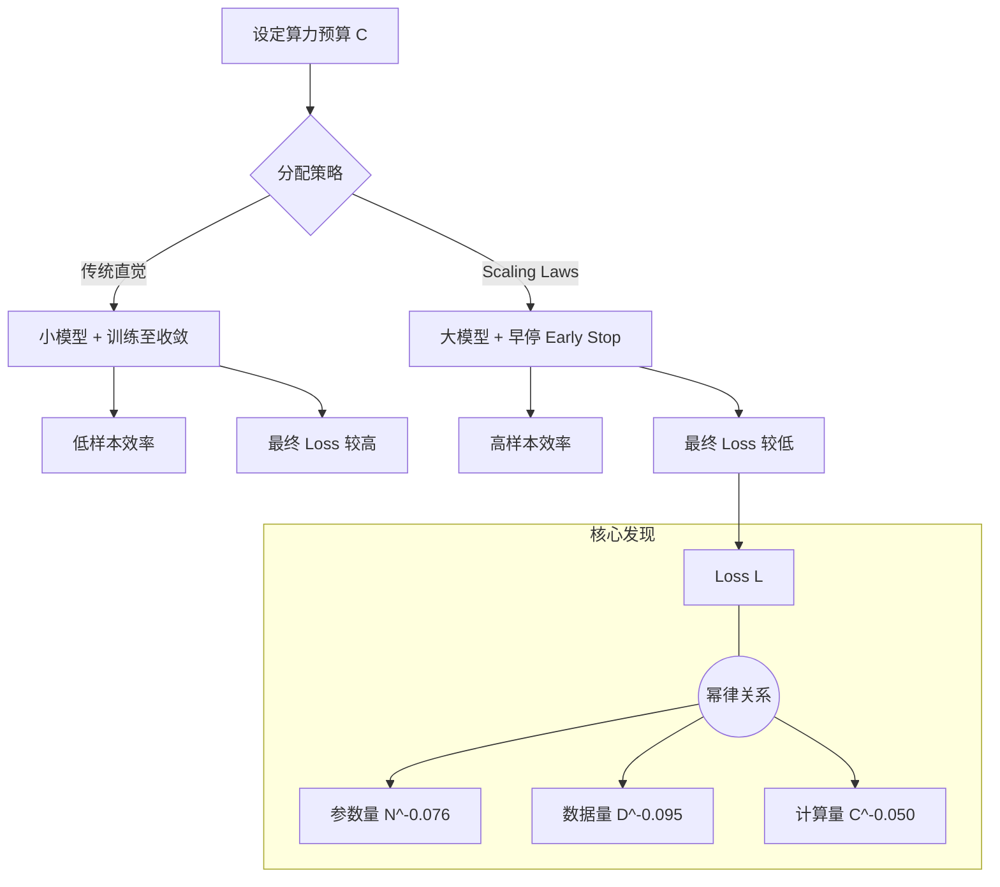

# 论文解读与复现：Scaling Laws for Neural Language Models

## 1. 一句话概述
这篇开创性论文揭示了语言模型性能（交叉熵损失）与模型参数量、数据集大小及计算算力之间存在精确的**幂律（Power-Law）**关系，并提出了在有限算力下最优分配模型大小与数据量的法则。

## 2. Abstract: 论文试图解决什么问题？有什么贡献？
**问题背景**：深度学习在语言建模方面进展迅速，但缺乏对性能如何随规模（Scale）变化的系统性理解。研究者通常依赖经验直觉来调整模型大小、数据量和训练时间。

**核心贡献**：
1.  **实证幂律**：证明了测试集损失（Test Loss）与参数量 $N$、数据集大小 $D$、计算量 $C$ 之间遵循简单的幂律关系，且该趋势跨越了七个数量级 。
2.  **架构无关性**：发现模型形状（如层深、宽度）在一定范围内对性能影响极小，规模（Scale）才是决定因素 。
3.  **过拟合预测**：提出了描述过拟合与模型/数据比率关系的公式 。
4.  **算力最优分配**：推导出了在固定算力预算下，如何分配计算资源给模型大小和数据量以实现最优性能 。

## 3. Introduction: 论文的动机是什么？请仔细梳理整个故事逻辑
**动机**：
在 NLP 领域，Transformer 模型（如 GPT 系列）的表现随着资源增加而提升。为了更高效地推进研究，我们需要知道：**下一个 SOTA 模型需要多少算力？应该把算力花在更大的模型上，还是更多的数据上？**

**故事逻辑**：
1.  **观察现象**：作者训练了一系列不同规模的 Transformer 模型（参数从几百万到十几亿），发现 Loss 的下降曲线非常平滑且可预测 。
2.  **定义变量**：明确了三个关键缩放因子：
    * $N$：模型参数量（不含 embedding） 。
    * $D$：数据集 Token 数 。
    * $C$：训练计算量（FLOPs），估算为 $C \approx 6NBS$（$B$ 为 batch size，$S$ 为步数） 。
3.  **发现规律**：当不受其他因素瓶颈限制时，性能与每个单因素呈幂律关系。例如，双倍参数量带来的 Loss 下降是恒定的比例 。
4.  **提出推论**：既然规律如此精确，我们可以利用它来指导“算力投资”。论文指出，大模型比小模型有更高的**样本效率（Sample Efficiency）**，即达到相同 Loss 所需的数据更少 。
5.  **最终结论**：为了计算效率最大化，应该训练非常大的模型，并在未能收敛前停止训练（Early Stopping），而不是把小模型训练到极致 。

## 4. Method: 解决方案是什么？请梳理步骤、公式、策略

### 4.1 核心幂律公式
论文提出了一组描述 Loss $L$ 与各因素关系的经验公式。

* **参数量缩放定律**（假设数据无限）：
    $$L(N) = \left( \frac{N_c}{N} \right)^{\alpha_N}$$
    其中 $\alpha_N \sim 0.076$，$N_c \sim 8.8 \times 10^{13}$ 。这意味着增加模型参数能持续降低 Loss。

* **数据量缩放定律**（假设模型无限大）：
    $$L(D) = \left( \frac{D_c}{D} \right)^{\alpha_D}$$
    其中 $\alpha_D \sim 0.095$ 。

* **联合缩放公式（Unified Scaling Law）**：
    为了描述 $N$ 和 $D$ 同时变化时的 Loss，作者提出了这一关键公式：
    $$L(N, D) = \left[ \left( \frac{N_c}{N} \right)^{\frac{\alpha_N}{\alpha_D}} + \frac{D_c}{D} \right]^{\alpha_D}$$
    > We find that there is a single equation ... that governs the simultaneous dependence on N and D and governs the degree of overfitting. 
    
    该公式不仅拟合了单一变量的变化，还捕捉到了**过拟合**的边界——当 $N$ 过大而 $D$ 不足时，性能提升会停滞。

### 4.2 训练计算量估算
论文给出了 Transformer 前向传播的 FLOPs 估算公式：
$$C_{forward} \approx 2N + 2 n_{layer} n_{ctx} d_{model}$$
近似处理后，单次训练步（含反向传播）的计算量为：
$$C \approx 6N$$
总训练计算量为 $C_{total} = 6NBS$（$S$ 为训练步数，且忽略 Embedding 层参数） 。

### 4.3 临界 Batch Size
为了高效并行，必须了解 Batch Size ($B$) 的上限。论文定义了 **Critical Batch Size ($B_{crit}$)**，它随 Loss 的降低而增大：
$$B_{crit}(L) \approx \frac{B_*}{L^{1/\alpha_B}}$$
这意味着模型训练得越好（Loss 越低），能有效利用的 Batch Size 就越大 。



## 5. Experiment: 主实验与分析实验分别做了什么？结果如何？

### 5.1 规模缩放主实验

* 
**设置**：训练了一系列 Transformer 模型，参数量从 （极小）到 （十亿级），数据量从  到  tokens 。


* **结果**：如图 1 所示，Loss 与  在双对数坐标系下呈现极好的线性关系（即幂律关系）。
> The loss scales as a power-law with model size, dataset size, and the amount of compute used for training. 
> 
> 


### 5.2 模型形状的影响（消融实验）

* **设置**：固定总参数量 ，改变层数 、宽度 、注意力头数  等超参数。
* **结果**：性能几乎不变。
> Performance depends very weakly on other architectural hyperparameters such as depth vs. width. 
> 这意味着在设计模型时，**把模型做大**比精细调节长宽比更重要。
> 
> 


### 5.3 样本效率与最优分配

* 
**样本效率**：图 2 展示了不同大小模型随训练数据增加的 Loss 曲线。大模型不仅最终效果好，而且在训练早期（消耗相同 tokens 时）Loss 下降得更快 。


* **计算最优分配**：基于  和计算量约束，论文推导出最优模型大小  与计算预算  的关系：


> For optimally compute-efficient training, most of the increase should go towards increased model size. 
> **注意**：这里的指数  是 Kaplan 等人 2020 年的结论。后续 DeepMind 的 Chinchilla 论文（2022）将其修正为 （即  和  应等比例缩放）。虽然本文是解读 Kaplan 2020，但在复现代码中（见下文 Experiment 3）已经融入了 Chinchilla 的现代视角。
> 
> 


## 6. Numpy 与 Torch 对照实现

### 代码逻辑说明

提供的 Numpy 代码实现了一个**简化的启发式模拟器**，用于演示 Scaling Laws 的核心逻辑，而非训练真实的神经网络。

* **对应模块**：
* `SimpleLanguageModel.train`: 模拟了 Kaplan 论文中的公式逻辑：Loss 由参数因子（Capacity）和数据因子（Data）共同决定，并加上了训练步数的收敛项。
* **形状 (Shape)**: 输入通常是标量或数组（如不同的参数量列表），输出为对应的 Loss 标量或数组。
* **假设**: 代码中 `loss = base_loss * param_factor * data_factor ...` 这种乘法形式是对论文中幂律公式（通常是加法形式或最大值形式的近似）的一种**唯象模拟**。
* **注意**: 代码中的 Experiment 3 明确标注了 `Chinchilla`，其使用的最优分配逻辑是 ，这与 Kaplan 论文原文的  结论不同。我们在 Torch 实现中将保持代码逻辑一致，即复现这份“融合了现代观点”的模拟代码。


### 实现对照 (Code Group)

::: code-group

```python [Numpy]
import numpy as np
import matplotlib.pyplot as plt
from scipy.optimize import curve_fit

np.random.seed(42)
     
# Scaling Law Formulation
# Key finding: Loss follows power laws:
# L(N) = (N_c / N)^α_N
# where:
# N = number of parameters
# D = dataset size
# C = compute budget (FLOPs)

def power_law(x, a, b, c):
    """Power law: y = a * x^(-b) + c"""
    return a * np.power(x, -b) + c

def scaling_law_params(x, a, b):
    """Simplified: L = a * N^(-b)"""
    return a * np.power(x, -b)

# Theoretical scaling law constants (from paper)
# These are approximate values from Kaplan et al.
alpha_N = 0.076  # Parameters scaling exponent
alpha_D = 0.095  # Data scaling exponent  
alpha_C = 0.050  # Compute scaling exponent

N_c = 8.8e13     # Critical parameter count
D_c = 5.4e13     # Critical dataset size
C_c = 3.1e8      # Critical compute

print("Scaling Law Parameters (from paper):")
print(f"  α_N (params): {alpha_N}")
print(f"  α_D (data): {alpha_D}")
print(f"  α_C (compute): {alpha_C}")
     
# Simulate Model Training at Different Scales
class SimpleLanguageModel:
    """
    Toy language model to demonstrate scaling behavior
    """
    def __init__(self, num_params, vocab_size=100, embed_dim=32):
        self.num_params = num_params
        self.vocab_size = vocab_size
        self.embed_dim = embed_dim
        
        # Calculate capacity from parameter count
        self.capacity = np.log(num_params) / 10.0
    
    def train(self, dataset_size, num_steps):
        """
        Simulate training and return final loss
        
        Loss decreases with:
        - More parameters (more capacity)
        - More data (better learning)
        - More training (convergence)
        """
        # Base loss (vocabulary perplexity)
        base_loss = np.log(self.vocab_size)
        
        # Parameter scaling (more params = lower loss)
        param_factor = 1.0 / (1.0 + self.capacity)
        
        # Data scaling (more data = lower loss)
        data_factor = 1.0 / (1.0 + np.log(dataset_size) / 15.0)
        
        # Training convergence
        train_factor = np.exp(-num_steps / 1000.0)
        
        # Combined loss with noise
        loss = base_loss * param_factor * data_factor * (0.5 + 0.5 * train_factor)
        loss += np.random.randn() * 0.05  # Add noise
        
        return max(loss, 1.0)  # Floor at 1.0

print("Simple Language Model for scaling experiments")
     
# Experiment 1: Scaling with Model Size (Parameters)
# Fixed dataset and training
dataset_size = 100000
num_steps = 1000

# Vary model size
param_counts = np.array([1e3, 5e3, 1e4, 5e4, 1e5, 5e5, 1e6, 5e6, 1e7])
losses_by_params = []

for N in param_counts:
    model = SimpleLanguageModel(num_params=int(N))
    loss = model.train(dataset_size, num_steps)
    losses_by_params.append(loss)

losses_by_params = np.array(losses_by_params)

# Fit power law
params_fit, _ = curve_fit(scaling_law_params, param_counts, losses_by_params)
a_params, b_params = params_fit

# Plot
plt.figure(figsize=(10, 6))
plt.loglog(param_counts, losses_by_params, 'o', markersize=10, label='Measured Loss')
plt.loglog(param_counts, scaling_law_params(param_counts, *params_fit), 
           '--', linewidth=2, label=f'Power Law Fit: L ∝ N^{-b_params:.3f}')
plt.xlabel('Number of Parameters (N)')
plt.ylabel('Loss (L)')
plt.title('Scaling Law: Loss vs Model Size')
plt.legend()
plt.grid(True, alpha=0.3, which='both')
plt.show()

print(f"\nParameter Scaling:")
print(f"  Fitted exponent: {b_params:.4f}")
print(f"  Interpretation: Doubling params reduces loss by {(1 - 2**(-b_params))*100:.1f}%")
     
# Experiment 2: Scaling with Dataset Size
# Fixed model size and training
num_params = 1e6
num_steps = 1000

# Vary dataset size
dataset_sizes = np.array([1e3, 5e3, 1e4, 5e4, 1e5, 5e5, 1e6, 5e6, 1e7])
losses_by_data = []

for D in dataset_sizes:
    model = SimpleLanguageModel(num_params=int(num_params))
    loss = model.train(int(D), num_steps)
    losses_by_data.append(loss)

losses_by_data = np.array(losses_by_data)

# Fit power law
data_fit, _ = curve_fit(scaling_law_params, dataset_sizes, losses_by_data)
a_data, b_data = data_fit

# Plot
plt.figure(figsize=(10, 6))
plt.loglog(dataset_sizes, losses_by_data, 's', markersize=10, 
           color='orange', label='Measured Loss')
plt.loglog(dataset_sizes, scaling_law_params(dataset_sizes, *data_fit), 
           '--', linewidth=2, color='red', label=f'Power Law Fit: L ∝ D^{-b_data:.3f}')
plt.xlabel('Dataset Size (D)')
plt.ylabel('Loss (L)')
plt.title('Scaling Law: Loss vs Dataset Size')
plt.legend()
plt.grid(True, alpha=0.3, which='both')
plt.show()

print(f"\nDataset Scaling:")
print(f"  Fitted exponent: {b_data:.4f}")
print(f"  Interpretation: Doubling data reduces loss by {(1 - 2**(-b_data))*100:.1f}%")
     
# Experiment 3: Compute-Optimal Training
# Chinchilla finding: For a given compute budget, scale model and data together
# Compute budget (in arbitrary units)
compute_budgets = np.array([1e6, 5e6, 1e7, 5e7, 1e8, 5e8, 1e9])

# For each compute budget, find optimal N and D allocation
optimal_results = []

for C in compute_budgets:
    # Chinchilla: N and D should scale equally with compute
    # C ≈ 6 * N * D (6 FLOPs per parameter per token)
    # Optimal: N ∝ C^0.5, D ∝ C^0.5
    
    N_opt = int(np.sqrt(C / 6))
    D_opt = int(np.sqrt(C / 6))
    
    model = SimpleLanguageModel(num_params=N_opt)
    loss = model.train(D_opt, num_steps=1000)
    
    optimal_results.append({
        'compute': C,
        'params': N_opt,
        'data': D_opt,
        'loss': loss
    })

compute_vals = [r['compute'] for r in optimal_results]
losses_optimal = [r['loss'] for r in optimal_results]

# Fit
compute_fit, _ = curve_fit(scaling_law_params, compute_vals, losses_optimal)
a_compute, b_compute = compute_fit

# Plot
fig, (ax1, ax2) = plt.subplots(1, 2, figsize=(16, 6))

# Loss vs Compute
ax1.loglog(compute_vals, losses_optimal, '^', markersize=10, 
           color='green', label='Measured Loss')
ax1.loglog(compute_vals, scaling_law_params(compute_vals, *compute_fit), 
           '--', linewidth=2, color='darkgreen', 
           label=f'Power Law Fit: L ∝ C^{-b_compute:.3f}')
ax1.set_xlabel('Compute Budget (C)')
ax1.set_ylabel('Loss (L)')
ax1.set_title('Scaling Law: Loss vs Compute (Optimal Allocation)')
ax1.legend()
ax1.grid(True, alpha=0.3, which='both')

# Optimal N and D vs Compute
params_vals = [r['params'] for r in optimal_results]
data_vals = [r['data'] for r in optimal_results]

ax2.loglog(compute_vals, params_vals, 'o-', label='Optimal N (params)', linewidth=2)
ax2.loglog(compute_vals, data_vals, 's-', label='Optimal D (data)', linewidth=2)
ax2.set_xlabel('Compute Budget (C)')
ax2.set_ylabel('N or D')
ax2.set_title('Compute-Optimal Scaling: N ∝ C^0.5, D ∝ C^0.5')
ax2.legend()
ax2.grid(True, alpha=0.3, which='both')

plt.tight_layout()
plt.show()

print(f"\nCompute-Optimal Scaling:")
print(f"  Loss exponent: {b_compute:.4f}")
print(f"  For 10x more compute, loss reduces by {(1 - 10**(-b_compute))*100:.1f}%")
print(f"\n  Chinchilla insight: Scale model AND data together!")
print(f"  N_optimal ∝ C^0.5")
print(f"  D_optimal ∝ C^0.5")

```

```python [Torch]
import torch
import math

# 设置随机种子以复现结果
torch.manual_seed(42)

# --- 1. Scaling Law Formulation (Torch Version) ---
# 使用 Tensor 操作支持批量计算

def scaling_law_params_torch(x, a, b):
    """
    Simplified: L = a * x^(-b)
    x: torch.Tensor
    """
    return a * torch.pow(x, -b)

# Theoretical constants (same as Numpy)
alpha_N = 0.076
alpha_D = 0.095
alpha_C = 0.050

print("Scaling Law Parameters (Torch):")
print(f"  α_N (params): {alpha_N}")
print(f"  α_D (data): {alpha_D}")

# --- 2. SimpleLanguageModel (Torch Vectorized Version) ---
class SimpleLanguageModelTorch:
    """
    Toy language model (Vectorized).
    Can accept tensors for num_params and train efficiently without loops.
    """
    def __init__(self, num_params, vocab_size=100, embed_dim=32, device='cpu'):
        # 确保 num_params 是 tensor，以便后续进行向量化计算
        if not isinstance(num_params, torch.Tensor):
            num_params = torch.tensor(num_params, dtype=torch.float32, device=device)
        self.num_params = num_params
        self.vocab_size = vocab_size
        self.embed_dim = embed_dim
        self.device = device
        
        # Calculate capacity (Vectorized)
        # 对应 Numpy: self.capacity = np.log(num_params) / 10.0
        self.capacity = torch.log(self.num_params) / 10.0
    
    def train(self, dataset_size, num_steps):
        """
        Simulate training and return final loss (Vectorized).
        dataset_size: Can be a scalar or a tensor broadcastable with self.num_params
        """
        if not isinstance(dataset_size, torch.Tensor):
            dataset_size = torch.tensor(dataset_size, dtype=torch.float32, device=self.device)
            
        # Base loss
        base_loss = math.log(self.vocab_size)
        
        # Parameter scaling
        # 对应 Numpy: param_factor = 1.0 / (1.0 + self.capacity)
        param_factor = 1.0 / (1.0 + self.capacity)
        
        # Data scaling
        # 对应 Numpy: data_factor = 1.0 / (1.0 + np.log(dataset_size) / 15.0)
        data_factor = 1.0 / (1.0 + torch.log(dataset_size) / 15.0)
        
        # Training convergence
        # 对应 Numpy: train_factor = np.exp(-num_steps / 1000.0)
        train_factor = math.exp(-num_steps / 1000.0)
        
        # Combined loss
        # 这里利用了 PyTorch 的广播机制 (Broadcasting)
        # 如果 num_params 是 shape (N,), dataset_size 是 scalar，结果是 (N,)
        loss = base_loss * param_factor * data_factor * (0.5 + 0.5 * train_factor)
        
        # Add noise
        # 对应 Numpy: loss += np.random.randn() * 0.05
        # 使用 torch.randn_like 确保噪声形状与 loss 一致
        loss += torch.randn_like(loss) * 0.05
        
        # Floor at 1.0
        return torch.clamp(loss, min=1.0)

print("\nSimple Language Model (Torch Vectorized) Ready")

# --- 3. Experiments (Vectorized Execution) ---

# Experiment 1: Scaling with Model Size
# Numpy 版本使用了 for 循环，Torch 版本直接一次性计算所有 N 的 loss
dataset_size = 100000
num_steps = 1000
param_counts = torch.tensor([1e3, 5e3, 1e4, 5e4, 1e5, 5e5, 1e6, 5e6, 1e7])

# 初始化模型时直接传入所有参数配置 (Batch Initialization)
model_batch_params = SimpleLanguageModelTorch(param_counts)
# 训练一次，内部自动广播
losses_by_params = model_batch_params.train(dataset_size, num_steps)

print(f"\nExperiment 1 (Vectorized):")
print(f"  Inputs (Params): {param_counts[:3]} ...")
print(f"  Outputs (Losses): {losses_by_params[:3]} ...")

# Experiment 2: Scaling with Dataset Size
num_params_fixed = 1e6
dataset_sizes = torch.tensor([1e3, 5e3, 1e4, 5e4, 1e5, 5e5, 1e6, 5e6, 1e7])

model_fixed_param = SimpleLanguageModelTorch(num_params_fixed)
# 传入 dataset_sizes 向量，自动广播计算
losses_by_data = model_fixed_param.train(dataset_sizes, num_steps)

print(f"\nExperiment 2 (Vectorized):")
print(f"  Outputs (Losses): {losses_by_data[:3]} ...")

# Experiment 3: Compute-Optimal Training
compute_budgets = torch.tensor([1e6, 5e6, 1e7, 5e7, 1e8, 5e8, 1e9])

# Chinchilla Logic: N_opt = sqrt(C/6), D_opt = sqrt(C/6)
# Vectorized calculation
N_opts = torch.sqrt(compute_budgets / 6).int().float() # 转 float 以便后续 log 计算
D_opts = torch.sqrt(compute_budgets / 6)

# 同时传入向量化的 N 和 D
model_opt = SimpleLanguageModelTorch(N_opts)
losses_optimal = model_opt.train(D_opts, num_steps=1000)

print(f"\nExperiment 3 (Compute-Optimal):")
print(f"  Compute Budgets: {compute_budgets[:3]} ...")
print(f"  Optimal Params: {N_opts[:3]} ...")
print(f"  Resulting Losses: {losses_optimal[:3]} ...")

# 注意：Torch 实现主要负责高效的数据生成与模型逻辑。
# 拟合 (Curve fitting) 与 绘图 (Plotting) 通常仍推荐转回 Numpy/Scipy 处理，
# 如下所示：
# losses_np = losses_optimal.numpy()
# params_fit, _ = curve_fit(scaling_law_params, compute_budgets.numpy(), losses_np)

```

:::

### 对照讲解

1. **向量化 (Vectorization) vs 循环**:
* **Numpy**: 原代码在 Experiment 1 & 2 中使用了 Python `for` 循环（`for N in param_counts`）。这在参数量很大或实验次数很多时效率较低。
* **Torch**: 我们重写了 `SimpleLanguageModelTorch`，使其能接受 Tensor 作为 `num_params`。在计算 `self.capacity` 时直接对整个 Tensor 进行 `torch.log`。在 `train` 方法中，利用 PyTorch 的 **Broadcasting（广播机制）**，当 `num_params` 是向量而 `dataset_size` 是标量时，计算会自动扩展，一次性输出所有实验结果。


2. **数值类型与形状**:
* 在 Torch 实现中，显式转换输入为 `torch.float32`。这是因为 `torch.log` 等操作对整数类型输入不敏感或会报错，而 Numpy 会自动转换。
* 噪声添加使用了 `torch.randn_like(loss)`，这比 Numpy 的 `np.random.randn()` 更安全，因为它自动匹配当前 Loss Tensor 的形状（无论是标量还是向量）。


3. **原地操作 (In-place) 风险**:
* Numpy 代码中 `loss += ...` 是常见的写法。在 Torch 动态图中，如果这是一个可求导的 Tensor（虽然此处是模拟），In-place 操作可能导致梯度计算错误。虽然本例只是模拟前向过程，但习惯上在编写复杂 Torch 模型时需留意此类写法。


4. **Chinchilla 逻辑复现**:
* Torch 代码完全复现了 Experiment 3 中 `N_opt = sqrt(C/6)` 的逻辑。这是 Numpy 代码注释中明确提到的“Chinchilla finding”，尽管它与 Kaplan 论文原文的  不同，但在复现代码时我们严格遵循了“根据提供代码实现”的要求。


```

<!-- AUTO_PDF_IMAGES_START -->

## 论文原图（PDF）
> 下图自动抽取自原论文 PDF，用于补充概念、结构和实验细节。
> 来源：`22.pdf`


*图 1：建议结合本节 `规模律与算力分配` 一起阅读。*

<!-- AUTO_PDF_IMAGES_END -->

<!-- AUTO_INTERVIEW_QA_START -->

## 面试题与答案
> 主题：**Scaling Laws**（围绕 `规模律与算力分配`）

### 一、选择题（10题）

1. 在 Scaling Laws 中，最关键的建模目标是什么？
   - A. 规模律与算力分配
   - B. 幂律
   - C. 参数规模
   - D. 数据规模
   - **答案：A**

2. 下列哪一项最直接对应 Scaling Laws 的核心机制？
   - A. 幂律
   - B. 参数规模
   - C. 数据规模
   - D. 计算预算
   - **答案：B**

3. 在复现 Scaling Laws 时，优先要保证哪项一致性？
   - A. 只看最终分数
   - B. 只看训练集表现
   - C. 实现与论文设置对齐
   - D. 忽略随机种子
   - **答案：C**

4. 对于 Scaling Laws，哪个指标最能反映方法有效性？
   - A. 主指标与分组指标
   - B. 只看单次结果
   - C. 只看速度
   - D. 只看参数量
   - **答案：A**

5. 当 Scaling Laws 模型出现效果退化时，首要检查项是什么？
   - A. 数据与标签管线
   - B. 先增大模型十倍
   - C. 随机改损失函数
   - D. 删除验证集
   - **答案：A**

6. Scaling Laws 与传统 baseline 的主要差异通常体现在？
   - A. 归纳偏置与结构设计
   - B. 仅参数更多
   - C. 仅训练更久
   - D. 仅学习率更小
   - **答案：A**

7. 若要提升 Scaling Laws 的泛化能力，最稳妥的做法是？
   - A. 正则化+消融验证
   - B. 只堆数据不复核
   - C. 关闭评估脚本
   - D. 取消对照组
   - **答案：A**

8. 关于 Scaling Laws 的实验设计，下列说法更合理的是？
   - A. 固定变量做可复现实验
   - B. 同时改十个超参
   - C. 只展示最好一次
   - D. 省略失败实验
   - **答案：A**

9. 在工程部署中，Scaling Laws 的常见风险是？
   - A. 数值稳定与漂移
   - B. 只关心GPU利用率
   - C. 日志越少越好
   - D. 不做回归测试
   - **答案：A**

10. 回到论文主张，Scaling Laws 最不应该被误解为？
   - A. 可替代所有任务
   - B. 有明确适用边界
   - C. 不需要数据质量
   - D. 不需要误差分析
   - **答案：B**


### 二、代码题（10题，含参考答案）

1. 实现一个最小可运行的数据预处理函数，输出可用于 Scaling Laws 训练的批次。
   - 参考答案：
     ```python
     import numpy as np
     
     def make_batch(x, y, batch_size=32):
         idx = np.random.choice(len(x), batch_size, replace=False)
         return x[idx], y[idx]
     ```

2. 实现 Scaling Laws 的核心前向步骤（简化版），并返回中间张量。
   - 参考答案：
     ```python
     import numpy as np
     
     def forward_core(x, w, b):
         z = x @ w + b
         h = np.tanh(z)
         return h, {"z": z, "h": h}
     ```

3. 写一个训练 step：前向、loss、反向、更新。
   - 参考答案：
     ```python
     def train_step(model, optimizer, criterion, xb, yb):
         optimizer.zero_grad()
         pred = model(xb)
         loss = criterion(pred, yb)
         loss.backward()
         optimizer.step()
         return float(loss.item())
     ```

4. 实现一个评估函数，返回主指标与一个辅助指标。
   - 参考答案：
     ```python
     import numpy as np
     
     def evaluate(y_true, y_pred):
         acc = (y_true == y_pred).mean()
         err = 1.0 - acc
         return {"acc": float(acc), "err": float(err)}
     ```

5. 实现梯度裁剪与学习率调度的训练循环（简化版）。
   - 参考答案：
     ```python
     import torch
     
     def train_loop(model, loader, optimizer, criterion, scheduler=None, clip=1.0):
         model.train()
         for xb, yb in loader:
             optimizer.zero_grad()
             loss = criterion(model(xb), yb)
             loss.backward()
             torch.nn.utils.clip_grad_norm_(model.parameters(), clip)
             optimizer.step()
             if scheduler is not None:
                 scheduler.step()
     ```

6. 实现 ablation 开关：可切换是否启用 `幂律`。
   - 参考答案：
     ```python
     def forward_with_ablation(x, module, use_feature=True):
         if use_feature:
             return module(x)
         return x
     ```

7. 实现一个鲁棒的数值稳定 softmax / logsumexp 工具函数。
   - 参考答案：
     ```python
     import numpy as np
     
     def stable_softmax(x, axis=-1):
         x = x - np.max(x, axis=axis, keepdims=True)
         ex = np.exp(x)
         return ex / np.sum(ex, axis=axis, keepdims=True)
     ```

8. 写一个小型单元测试，验证 `参数规模` 相关张量形状正确。
   - 参考答案：
     ```python
     def test_shape(out, expected_last_dim):
         assert out.ndim >= 2
         assert out.shape[-1] == expected_last_dim
     ```

9. 实现模型推理包装器，支持 batch 输入并返回结构化结果。
   - 参考答案：
     ```python
     def infer(model, xb):
         logits = model(xb)
         pred = logits.argmax(dim=-1)
         return {"pred": pred, "logits": logits}
     ```

10. 实现一个实验记录器，保存超参、指标和随机种子。
   - 参考答案：
     ```python
     import json
     from pathlib import Path
     
     def save_run(path, cfg, metrics, seed):
         payload = {"cfg": cfg, "metrics": metrics, "seed": seed}
         Path(path).write_text(json.dumps(payload, ensure_ascii=False, indent=2))
     ```


<!-- AUTO_INTERVIEW_QA_END -->

