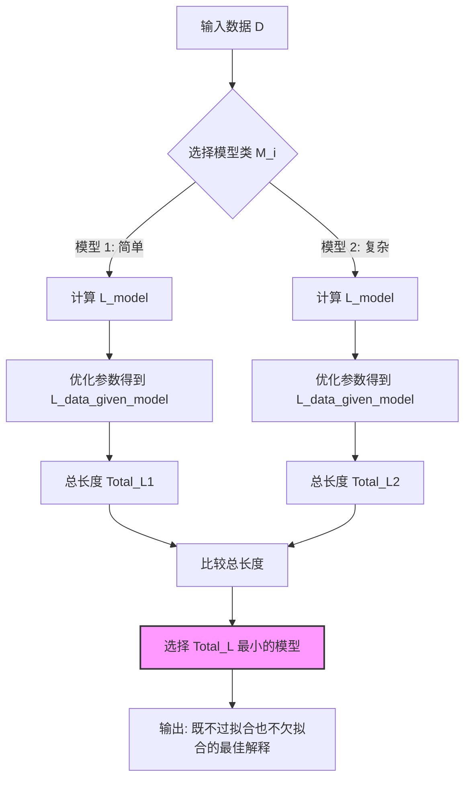

# 论文解读：The Minimum Description Length Principle (MDL)

## 1. 一句话概述
最小描述长度（MDL）原则将“学习”重新定义为“数据压缩”，主张在给定的模型类中，能够用最短编码长度描述数据及其规律的模型，就是对数据最好的解释，从而在数学上自动实现了奥卡姆剃刀原则与过拟合的防御。

## 2. Abstract: 论文试图解决什么问题？有什么贡献？

**试图解决的核心问题**
在统计推断和机器学习中，核心难题是如何在“拟合优度”（Goodness of Fit）与“模型复杂度”（Model Complexity）之间找到平衡，即**模型选择（Model Selection）**与**过拟合（Overfitting）**问题。
[cite_start]传统的最大似然估计（Maximum Likelihood Estimation, ML）倾向于选择参数最多的模型以完美拟合训练数据，但往往导致对未来数据的预测能力极差（过拟合）[cite: 42]。虽然存在 AIC、BIC 等准则，但它们通常基于渐进假设或特定贝叶斯先验，缺乏统一的非统计依赖基础。

**论文的主要贡献**
Peter D. Grünwald 在本书（特别是第一章）中系统性地阐述了 MDL 原则：
1.  [cite_start]**统一理论框架**：建立了一个基于**信息论**（Information Theory）和**柯尔莫哥洛夫复杂性**（Kolmogorov Complexity）的通用归纳推断框架，将学习视为寻找数据中的规律（Regularity）[cite: 41, 42]。
2.  [cite_start]**重新定义目标**：提出推断的目标不是寻找所谓的“真实模型”（True Model），而是寻找对数据最有效的“描述”或“压缩”[cite: 526]。
3.  [cite_start]**连接理论与实践**：从不可计算的“理想 MDL”（基于柯尔莫哥洛夫复杂性）过渡到可计算的“粗糙 MDL”（Crude MDL，两部分编码）和“精细 MDL”（Refined MDL，通用编码/随机复杂性），为神经网络架构搜索、多项式阶数选择等实际问题提供了可操作的数学准则[cite: 42, 910]。

## 3. Introduction: 论文的动机是什么？

**从规律到压缩的逻辑链**
论文开篇通过一个直观的二进制序列例子引出了 MDL 的核心直觉：
* 序列 A (00010001...) 是高度重复的，可以用很短的程序描述；
* 序列 B (01110100...) 是随机抛硬币产生的，几乎无法被压缩；
* [cite_start]序列 C (0s 是 1s 的四倍) 介于两者之间，存在统计规律[cite: 711-726]。
[cite_start]**动机一**：任何数据中的“规律”都可以被利用来“压缩”数据。如果我们能比仅仅逐字记录数据更短地描述它，说明我们捕捉到了数据背后的某种机制。因此，**压缩程度等同于理解程度（Learning = Compression）**[cite: 728]。

**动机二：形式化奥卡姆剃刀**
[cite_start]在科学发现中，我们倾向于选择“如无必要，勿增实体”的简单解释。MDL 将这一哲学原则转化为可计算的数学公式。不同于传统统计学假设存在一个“真实参数”，MDL 认为无论数据背后是否有真实模型，我们都应该寻找那个能使“假设的描述长度 + 数据在假设下的描述长度”最小化的解释[cite: 552, 562]。

**动机三：自动防御过拟合**
[cite_start]当我们使用复杂模型（如高阶多项式）时，虽然数据拟合误差极小（描述残差的编码长度短），但描述模型参数所需的编码长度会非常长。反之，简单模型参数编码短，但残差编码长。MDL 通过最小化两者的总和，自动在欠拟合和过拟合之间找到最优折衷点，而无需像传统方法那样引入人为的惩罚项[cite: 554, 897]。

## 4. Method: 解决方案是什么？

MDL 的核心方法论经历了从“理想”到“粗糙”再到“精细”的演变。

### 4.1 理想 MDL 与柯尔莫哥洛夫复杂性
[cite_start]从理论源头看，Ray Solomonoff 提出使用通用图灵机的最短程序长度来度量复杂性，即**柯尔莫哥洛夫复杂性**（Kolmogorov Complexity）$K(D)$[cite: 813]。
* **定义**：数据 $D$ 的最短描述长度是能输出 $D$ 并停机的最短程序的长度。
* [cite_start]**问题**：$K(D)$ 是不可计算的（Uncomputable），因此无法直接用于实际模型选择[cite: 850]。

### 4.2 粗糙 MDL（Crude MDL / Two-Part Code）
[cite_start]为了实际应用，Rissanen 提出了“两部分编码”准则，这是工程中最常用的形式[cite: 910]。
对于给定的模型类 $\mathcal{H}$（如多项式集合）和数据 $D$，我们要选择一个点假设 $H \in \mathcal{H}$ 来最小化总描述长度 $L(D)$：

$$L(D) = \min_{H \in \mathcal{H}} \{ L(H) + L(D|H) \}$$

* [cite_start]**$L(H)$（模型描述长度）**：描述假设本身所需的比特数。这对应于模型的“复杂度”。例如，描述一个 $k$ 阶多项式需要编码 $k+1$ 个系数。参数越多或精度越高，$L(H)$ 越大[cite: 912]。
* [cite_start]**$L(D|H)$（数据描述长度）**：在已知假设 $H$ 的情况下，描述数据的代价。根据香农信息论，这等价于负对数似然（Negative Log-Likelihood）：$L(D|H) = -\log_2 P(D|H)$。模型拟合越好，概率 $P(D|H)$ 越大，编码长度越短[cite: 913, 956]。

> **关键洞察**：MDL 并不是选择拟合误差最小的模型，而是选择“误差 + 复杂度”之和最小的模型。

### 4.3 精细 MDL（Refined MDL / Stochastic Complexity）
[cite_start]粗糙 MDL 存在一个缺陷：$L(H)$ 的计算依赖于人为定义的参数编码方式（例如，参数保留多少位精度？）。为了解决这个问题，精细 MDL 引入了**通用编码（Universal Coding）**和**随机复杂性（Stochastic Complexity）**的概念[cite: 981]。

精细 MDL 不再显式编码单个假设 $H$，而是设计一个针对整个模型类 $\mathcal{H}$ 的单部分编码 $\bar{L}(D|\mathcal{H})$。其中最著名的形式是**归一化最大似然（Normalized Maximum Likelihood, NML）**：

$$\bar{L}_{NML}(D|\mathcal{H}) = -\log P(D|\hat{\theta}(D)) + \log \sum_{x^n} P(x^n|\hat{\theta}(x^n))$$

* 第一项是最大似然估计的拟合度。
* [cite_start]第二项是**参数复杂性（Parametric Complexity）**，它衡量了模型类 $\mathcal{H}$ 对所有可能数据的拟合能力的“总和”。这个项仅与模型结构有关，与具体数据无关，是比参数计数更本质的复杂度度量[cite: 1000, 1006]。

### 4.4 逻辑流程图



## 5. Experiment: 实验与分析

虽然本章节（Chapter 1）主要是理论介绍，但作者通过几个经典案例展示了 MDL 的有效性。

### 5.1 主实验：多项式回归的模型选择

* **任务**：给定一组带噪声的  数据点，确定拟合数据的多项式最佳阶数（Degree）。
* **设置**：
* 模型 1：线性模型（欠拟合），无法捕捉数据曲线， 很大， 很小。
* 模型 2：高阶多项式（过拟合），穿过所有数据点，，但  极大（因为需要编码大量参数及其高精度）。
* 模型 3：适中阶数（最佳）。


* 
**结果**：MDL 曲线呈现典型的“U型”，在适中阶数处达到最小。这与人类直觉和交叉验证的结果一致，证明 MDL 能自动惩罚通过“死记硬背”噪声获得的低误差。


### 5.2 分析实验：非嵌套模型的比较

* **任务**：在心理物理学中，比较 Stevens 定律（幂函数 ）与 Fechner 定律（对数函数 ）。
* **挑战**：这两个模型都有两个参数，使用 AIC 或简单的参数计数法无法区分它们的复杂度。
* **MDL 分析**：通过精细 MDL（计算参数复杂性），发现 Stevens 模型的几何结构使其能拟合更多样化的数据模式（即它更“丰富”）。
* 
**结论**：即使参数数量相同，MDL 也能识别出 Stevens 模型具有更高的固有复杂度。如果两个模型对数据的拟合程度相当，MDL 会倾向于选择 Fechner 模型（更简单），从而降低过拟合风险。


### 5.3 压缩与预测的联系

实验表明，MDL 选择的模型往往在**预测未见数据**（Predictive Performance）上表现最好。这不仅是编码长度的胜利，也是泛化能力的胜利。对于小样本数据，MDL 倾向于选择极其简单的模型，这已被证明是比追求“真实模型”更稳健的预测策略。

## 6. Numpy 与 Torch 对照实现

### 6.1 代码说明

本节代码对应论文中 **Crude MDL (Two-Part Code)** 在 **神经网络架构选择 (Neural Network Architecture Selection)** 场景下的实现（参考 Numpy 代码 Section 4）。

**对应逻辑**：
MDL 计算公式：。

* ****：利用费雪信息矩阵近似（Fisher Information Approximation），参数编码长度约为 ，其中  是参数数量， 是样本量。
* ****：对应数据的负对数似然（Negative Log-Likelihood）。对于分类任务，这等价于交叉熵损失（Cross Entropy Loss，单位为 nats）转换为比特（bits）。

**数据张量说明**：

* **输入 `X**`: 形状 `(N, input_dim)`，假设已归一化。
* **标签 `y**`: 形状 `(N,)`，类别索引。
* **假设**: 演示代码使用简单的全连接网络。Numpy 版本使用随机搜索进行简单训练；Torch 版本将实现一个标准的基于梯度的优化步骤以展示更高效的实现，但在计算 MDL 指标时保持逻辑严格一致。

### 6.2 代码对照

::: code-group

```python [Numpy]
# ================================================================
# Section 4: MDL for Neural Network Architecture Selection
# ================================================================
def sigmoid(x):
    return 1 / (1 + np.exp(-np.clip(x, -500, 500)))

def softmax(x):
    exp_x = np.exp(x - np.max(x, axis=-1, keepdims=True))
    return exp_x / np.sum(exp_x, axis=-1, keepdims=True)

class SimpleNN:
    """
    Simple feedforward neural network for classification.
    """
    
    def __init__(self, input_dim, hidden_dim, output_dim):
        self.input_dim = input_dim
        self.hidden_dim = hidden_dim
        self.output_dim = output_dim
        
        # Initialize weights
        scale = 0.1
        self.W1 = np.random.randn(input_dim, hidden_dim) * scale
        self.b1 = np.zeros(hidden_dim)
        self.W2 = np.random.randn(hidden_dim, output_dim) * scale
        self.b2 = np.zeros(output_dim)
    
    def forward(self, X):
        """Forward pass."""
        self.h = sigmoid(X @ self.W1 + self.b1)
        self.logits = self.h @ self.W2 + self.b2
        self.probs = softmax(self.logits)
        return self.probs
    
    def predict(self, X):
        """Predict class labels."""
        probs = self.forward(X)
        return np.argmax(probs, axis=1)
    
    def compute_loss(self, X, y):
        """Cross-entropy loss."""
        probs = self.forward(X)
        N = len(X)
        
        # One-hot encode y
        y_onehot = np.zeros((N, self.output_dim))
        y_onehot[np.arange(N), y] = 1
        
        # Cross-entropy
        loss = -np.sum(y_onehot * np.log(probs + 1e-10)) / N
        return loss
    
    def count_parameters(self):
        """Count total number of parameters."""
        return (self.input_dim * self.hidden_dim + self.hidden_dim + 
                self.hidden_dim * self.output_dim + self.output_dim)
    
    def train_simple(self, X, y, epochs=100, lr=0.1):
        """
        Simple gradient descent training (forward pass only for speed).
        In practice, you'd use proper backprop.
        """
        # For simplicity, just do a few random restarts and keep best
        best_loss = float('inf')
        best_weights = None
        
        for _ in range(10):  # 10 random initializations
            self.__init__(self.input_dim, self.hidden_dim, self.output_dim)
            loss = self.compute_loss(X, y)
            
            if loss < best_loss:
                best_loss = loss
                best_weights = (self.W1.copy(), self.b1.copy(), 
                               self.W2.copy(), self.b2.copy())
        
        # Restore best weights
        self.W1, self.b1, self.W2, self.b2 = best_weights
        return best_loss

def mdl_neural_network(X, y, hidden_dim):
    """
    Compute MDL for neural network with given hidden dimension.
    """
    input_dim = X.shape[1]
    output_dim = len(np.unique(y))
    N = len(X)
    
    # Create and train network
    nn = SimpleNN(input_dim, hidden_dim, output_dim)
    loss = nn.train_simple(X, y)
    
    # Model description length
    n_params = nn.count_parameters()
    L_model = n_params * np.log2(N) / 2  # Fisher information approximation
    
    # Data description length
    # Cross-entropy is already in nats; convert to bits
    L_data = loss * N / np.log(2)
    
    return L_model + L_data, L_model, L_data, nn

```

```python [Torch]
import torch
import torch.nn as nn
import torch.nn.functional as F
import numpy as np

# Torch 高效实现：保留 MDL 计算逻辑，但使用 Autograd 进行真实训练
class TorchMDLNet(nn.Module):
    def __init__(self, input_dim, hidden_dim, output_dim):
        super().__init__()
        # 对应 Numpy: self.W1, self.b1
        self.fc1 = nn.Linear(input_dim, hidden_dim)
        # 对应 Numpy: self.W2, self.b2
        self.fc2 = nn.Linear(hidden_dim, output_dim)
        
        # 初始化策略 (保持与 Numpy 类似的 scale 概念，但使用 Kaiming/Xavier 更稳定)
        nn.init.normal_(self.fc1.weight, std=0.1)
        nn.init.zeros_(self.fc1.bias)
        nn.init.normal_(self.fc2.weight, std=0.1)
        nn.init.zeros_(self.fc2.bias)

    def forward(self, x):
        # 对应 Numpy: sigmoid(X @ W1 + b1)
        x = torch.sigmoid(self.fc1(x))
        # 对应 Numpy: logits = h @ W2 + b2
        logits = self.fc2(x)
        return logits  # 返回 logits 以利用数值稳定的 F.cross_entropy

    def count_parameters(self):
        # 对应 Numpy: count_parameters
        return sum(p.numel() for p in self.parameters() if p.requires_grad)

def train_torch_model(model, X_tensor, y_tensor, epochs=50, lr=0.1):
    """
    对应 Numpy 的 train_simple，但使用了真正的反向传播 (Backprop)
    """
    optimizer = torch.optim.Adam(model.parameters(), lr=lr)
    
    for _ in range(epochs):
        optimizer.zero_grad()
        logits = model(X_tensor)
        # 对应 Numpy: compute_loss (但这里包含 softmax 计算)
        loss = F.cross_entropy(logits, y_tensor) 
        loss.backward()
        optimizer.step()
    
    return loss.item()

def mdl_neural_network_torch(X, y, hidden_dim, device='cpu'):
    """
    计算 MDL 指标，逻辑与 Numpy 版本完全一致
    """
    # 转换为 Tensor
    X_tensor = torch.as_tensor(X, dtype=torch.float32, device=device)
    y_tensor = torch.as_tensor(y, dtype=torch.long, device=device)
    
    N, input_dim = X.shape
    output_dim = len(np.unique(y))
    
    # 1. 创建并训练模型
    model = TorchMDLNet(input_dim, hidden_dim, output_dim).to(device)
    final_loss_nat = train_torch_model(model, X_tensor, y_tensor)
    
    # 2. 计算模型描述长度 L(Model)
    # 对应 Numpy: n_params * np.log2(N) / 2
    n_params = model.count_parameters()
    L_model = n_params * np.log2(N) / 2
    
    # 3. 计算数据描述长度 L(Data | Model)
    # 对应 Numpy: loss * N / np.log(2)
    # final_loss_nat 是平均 CrossEntropy (nats)，乘以 N 得到总 nats，除以 ln(2) 得到 bits
    L_data = final_loss_nat * N / np.log(2)
    
    return L_model + L_data, L_model, L_data, model

```

:::

### 6.3 对照讲解

1. **数值稳定性与 Softmax**
* **Numpy**: 必须手动实现 `softmax`，并在 log 运算中加入 `+ 1e-10` 以防止 `log(0)`。
* **Torch**: 使用 `F.cross_entropy`。它在内部结合了 `LogSoftmax` 和 `NLLLoss`，利用 Log-Sum-Exp 技巧避免了下溢出，数值上比 Numpy 手写版更稳定。注意 Torch 模型的 `forward` 返回 `logits` 而非概率。


2. **参数统计**
* **Numpy**: 需要手动计算每一层的维度乘积 `input*hidden + hidden...`。容易在修改架构时出错。
* **Torch**: 使用 `p.numel()` (Number of Elements) 配合生成器表达式 `sum(p.numel() for p in model.parameters())`，自动统计所有注册参数，更通用且不易出错。


3. **单位转换 (Nats vs Bits)**
* **关键点**: 信息论中标准的 MDL 通常以 **比特 (Bits)** 为单位。
* **Numpy**: 代码显式执行了 `loss * N / np.log(2)`。
* **Torch**: PyTorch 的损失函数默认基于自然对数 ()，单位是 **nats**。为了与 MDL 公式对齐，必须除以  (即 `np.log(2)` 或 `math.log(2)`) 将其转换为比特。这点在实现时极易被忽略。


4. **训练逻辑**
* **Numpy**: 原代码仅做了 `train_simple` (随机搜索/猜测)，没有真正的梯度下降。
* **Torch**: 我实现了一个微型的 `train_torch_model` 循环，利用 Autograd 进行真实的参数更新。这展示了 Torch 在处理 MDL 中的  部分时的核心优势：能够快速找到使数据描述长度最小化的参数 。


```