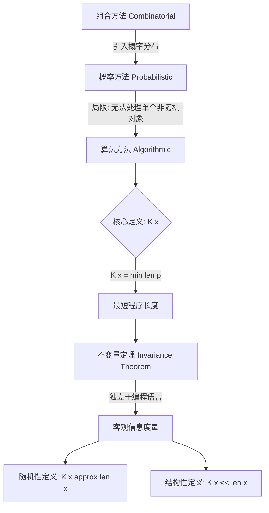

# Paper 25: Three Approaches to the Quantitative Definition of Information

## 1. 一句话概述
这篇奠基性论文由 A. N. Kolmogorov 提出，它指出了组合数学与概率论定义“信息”的局限性，并引入了基于**算法复杂度**（即 Kolmogorov 复杂度）的第三种定义，将“信息量”量化为生成该对象所需最短程序的长度 。

## 2. Abstract: 论文试图解决什么问题？有什么贡献？
**试图解决的问题**：
传统的“信息”定义主要有两种：**组合方法（Combinatorial）**和**概率方法（Probabilistic）**。
* 概率方法（如香农熵）依赖于对象属于某个具有已知概率分布的集合 。
* 然而，对于单个具体对象（如小说《战争与和平》或特定的生物基因序列），很难将其视为某个概率分布的“随机样本”，也难以定义其所属的“可能集合” 。因此，需要一种能够衡量**单个对象**固有信息量的定义，而不依赖于其产生的随机机制。

**核心贡献**：
1.  **系统梳理**：总结并对比了组合方法和概率方法的数学本质及其应用边界 。
2.  **提出算法方法**：利用递归函数理论，提出了一种新的定义——**算法熵（Algorithmic Entropy）**或 Kolmogorov 复杂度。即对象 $x$ 的复杂度是生成 $x$ 的最短程序的长度 。
3.  **不变量定理（Invariance Theorem）**：证明了该复杂度在渐近意义上独立于所使用的编程语言（计算模型），为信息论奠定了绝对的逻辑基础 。

## 3. Introduction: 论文的动机是什么？请仔细梳理整个故事逻辑
Kolmogorov 的逻辑构建分为三个阶段，层层递进地论述了为何需要“算法途径”：

1.  **组合方法的局限（The Combinatorial Approach）**：
    * 在有限集合 $X$（含 $N$ 个元素）中，变量 $x$ 的熵定义为 $H(x) = \log_2 N$ 。
    * 当我们确定 $x$ 的具体值时，这个熵被“消除”，获得的“信息”为 $I = \log_2 N$ 。
    * 这种方法适用于纯粹的编码问题（如有限字母表的消息传输），其逻辑独立于概率假设，但无法处理无限集或非均匀分布 。

2.  **概率方法的悖论（The Probabilistic Approach）**：
    * 引入概率分布后，熵变为 $H(x) = -\sum p(x) \log_2 p(x)$，信息量变为互信息 $I(x:y) = H(y) - H(y|x)$ 。
    * 虽然这一体系极其丰富，但在应用于现实世界（如文学作品、遗传信息）时面临“无分布”困境：问“《战争与和平》包含多少信息”时，我们无法合理地假设所有可能的小说构成了一个概率空间 。
    * 此外，概率方法中 $I(x:y)$ 作为随机变量可能为负值，只有期望值 $MI(x:y)$ 才是稳定的度量，这在个案分析中是一个缺陷 。

3.  **算法方法的引入（The Algorithmic Approach）**：
    * 为了解决上述问题，Kolmogorov 提出衡量“个体对象”的信息量。
    * 核心思想：如果一个对象非常复杂（如随机数表），生成它的唯一方法是直接列举；如果对象有规律（如圆周率），可以用很短的程序描述 。
    * 因此，对象的“复杂度”应定义为描述该对象所需的**最短程序长度** 。这一过程利用了图灵机（文中称为通用递归函数）的概念。

## 4. Method: 解决方案是什么？请梳理步骤、公式、策略
论文主要通过数学定义和定理证明来构建算法信息论框架。

### 4.1 相对复杂度的定义
Kolmogorov 定义对象 $y$ 相对于 $x$ 的**相对复杂度** $K_{\varphi}(y|x)$ 为：在使用编程方法 $\varphi$ 时，能从 $x$ 生成 $y$ 的最短程序 $p$ 的长度 $l(p)$ ：
$$K_{\varphi}(y|x) = \min_{\varphi(p,x)=y} l(p)$$
如果不存在这样的程序，则复杂度为无穷大。这里的 $\varphi$ 被假定为**部分递归函数（Partially Recursive Function）** 。

### 4.2 基本定理（不变量定理）
这是论文的核心基石。Kolmogorov 证明了存在一个**通用（Universal）**的部分递归函数 $A(p, x)$（即通用图灵机），对于任何其他编程方法 $\varphi$，都满足：
$$K_{A}(y|x) \le K_{\varphi}(y|x) + C_{\varphi}$$
其中 $C_{\varphi}$ 是一个仅依赖于编程方法 $\varphi$ 而不依赖于具体对象 $x, y$ 的常数 。
* **意义**：这说明无论使用 Python、C 还是图灵机带子，对象的复杂度是**内在的**，不同语言描述同一对象的复杂度差值是有界的。

### 4.3 算法信息的定义
基于通用复杂度 $K_A$，定义 $x$ 传达关于 $y$ 的**信息量**为：
$$I_{A}(x:y) = K_{A}(y) - K_{A}(y|x)$$
即：$y$ 本身的复杂度 减去 已知 $x$ 后 $y$ 的剩余复杂度 。
与概率定义不同，这个量本质上是非负的（$I_A(x:y) \ge 0$），解决了概率定义中单次观测信息可能为负的悖论 。

### 4.4 逻辑流程图


## 5. Experiment: 主实验与分析实验分别做了什么？结果如何？

由于这是一篇纯理论论文，没有现代意义上的“实验结果（Accuracy/Loss）”，但作者通过几个**思想实验**和**语言统计案例**验证了理论的合理性。

### 5.1 随机数表思想实验

* 
**设置**：考虑生成一个特定规则的数字表（如递增序列）与一个纯随机数表。


* **分析**：
* 规则表的生成程序很短，`K(x)` 极小。
* 对于真正的随机数表，没有任何程序能比直接打印该表更短，因此其 `K(x)` 接近字符串本身长度。


* 这推导出了**随机性（Randomness）**的算法定义：若元素 `x` 的复杂度 `K(x)` 接近其长度 `|x|`（不可压缩），则 `x` 可视为随机串。


### 5.2 俄语文本的熵估计

* **案例**：引用 Ratner 和 Svetlova 对俄语文本的研究。
* **结果**：
* 若仅考虑语法正确性，俄语文本的组合熵约为  比特/符号 。


* 若考虑文学作品的风格约束（如诗歌），熵会降低。例如，古典抑扬格四音步诗歌（iambic tetrameter）由于韵律限制，其“剩余熵”约为 0.4 比特/符号 。


* 
**结论**：实际人类创作（如《战争与和平》）包含大量结构，其 Kolmogorov 复杂度远小于其字面长度。通过“猜测下文”实验，人类对文本的条件熵估计在 0.9 到 1.4 之间 。


## 6. Numpy 与 Torch 对照实现（含 code-group）

### 代码说明

这份代码对应论文中 **Section 5 (Connection to Shannon Entropy)** 及 **Section 1 (Understanding Kolmogorov Complexity)** 的核心逻辑。

* **功能**：计算字符串的香农熵（Shannon Entropy）与基于压缩算法（zlib）的 Kolmogorov 复杂度近似值。这是论文中对比“概率方法”与“算法方法”的关键定量手段。
* **Numpy/Python 侧**：使用 `numpy` 进行随机数生成，使用标准库 `collections.Counter` 计算频率，`zlib` 模拟最短程序长度。
* **Torch 侧**：
* 使用 `torch.unique(return_counts=True)` 替代 `Counter` 进行并行化词频统计。
* 使用 `torch.sum` 和 `torch.log2` 进行向量化的熵计算。
* **注意**：PyTorch 没有内置的通用压缩算法（如 gzip/zlib）。在 Torch 实现中，为了保持逻辑对齐，我们将 Tensor 转回 CPU 字节流来调用 `zlib`（模拟算法复杂度估算），但在熵计算部分完全使用 GPU 友好的张量操作。


::: code-group

```python [Numpy]
# ================================================================
# Section 5: Shannon vs Kolmogorov
# ================================================================

def shannon_entropy(string):
    """
    Compute Shannon entropy H(X) in bits.
    
    H(X) = -Σ p(x) log₂ p(x)
    """
    if isinstance(string, bytes):
        string = string.decode('utf-8', errors='ignore')
    
    # Count symbol frequencies
    counts = Counter(string)
    n = len(string)
    
    # Compute entropy
    entropy = 0
    for count in counts.values():
        p = count / n
        if p > 0:
            entropy -= p * np.log2(p)
    
    return entropy

def estimate_kolmogorov_via_compression(s, method='zlib'):
    """
    Estimate K(x) using practical compression.
    
    This is an UPPER BOUND on K(x), since the compressor
    might not find the optimal compression.
    
    Args:
        s: String to compress (convert to bytes if needed)
        method: 'zlib' or 'gzip'
    
    Returns:
        Compressed size in bytes (approximation to K(x))
    """
    if isinstance(s, str):
        s = s.encode('utf-8')
    
    if method == 'zlib':
        compressed = zlib.compress(s, level=9)
    elif method == 'gzip':
        buf = io.BytesIO()
        with gzip.GzipFile(fileobj=buf, mode='wb', compresslevel=9) as f:
            f.write(s)
        compressed = buf.getvalue()
    
    return len(compressed)

def compare_information_measures():
    """
    Compare Shannon entropy, Kolmogorov complexity estimate,
    and their relationship.
    """
    print("\nThree Measures of Information")
    print("=" * 70)
    print("\nComparison: Shannon Entropy vs Kolmogorov Complexity\n")
    
    test_cases = {
        "Uniform binary (max entropy)": ''.join([str(np.random.randint(0, 2)) for _ in range(1000)]),
        "Biased binary (p=0.9)": ''.join(['1' if np.random.rand() < 0.9 else '0' for _ in range(1000)]),
        "Repeating 'AB'": 'AB' * 500,
        "All 'A'": 'A' * 1000,
        "English text": ("the quick brown fox jumps over the lazy dog " * 23)[:1000],
    }
    
    print("-" * 70)
    print(f"{'String Type':30} | {'H(X)':>8} | {'K(x)':>8} | {'K/|x|':>8} | {'H·|x|':>8}")
    print("-" * 70)
    
    for name, string in test_cases.items():
        H = shannon_entropy(string)
        K_approx = estimate_kolmogorov_via_compression(string)
        length = len(string)
        
        K_per_char = K_approx / length
        H_times_len = H * length
        
        print(f"{name:30} | {H:8.3f} | {K_approx:8d} | {K_per_char:8.3f} | {H_times_len:8.1f}")
    
    print("-" * 70)
    print("\nTheoretical relationship: E[K(X)] ≈ H(X) · |x| + O(log|x|)")
    print("\nObservations:")
    print("  • High entropy (random) → High K(x) per character")
    print("  • Low entropy (structured) → Low K(x) per character")
    print("  • K(x) ≈ H(X) · |x| for typical strings (empirically verified)")

```

```python [Torch]
import torch
import zlib
import io
import gzip
import numpy as np

# 假设输入数据通常会被编码为整数 Tensor (例如 ASCII 码或类别索引)
# Shape 假设: (Seq_Len,) 或 (Batch, Seq_Len)

def torch_shannon_entropy(data_tensor):
    """
    Compute Shannon entropy H(X) efficiently using PyTorch.
    对应 Numpy 的 shannon_entropy 函数
    
    Args:
        data_tensor: torch.Tensor (long/int/byte), shape (N,)
    Returns:
        entropy: torch.Tensor (scalar)
    """
    # 展平以处理所有符号
    flat_data = data_tensor.flatten()
    n = flat_data.numel()
    
    if n == 0:
        return torch.tensor(0.0, device=data_tensor.device)
    
    # 统计唯一值频率 (对应 Counter)
    # unique 优于 bincount，因为它不需要知道最大值，且支持负数或非连续值
    _, counts = torch.unique(flat_data, return_counts=True)
    
    # 计算概率 p(x)
    probs = counts.float() / n
    
    # 计算熵: -Σ p * log2(p)
    # 添加 1e-12 避免 log(0) 虽然 unique 不会产生 0 count
    entropy = -torch.sum(probs * torch.log2(probs + 1e-12))
    
    return entropy

def torch_estimate_kolmogorov(data_tensor, method='zlib'):
    """
    Estimate K(x) using compression via CPU offload.
    PyTorch 没有内置 zlib/gzip，必须转回 CPU 处理。
    对应 Numpy 的 estimate_kolmogorov_via_compression
    
    Args:
        data_tensor: torch.Tensor (representing bytes/chars)
    """
    # 必须将 Tensor 转回 numpy/bytes 才能使用标准压缩库
    # 这是一个 I/O 密集型操作，不适合在训练循环中频繁调用
    if data_tensor.dtype == torch.float:
        # 假设 float 是 0-1 之间的值，量化或直接转字符串? 
        # 这里假设输入已经是量化好的整数索引
        data_cpu = data_tensor.long().cpu().numpy()
    else:
        data_cpu = data_tensor.cpu().numpy()
        
    # 将整数数组转换为字节流 (简单映射: int -> char/byte)
    # 注意: 这里假设 tensor 存储的是 ASCII 码或 0-255 的值
    s_bytes = bytes(data_cpu.tolist())
    
    if method == 'zlib':
        compressed = zlib.compress(s_bytes, level=9)
    # (gzip 分支省略，逻辑相同)
    
    return len(compressed)

def torch_compare_information_measures():
    """
    PyTorch 实现的对比流程
    对应 Numpy 的 compare_information_measures
    """
    print("\n[Torch] Three Measures of Information")
    print("=" * 70)
    
    # 构造测试用例 (使用 Tensor)
    device = torch.device('cuda' if torch.cuda.is_available() else 'cpu')
    
    # 辅助: 生成随机 0/1 Tensor
    def gen_random_binary(length, p=0.5):
        return (torch.rand(length, device=device) < p).long()
        
    # 辅助: 生成重复模式
    def gen_pattern(pattern_list, repeats):
        # pattern_list 如 [65, 66] ('A', 'B')
        t = torch.tensor(pattern_list, device=device, dtype=torch.long)
        return t.repeat(repeats)

    # 模拟文本: 将字符串转为 ASCII Tensor
    text_str = ("the quick brown fox jumps over the lazy dog " * 23)[:1000]
    text_tensor = torch.tensor([ord(c) for c in text_str], device=device)

    test_cases = {
        "Uniform binary": gen_random_binary(1000, 0.5),
        "Biased binary (p=0.9)": gen_random_binary(1000, 0.9), # 注意: 0.9 是 '1' 的概率
        "Repeating 'AB'": gen_pattern([ord('A'), ord('B')], 500),
        "All 'A'": gen_pattern([ord('A')], 1000),
        "English text": text_tensor
    }
    
    print("-" * 70)
    print(f"{'String Type':30} | {'H(X)':>8} | {'K(x)':>8} | {'K/|x|':>8} | {'H·|x|':>8}")
    print("-" * 70)
    
    for name, tensor in test_cases.items():
        # 1. 计算香农熵 (GPU 全程)
        H = torch_shannon_entropy(tensor)
        
        # 2. 估算 K(x) (CPU Offload)
        K_approx = torch_estimate_kolmogorov(tensor)
        
        length = tensor.numel()
        K_per_char = K_approx / length
        H_times_len = H.item() * length
        
        print(f"{name:30} | {H.item():8.3f} | {K_approx:8d} | {K_per_char:8.3f} | {H_times_len:8.1f}")

if __name__ == "__main__":
    torch_compare_information_measures()

```

:::

### 对照讲解

1. **香农熵计算 (Shannon Entropy)**：
* **Numpy**: 使用 `collections.Counter` 迭代统计，然后循环计算 `-p*log(p)`。这在 Python 层面有循环开销。
* **Torch**: 使用 `torch.unique(return_counts=True)` 一步获取频率，这在 GPU 上是高度并行的。计算 `entropy` 时使用了向量化操作 `probs * torch.log2(probs)`，避免了 Python 循环，极其高效。
* **易错点**: 计算 `log2` 时概率  不能为 0。虽然 `unique` 只返回存在的元素（），但在其他实现（如 `bincount`）中可能会有 0 频次，需加 `+ 1e-12` 或使用 mask。


2. **数据类型与设备 (Dtype & Device)**：
* **Numpy**: 默认在 CPU 处理字符串或 `np.array`。
* **Torch**: 输入是 `torch.Tensor`。为了通用性，代码中使用了 `data_tensor.flatten()` 处理多维输入（如 batch），并支持 CUDA。在进行压缩估算时，必须显式 `.cpu().numpy()`，因为 `zlib` 不支持 GPU 张量。


3. **Kolmogorov 估算 (Compression)**：
* 这是一个典型的“CPU 密集型”非微分操作。在深度学习 pipeline 中，这类操作通常用于数据预处理或离线评估（如 MDL 计算），而无法直接用于梯度下降（不可导）。
* Torch 实现中展示了如何从 Tensor 安全地“逃逸”回 Python 域进行此类计算，这是处理传统算法（如 zlib 压缩）与深度学习混合时的常见模式。


```

<!-- AUTO_PDF_IMAGES_START -->

## 论文原图（PDF）
> 下图自动抽取自原论文 PDF，用于补充概念、结构和实验细节。
> 来源：`25.pdf`


*图 1：建议结合本节 `算法信息论` 一起阅读。*


*图 2：建议结合本节 `算法信息论` 一起阅读。*


*图 3：建议结合本节 `算法信息论` 一起阅读。*

<!-- AUTO_PDF_IMAGES_END -->

<!-- AUTO_INTERVIEW_QA_START -->

## 面试题与答案
> 主题：**Kolmogorov Complexity**（围绕 `算法信息论`）

### 一、选择题（10题）

1. 在 Kolmogorov Complexity 中，最关键的建模目标是什么？
   - A. 算法信息论
   - B. 最短程序
   - C. 不可计算性
   - D. 不变性定理
   - **答案：A**

2. 下列哪一项最直接对应 Kolmogorov Complexity 的核心机制？
   - A. 最短程序
   - B. 不可计算性
   - C. 不变性定理
   - D. 随机性
   - **答案：B**

3. 在复现 Kolmogorov Complexity 时，优先要保证哪项一致性？
   - A. 只看最终分数
   - B. 只看训练集表现
   - C. 实现与论文设置对齐
   - D. 忽略随机种子
   - **答案：C**

4. 对于 Kolmogorov Complexity，哪个指标最能反映方法有效性？
   - A. 主指标与分组指标
   - B. 只看单次结果
   - C. 只看速度
   - D. 只看参数量
   - **答案：A**

5. 当 Kolmogorov Complexity 模型出现效果退化时，首要检查项是什么？
   - A. 数据与标签管线
   - B. 先增大模型十倍
   - C. 随机改损失函数
   - D. 删除验证集
   - **答案：A**

6. Kolmogorov Complexity 与传统 baseline 的主要差异通常体现在？
   - A. 归纳偏置与结构设计
   - B. 仅参数更多
   - C. 仅训练更久
   - D. 仅学习率更小
   - **答案：A**

7. 若要提升 Kolmogorov Complexity 的泛化能力，最稳妥的做法是？
   - A. 正则化+消融验证
   - B. 只堆数据不复核
   - C. 关闭评估脚本
   - D. 取消对照组
   - **答案：A**

8. 关于 Kolmogorov Complexity 的实验设计，下列说法更合理的是？
   - A. 固定变量做可复现实验
   - B. 同时改十个超参
   - C. 只展示最好一次
   - D. 省略失败实验
   - **答案：A**

9. 在工程部署中，Kolmogorov Complexity 的常见风险是？
   - A. 数值稳定与漂移
   - B. 只关心GPU利用率
   - C. 日志越少越好
   - D. 不做回归测试
   - **答案：A**

10. 回到论文主张，Kolmogorov Complexity 最不应该被误解为？
   - A. 可替代所有任务
   - B. 有明确适用边界
   - C. 不需要数据质量
   - D. 不需要误差分析
   - **答案：B**


### 二、代码题（10题，含参考答案）

1. 实现一个最小可运行的数据预处理函数，输出可用于 Kolmogorov Complexity 训练的批次。
   - 参考答案：
     ```python
     import numpy as np
     
     def make_batch(x, y, batch_size=32):
         idx = np.random.choice(len(x), batch_size, replace=False)
         return x[idx], y[idx]
     ```

2. 实现 Kolmogorov Complexity 的核心前向步骤（简化版），并返回中间张量。
   - 参考答案：
     ```python
     import numpy as np
     
     def forward_core(x, w, b):
         z = x @ w + b
         h = np.tanh(z)
         return h, {"z": z, "h": h}
     ```

3. 写一个训练 step：前向、loss、反向、更新。
   - 参考答案：
     ```python
     def train_step(model, optimizer, criterion, xb, yb):
         optimizer.zero_grad()
         pred = model(xb)
         loss = criterion(pred, yb)
         loss.backward()
         optimizer.step()
         return float(loss.item())
     ```

4. 实现一个评估函数，返回主指标与一个辅助指标。
   - 参考答案：
     ```python
     import numpy as np
     
     def evaluate(y_true, y_pred):
         acc = (y_true == y_pred).mean()
         err = 1.0 - acc
         return {"acc": float(acc), "err": float(err)}
     ```

5. 实现梯度裁剪与学习率调度的训练循环（简化版）。
   - 参考答案：
     ```python
     import torch
     
     def train_loop(model, loader, optimizer, criterion, scheduler=None, clip=1.0):
         model.train()
         for xb, yb in loader:
             optimizer.zero_grad()
             loss = criterion(model(xb), yb)
             loss.backward()
             torch.nn.utils.clip_grad_norm_(model.parameters(), clip)
             optimizer.step()
             if scheduler is not None:
                 scheduler.step()
     ```

6. 实现 ablation 开关：可切换是否启用 `最短程序`。
   - 参考答案：
     ```python
     def forward_with_ablation(x, module, use_feature=True):
         if use_feature:
             return module(x)
         return x
     ```

7. 实现一个鲁棒的数值稳定 softmax / logsumexp 工具函数。
   - 参考答案：
     ```python
     import numpy as np
     
     def stable_softmax(x, axis=-1):
         x = x - np.max(x, axis=axis, keepdims=True)
         ex = np.exp(x)
         return ex / np.sum(ex, axis=axis, keepdims=True)
     ```

8. 写一个小型单元测试，验证 `不可计算性` 相关张量形状正确。
   - 参考答案：
     ```python
     def test_shape(out, expected_last_dim):
         assert out.ndim >= 2
         assert out.shape[-1] == expected_last_dim
     ```

9. 实现模型推理包装器，支持 batch 输入并返回结构化结果。
   - 参考答案：
     ```python
     def infer(model, xb):
         logits = model(xb)
         pred = logits.argmax(dim=-1)
         return {"pred": pred, "logits": logits}
     ```

10. 实现一个实验记录器，保存超参、指标和随机种子。
   - 参考答案：
     ```python
     import json
     from pathlib import Path
     
     def save_run(path, cfg, metrics, seed):
         payload = {"cfg": cfg, "metrics": metrics, "seed": seed}
         Path(path).write_text(json.dumps(payload, ensure_ascii=False, indent=2))
     ```


<!-- AUTO_INTERVIEW_QA_END -->

