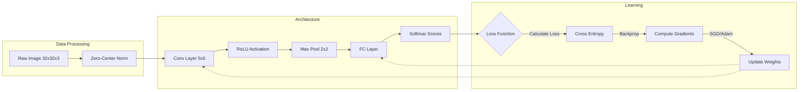

# 论文解读与复现：CS231n - Convolutional Neural Networks for Visual Recognition

## 1. 一句话概述
这是一份计算机视觉领域的“原本真经”（The Vision Bible），它系统性地构建了从像素到语义预测的完整知识体系，确立了以卷积神经网络（CNN）为核心的端到端图像分类范式，并将“数据驱动”与“反向传播”确立为现代视觉系统的基石。

## 2. Abstract: 论文试图解决什么问题？有什么贡献？
**CS231n** 并非单篇论文，而是斯坦福大学的一门经典课程，其讲义与作业构成了现代深度学习视觉研究的入门标准。它试图解决的核心问题是 **Visual Recognition（视觉识别）** 的自动化与通用化。

在此之前，计算机视觉高度依赖人工设计的特征（如 SIFT, HOG）。CS231n 的核心贡献在于：
1.  **范式转移**：完整阐述了从“人工特征工程”向“端到端特征学习”的转移，系统展示了直接从原始像素学习层级化特征的可行性。
2.  **方法论体系化**：将神经网络的训练解构为评分函数（Score Function）、损失函数（Loss Function）和优化算法（Optimization）三个正交组件，为后来的深度学习框架设计奠定了逻辑基础。
3.  **CNN 普及**：深入剖析了卷积（Convolution）与池化（Pooling）的数学原理，解释了参数共享（Parameter Sharing）如何利用图像的空间结构（Spatial Structure），极大地推动了 CNN 在 AlexNet 之后的爆发式应用。

## 3. Introduction: 论文的动机是什么？请仔细梳理整个故事逻辑
这份材料的逻辑构建极其严密，它讲述了一个从“直觉”到“数学抽象”再到“仿生架构”的故事。

### 3.1 挑战：语义鸿沟
计算机看到的只是一个 $[0, 255]$ 的巨大数字矩阵，而人类看到的是“猫”或“狗”。这种像素值与其语义内容之间的巨大差异被称为 **Semantic Gap**。传统的基于规则的方法（如边缘检测）无法应对视角变化、光照、遮挡和形变。

### 3.2 起点：数据驱动方法（Data-Driven Approach）
既然无法硬编码规则，不如让机器通过数据去“看”。
> The computer is given a set of images... and effectively summarizes the knowledge into a model.
这就引出了 **k-Nearest Neighbors (kNN)**。虽然 kNN 逻辑简单（“我看你像谁，你就是谁”），但它在测试时需要遍历所有训练数据，计算成本极高且缺乏泛化能力（Memorization vs Learning）。

### 3.3 进化：线性分类器（Parametric Approach）
为了解决 kNN 的低效，引入了参数化模型 $f(x, W) = Wx + b$。
> One template per class... The weights $W$ correspond to class templates.
这里，$W$ 被解释为每个类别的“平均模板”。通过 **SVM（Hinge Loss）** 或 **Softmax（Cross-Entropy Loss）** 来衡量预测的好坏，并通过 **SGD** 进行优化。这是机器学习的经典形态。

### 3.4 质变：神经网络与 CNN
线性模型只能通过“画一条直线”来分类，无法处理异或（XOR）等非线性问题。
引入 **Hidden Layer** 和 **Non-linearity (ReLU)** 后，模型具备了拟合复杂流形的能力。进一步地，针对图像数据的**空间局部性（Local Connectivity）**，全连接层（Fully Connected）由于参数量过大且忽略空间结构而被 **卷积层（Convolutional Layer）** 取代。这最终导向了现代视觉的基石架构：**ConvNet**。

## 4. Method: 解决方案是什么？请梳理步骤、公式、策略

该方法论通过以下五个核心模块构建了现代视觉系统：

### 4.1 评分函数与全连接网络
对于全连接网络（MLP），输入图像被拉平为向量 $x$。一个两层网络的评分函数定义为：
$$f(x) = W_2 \cdot \max(0, W_1 x + b_1) + b_2$$
其中 $\max(0, \cdot)$ 是 **ReLU (Rectified Linear Unit)** 激活函数，它解决了梯度消失问题并加速收敛。

### 4.2 损失函数（Loss Functions）
为了量化“预测有多差”，论文（课程）对比了两种损失：
1.  **Multiclass SVM Loss**: 强调边缘间隔（Margin）。
    $$L_i = \sum_{j \neq y_i} \max(0, s_j - s_{y_i} + \Delta)$$
2.  **Softmax Loss**: 强调概率分布的拟合。
    $$L_i = -\log\left(\frac{e^{s_{y_i}}}{\sum_j e^{s_j}}\right)$$
    > Softmax classifier interprets the scores as unnormalized log probabilities.
    这不仅给出了分类结果，还给出了置信度。

### 4.3 卷积神经网络（CNN）的核心算子
这是处理视觉数据的核心创新。与全连接层不同，CNN 假设输入具有网格结构。

* **卷积（Convolution）**：
    输出尺寸的计算公式至关重要：
    $$Output = \frac{W - F + 2P}{S} + 1$$
    其中 $W$ 是输入尺寸，$F$ 是卷积核大小，$P$ 是填充，$S$ 是步长。这一公式决定了特征图在网络中的流动形态。
    > Parameter sharing... assumes that if one feature is useful to compute at some spatial position (x,y), then it should also be useful to compute at a different position (x2,y2).
    这种**平移不变性**大大减少了参数量。

* **池化（Pooling）**：
    通常使用 Max Pooling，用于通过降采样减少参数并获得空间不变性。

### 4.4 优化（Optimization）
仅仅定义 Loss 是不够的，必须通过**反向传播（Backpropagation）**计算梯度 $\nabla_W L$。
* **SGD**: $W \leftarrow W - \eta \nabla_W L$
* **Momentum**: 引入物理中的“动量”概念，帮助穿越平坦区域和局部极小值。
    $$v_{t+1} = \rho v_t + \nabla L, \quad W_{t+1} = W_t - \alpha v_{t+1}$$

### 4.5 训练技巧（Babysitting）
CS231n 强调工程实践：
* **初始化**：Xavier 或 He 初始化（防止激活值在前向传播中消失或爆炸）。
* **预处理**：零均值化（Zero-centering）。
* **正则化**：L2 Weight Decay 或 Dropout，防止过拟合。



## 5. Experiment: 主实验与分析实验分别做了什么？结果如何？

虽然 CS231n 是课程，但其作业设置复现了从线性模型到 CNN 的性能跃升，通常基于 **CIFAR-10** 数据集。

### 5.1 主实验：分类准确率对比

实验在 CIFAR-10（10类，32x32 RGB图像）上对比了不同模型的表现。

* **kNN**: 作为 Baseline，在像素空间通过 L2 距离计算。准确率通常较低（~20-30%），且受背景颜色影响严重。
* **Linear Classifier (Softmax)**: 准确率提升至 ~30-40%。
> Weights look like averaged class templates.
> 可视化发现，线性分类器学习到的是模糊的平均图像（例如，“马”的模板看起来像是一个双头的马，因为训练集里有向左和向右的马）。


* **Two-Layer NN**: 引入一个隐藏层，准确率提升至 ~50%。模型开始能够处理线性不可分的数据。
* **ConvNet (Mini AlexNet)**: 使用 Conv-ReLU-Pool 结构，准确率轻松突破 60-70%（甚至更高，取决于层数和训练时长）。这是深度学习威力的直接体现。

### 5.2 分析实验：可视化与解释性

这是 CS231n 极具教学意义的部分。

* **滤波器可视化**：
第一层卷积核（Filters）可视化后呈现出类似 Gabor 滤波器的形态——**边缘（Edges）和反色（Opponent Colors）**。这证明了 CNN 模仿了人类视觉皮层 V1 区的运作机制。
* **Saliency Maps**：
通过计算 ，可以高亮出图像中哪些像素对分类结果贡献最大。实验表明，网络关注的是物体的主体轮廓，而非背景噪声。

### 5.3 消融实验：超参数敏感性

* **学习率（Learning Rate）**：实验展示了学习率过大导致 Loss 爆炸（NaN），过小导致收敛停滞。
* **正则化（Regularization）**：展示了 L2 惩罚项如何平滑权重分布，防止模型死记硬背训练样本。

## 6. Numpy 与 Torch 对照实现（含 code-group）

### 实现说明

这份代码完整实现了 CS231n 课程的核心 Pipeline，涵盖了从数据生成、kNN、线性分类器、优化器到 CNN 的全部内容。

**代码对应关系与张量说明：**

1. **Data**: `generate_synthetic_cifar` 对应数据加载。输入形状 `(N, 32, 32, 3)`，为了适应全连接层需 Flatten 为 `(N, 3072)`。
2. **kNN**: `KNearestNeighbor` 展示了非参数方法。
3. **Linear**: `LinearClassifier` 实现  及 Softmax/SVM Loss。张量形状：Input `(N, D)`, Weight `(D, C)`。
4. **NN/CNN**: `TwoLayerNet` 和 `SimpleCNN`。
* **Numpy**: 必须手动推导反向传播梯度（例如 `dscores`），使用 `im2col` 或多重循环（代码中使用循环）实现卷积。**假设**：输入数据未归一化（代码中有简单的 `* 0.1` 噪声），但在训练时通常需要预处理。
* **Torch**: 利用 `autograd` 自动求导，利用 `nn.Conv2d` 等高度优化的算子。


**主要差异点：**

* **Backprop**: Numpy 版本需要手动写出 `dW = X.T @ dscores` 等反向传播公式；Torch 版本只需 `loss.backward()`。
* **维度顺序**: Numpy 代码处理图像时多处使用了 `(N, H, W, C)` 格式（这是 matplotlib 友好格式），但在卷积层转换为了 `(N, C, H, W)`。PyTorch 原生强制要求 `(N, C, H, W)`。
* **卷积实现**: Numpy 版为了教学使用了嵌套循环（极慢）；Torch 版使用了底层的 cuDNN/BLAS 优化（极快）。

::: code-group

```python [Numpy]
import numpy as np
import matplotlib.pyplot as plt
from scipy.ndimage import convolve
from typing import Tuple, List, Dict
from dataclasses import dataclass

np.random.seed(42)
plt.style.use('seaborn-v0_8-darkgrid')

print("CS231n: From Pixels to Predictions")
print("NumPy version:", np.__version__)
print("\nReady to learn computer vision!")

# Section 1: Dataset - Synthetic CIFAR-10
# CS231n uses CIFAR-10 (10 classes, 32×32 RGB images). We'll generate synthetic data with similar structure.
# Data Generation Strategy
# Create procedural 32×32 images with class-specific patterns:
# Class 0-2: Spirals (different rotations)
# Class 3-5: Checkerboards (different frequencies)
# Class 6-7: Gradients (different directions)
# Class 8-9: Circles (different sizes)
# This gives us:
# Learnable patterns (not pure noise)
# Visual diversity (test different features)
# Instant generation (no downloads)

def generate_synthetic_cifar(num_samples: int = 1000, 
                             img_size: int = 32, 
                             num_classes: int = 10) -> Tuple[np.ndarray, np.ndarray]:
    """Generate synthetic CIFAR-10 style dataset.
        Returns:
        X: (N, 32, 32, 3) RGB images
        y: (N,) class labels
    """
    X = np.zeros((num_samples, img_size, img_size, 3))
    y = np.random.randint(0, num_classes, num_samples)
    
    for i in range(num_samples):
        label = y[i]
        img = np.random.randn(img_size, img_size, 3) * 0.1  # Base noise
        
        # Class-specific patterns
        if label < 3:  # Spirals
            theta = np.linspace(0, 4*np.pi, 200)
            r = np.linspace(0, img_size/2, 200)
            rotation = label * np.pi / 3
            x_coords = (r * np.cos(theta + rotation) + img_size/2).astype(int)
            y_coords = (r * np.sin(theta + rotation) + img_size/2).astype(int)
            valid = (x_coords >= 0) & (x_coords < img_size) & (y_coords >= 0) & (y_coords < img_size)
            img[y_coords[valid], x_coords[valid], :] = [1.0, 0.5, 0.0]
            
        elif label < 6:  # Checkerboards
            freq = (label - 2) * 2
            xx, yy = np.meshgrid(np.arange(img_size), np.arange(img_size))
            pattern = ((xx // freq) + (yy // freq)) % 2
            img[:, :, 0] = pattern
            img[:, :, 1] = 1 - pattern
            
        elif label < 8:  # Gradients
            if label == 6:
                img[:, :, 0] = np.linspace(0, 1, img_size)[None, :]
            else:
                img[:, :, 1] = np.linspace(0, 1, img_size)[:, None]
                
        else:  # Circles
            radius = (label - 7) * 8 + 5
            yy, xx = np.ogrid[:img_size, :img_size]
            circle = ((xx - img_size/2)**2 + (yy - img_size/2)**2 <= radius**2)
            img[circle, 2] = 1.0
        
        X[i] = np.clip(img, 0, 1)
    
    return X, y

# Generate train/val/test splits
print("Generating synthetic CIFAR-10...\n")
X_train, y_train = generate_synthetic_cifar(num_samples=2000)
X_val, y_val = generate_synthetic_cifar(num_samples=400)
X_test, y_test = generate_synthetic_cifar(num_samples=400)

print(f"Training set:   X={X_train.shape}, y={y_train.shape}")
print(f"Validation set: X={X_val.shape}, y={y_val.shape}")
print(f"Test set:       X={X_test.shape}, y={y_test.shape}")

# Visualize samples
fig, axes = plt.subplots(2, 5, figsize=(15, 6))
for i in range(10):
    ax = axes[i // 5, i % 5]
    idx = np.where(y_train == i)[0][0]
    ax.imshow(X_train[idx])
    ax.set_title(f'Class {i}')
    ax.axis('off')
plt.suptitle('Synthetic CIFAR-10: Sample Images per Class', fontsize=14, fontweight='bold')
plt.tight_layout()
plt.show()

# Flatten for traditional classifiers
X_train_flat = X_train.reshape(len(X_train), -1)  # (N, 3072)
X_val_flat = X_val.reshape(len(X_val), -1)
X_test_flat = X_test.reshape(len(X_test), -1)

print(f"\nFlattened shape: {X_train_flat.shape} (32×32×3 = 3072 pixels)")
print("\n✓ Dataset ready!")

# Section 2: k-Nearest Neighbors (kNN)
# The simplest classifier: Given test image, find k closest training images and vote on label.
# Algorithm
# Compute distance to all training images: 
# Find k nearest neighbors
# Majority vote on their labels
# Distance Metrics
# L1 (Manhattan):
# L2 (Euclidean):

# Why kNN Matters
# No training: Just memorize data
# Test-time slow: O(N) per prediction
# Baseline: Establishes lower bound
# Never used in practice: But important pedagogically!

class KNearestNeighbor:
    """k-Nearest Neighbor classifier."""
    
    def __init__(self, k: int = 5):
        self.k = k
        self.X_train = None
        self.y_train = None
    
    def train(self, X: np.ndarray, y: np.ndarray):
        """'Train' by memorizing data (no actual training!)."""
        self.X_train = X
        self.y_train = y
        print(f"kNN 'trained' on {len(X)} samples")
    
    def predict(self, X: np.ndarray, distance_metric: str = 'l2') -> np.ndarray:
        """Predict labels for test data.
                Args:
            X: (N_test, D) test data
            distance_metric: 'l1' or 'l2'
                Returns:
            y_pred: (N_test,) predicted labels
        """
        num_test = X.shape[0]
        y_pred = np.zeros(num_test, dtype=int)
        
        for i in range(num_test):
            # Compute distances to all training samples
            if distance_metric == 'l1':
                distances = np.sum(np.abs(self.X_train - X[i]), axis=1)
            else:  # l2
                distances = np.sqrt(np.sum((self.X_train - X[i])**2, axis=1))
            
            # Find k nearest neighbors
            k_nearest = np.argsort(distances)[:self.k]
            k_nearest_labels = self.y_train[k_nearest]
            
            # Majority vote
            y_pred[i] = np.argmax(np.bincount(k_nearest_labels))
        
        return y_pred
    
    def compute_accuracy(self, X: np.ndarray, y: np.ndarray, **kwargs) -> float:
        """Compute classification accuracy."""
        y_pred = self.predict(X, **kwargs)
        return np.mean(y_pred == y)

# Train kNN (just memorize)
print("Testing k-Nearest Neighbors...\n")
knn = KNearestNeighbor(k=5)
knn.train(X_train_flat, y_train)

# Test different k values
k_values = [1, 3, 5, 10, 20]
accuracies_l1 = []
accuracies_l2 = []

print("\nTesting different k values...")
for k in k_values:
    knn.k = k
    acc_l1 = knn.compute_accuracy(X_val_flat[:100], y_val[:100], distance_metric='l1')
    acc_l2 = knn.compute_accuracy(X_val_flat[:100], y_val[:100], distance_metric='l2')
    accuracies_l1.append(acc_l1)
    accuracies_l2.append(acc_l2)
    print(f"  k={k:2d}: L1={acc_l1:.1%}, L2={acc_l2:.1%}")

# Plot accuracy vs k
fig, axes = plt.subplots(1, 2, figsize=(14, 5))

# Plot 1: Accuracy vs k
axes[0].plot(k_values, accuracies_l1, 'o-', linewidth=2, markersize=8, label='L1 distance')
axes[0].plot(k_values, accuracies_l2, 's-', linewidth=2, markersize=8, label='L2 distance')
axes[0].set_xlabel('k (number of neighbors)', fontsize=11)
axes[0].set_ylabel('Validation Accuracy', fontsize=11)
axes[0].set_title('kNN: Hyperparameter Tuning', fontsize=12, fontweight='bold')
axes[0].legend()
axes[0].grid(True, alpha=0.3)

# Plot 2: Confusion matrix for k=5
knn.k = 5
y_pred = knn.predict(X_val_flat[:200], distance_metric='l2')
y_true = y_val[:200]
confusion = np.zeros((10, 10))
for true, pred in zip(y_true, y_pred):
    confusion[true, pred] += 1

im = axes[1].imshow(confusion, cmap='Blues')
axes[1].set_xlabel('Predicted Label', fontsize=11)
axes[1].set_ylabel('True Label', fontsize=11)
axes[1].set_title('Confusion Matrix (k=5, L2)', fontsize=12, fontweight='bold')
plt.colorbar(im, ax=axes[1])
plt.tight_layout()
plt.show()

print("\n🔑 Key insights:")
print("   • kNN: No training, slow at test time")
print("   • k=1: Overfits (memorizes noise)")
print("   • k too large: Underfits (averages too much)")
print("   • Best k: Found via validation set")
print(f"   • Best accuracy: {max(max(accuracies_l1), max(accuracies_l2)):.1%} (baseline!)")
print("\n✓ kNN complete! Let's do better with parametric models...")

# Section 3: Linear Classifiers - SVM and Softmax
# Parametric models: Learn weight matrix to predict scores.
# Score Function
# where:
# : Input image (3072 pixels)
# : Weight matrix (10 × 3072)
# : Bias vector (10,)
# Output: 
# : Class scores (10,)
# Loss Functions
# 1. Multiclass SVM Loss (Hinge Loss)
# where is the margin.
# Intuition: Correct class score should be at least higher than wrong classes.
# 2. Softmax Loss (Cross-Entropy)
# Intuition: Maximize log-probability of correct class.
# Regularization
# Add penalty to prevent overfitting:
# Common choices:
# L2: 
# (weight decay)
# L1: 
# (sparsity)

class LinearClassifier:
    """Linear classifier with SVM or Softmax loss."""
    
    def __init__(self, input_dim: int = 3072, num_classes: int = 10):
        self.W = np.random.randn(input_dim, num_classes) * 0.0001
        self.b = np.zeros(num_classes)
    
    def forward(self, X: np.ndarray) -> np.ndarray:
        """Compute class scores.
                Args:
            X: (N, D) input data
                Returns:
            scores: (N, C) class scores
        """
        return X @ self.W + self.b
    
    def svm_loss(self, X: np.ndarray, y: np.ndarray, reg: float = 1e-5) -> Tuple[float, np.ndarray, np.ndarray]:
        """Compute SVM loss and gradients.
                Returns:
            loss: Scalar loss
            dW: Gradient of loss w.r.t. W
            db: Gradient of loss w.r.t. b
        """
        N = X.shape[0]
        scores = self.forward(X)  # (N, C)
        
        # Compute margins
        correct_scores = scores[range(N), y].reshape(-1, 1)  # (N, 1)
        margins = np.maximum(0, scores - correct_scores + 1)  # (N, C)
        margins[range(N), y] = 0  # Don't count correct class
        
        # Loss
        loss = np.sum(margins) / N
        loss += reg * np.sum(self.W ** 2)  # L2 regularization
        
        # Gradients
        binary = (margins > 0).astype(float)  # (N, C)
        binary[range(N), y] = -np.sum(binary, axis=1)  # Correct class gets negative
        
        dW = (X.T @ binary) / N + 2 * reg * self.W
        db = np.sum(binary, axis=0) / N
        
        return loss, dW, db
    
    def softmax_loss(self, X: np.ndarray, y: np.ndarray, reg: float = 1e-5) -> Tuple[float, np.ndarray, np.ndarray]:
        """Compute Softmax loss and gradients.
                Returns:
            loss: Scalar loss
            dW: Gradient of loss w.r.t. W
            db: Gradient of loss w.r.t. b
        """
        N = X.shape[0]
        scores = self.forward(X)  # (N, C)
        
        # Numerical stability: shift scores
        scores -= np.max(scores, axis=1, keepdims=True)
        
        # Softmax probabilities
        exp_scores = np.exp(scores)
        probs = exp_scores / np.sum(exp_scores, axis=1, keepdims=True)  # (N, C)
        
        # Loss
        correct_log_probs = -np.log(probs[range(N), y] + 1e-10)
        loss = np.sum(correct_log_probs) / N
        loss += reg * np.sum(self.W ** 2)
        
        # Gradients
        dscores = probs.copy()
        dscores[range(N), y] -= 1  # Subtract 1 from correct class
        dscores /= N
        
        dW = X.T @ dscores + 2 * reg * self.W
        db = np.sum(dscores, axis=0)
        
        return loss, dW, db
    
    def predict(self, X: np.ndarray) -> np.ndarray:
        """Predict class labels."""
        scores = self.forward(X)
        return np.argmax(scores, axis=1)
    
    def accuracy(self, X: np.ndarray, y: np.ndarray) -> float:
        """Compute classification accuracy."""
        y_pred = self.predict(X)
        return np.mean(y_pred == y)

def train_linear_classifier(classifier: LinearClassifier,
                           X_train: np.ndarray,
                           y_train: np.ndarray,
                           X_val: np.ndarray,
                           y_val: np.ndarray,
                           loss_function: str = 'softmax',
                           learning_rate: float = 1e-3,
                           reg: float = 1e-5,
                           num_iters: int = 1000,
                           batch_size: int = 200,
                           verbose: bool = True) -> Dict:
    """Train linear classifier using SGD.
        Returns:
        Dictionary with training history
    """
    N = X_train.shape[0]
    loss_history = []
    train_acc_history = []
    val_acc_history = []
    
    for it in range(num_iters):
        # Sample mini-batch
        batch_indices = np.random.choice(N, batch_size, replace=False)
        X_batch = X_train[batch_indices]
        y_batch = y_train[batch_indices]
        
        # Compute loss and gradients
        if loss_function == 'svm':
            loss, dW, db = classifier.svm_loss(X_batch, y_batch, reg)
        else:  # softmax
            loss, dW, db = classifier.softmax_loss(X_batch, y_batch, reg)
        
        loss_history.append(loss)
        
        # Update parameters
        classifier.W -= learning_rate * dW
        classifier.b -= learning_rate * db
        
        # Check accuracy periodically
        if it % 100 == 0:
            train_acc = classifier.accuracy(X_train[:1000], y_train[:1000])
            val_acc = classifier.accuracy(X_val, y_val)
            train_acc_history.append(train_acc)
            val_acc_history.append(val_acc)
            
            if verbose:
                print(f"Iter {it:4d}/{num_iters}: Loss={loss:.4f}, Train Acc={train_acc:.2%}, Val Acc={val_acc:.2%}")
    
    return {
        'loss_history': loss_history,
        'train_acc_history': train_acc_history,
        'val_acc_history': val_acc_history
    }

# Train Softmax classifier
print("Training Softmax Classifier...\n")
softmax_clf = LinearClassifier()
softmax_history = train_linear_classifier(
    softmax_clf, X_train_flat, y_train, X_val_flat, y_val,
    loss_function='softmax',
    learning_rate=1e-3,
    reg=1e-5,
    num_iters=1000)

# Train SVM classifier for comparison
print("\nTraining SVM Classifier...\n")
svm_clf = LinearClassifier()
svm_history = train_linear_classifier(
    svm_clf, X_train_flat, y_train, X_val_flat, y_val,
    loss_function='svm',
    learning_rate=1e-3,
    reg=1e-5,
    num_iters=1000)

# Visualize training
fig, axes = plt.subplots(1, 3, figsize=(15, 4))
# Plot 1: Loss curves
axes[0].plot(softmax_history['loss_history'], label='Softmax', alpha=0.7)
axes[0].plot(svm_history['loss_history'], label='SVM', alpha=0.7)
axes[0].set_xlabel('Iteration', fontsize=11)
axes[0].set_ylabel('Loss', fontsize=11)
axes[0].set_title('Training Loss', fontsize=12, fontweight='bold')
axes[0].legend()
axes[0].grid(True, alpha=0.3)

# Plot 2: Accuracy curves
iters_check = np.arange(0, 1000, 100)
axes[1].plot(iters_check, softmax_history['val_acc_history'], 'o-', label='Softmax', linewidth=2)
axes[1].plot(iters_check, svm_history['val_acc_history'], 's-', label='SVM', linewidth=2)
axes[1].set_xlabel('Iteration', fontsize=11)
axes[1].set_ylabel('Validation Accuracy', fontsize=11)
axes[1].set_title('Validation Accuracy', fontsize=12, fontweight='bold')
axes[1].legend()
axes[1].grid(True, alpha=0.3)

# Plot 3: Visualize learned weights (as images)
W_img = softmax_clf.W.T.reshape(10, 32, 32, 3)  # (10, 32, 32, 3)
W_grid = np.zeros((32*2, 32*5, 3))
for i in range(10):
    row, col = i // 5, i % 5
    W_normalized = (W_img[i] - W_img[i].min()) / (W_img[i].max() - W_img[i].min() + 1e-10)
    W_grid[row*32:(row+1)*32, col*32:(col+1)*32] = W_normalized

axes[2].imshow(W_grid)
axes[2].set_title('Learned Weight Templates', fontsize=12, fontweight='bold')
axes[2].axis('off')
plt.tight_layout()
plt.show()

# Final test accuracy
test_acc_softmax = softmax_clf.accuracy(X_test_flat, y_test)
test_acc_svm = svm_clf.accuracy(X_test_flat, y_test)
print(f"\n" + "="*50)
print("Final Test Accuracy:")
print(f"  Softmax: {test_acc_softmax:.2%}")
print(f"  SVM:     {test_acc_svm:.2%}")
print(f"  kNN:     {max(max(accuracies_l1), max(accuracies_l2)):.2%} (baseline)")
print("="*50)

print("\n🔑 Key insights:")
print("   • Linear classifier: f(x) = Wx + b (one template per class)")
print("   • SVM: Margin-based (hinge loss)")
print("   • Softmax: Probability-based (cross-entropy)")
print("   • Both outperform kNN and train fast!")
print("   • Weights look like averaged class templates")
print("\n✓ Linear classifiers complete! Let's add nonlinearity...")

# Section 4: Optimization - SGD, Momentum, and Learning Rate Schedules
# Stochastic Gradient Descent (SGD)
# Update rule:
# where is the learning rate.
# SGD with Momentum
# Add velocity term:
# where is the momentum coefficient (typically 0.9).
# Benefit: Smooths updates, accelerates through ravines.
# Learning Rate Schedules
# Step decay:
# Exponential decay:
# 1/t decay:
# Babysitting the Learning Process
# CS231n wisdom:
# Start with small lr (1e-3 to 1e-4)
# Monitor loss: Should decrease smoothly
# Check gradients: Not too small, not too large
# Visualize weights: Should show structure
# Overfit small dataset first (sanity check)

class Optimizer:
    """Base optimizer class."""
    
    def __init__(self, learning_rate: float = 1e-3):
        self.learning_rate = learning_rate
    
    def update(self, param: np.ndarray, grad: np.ndarray) -> np.ndarray:
        """Update parameter using gradient."""
        raise NotImplementedError

class SGD(Optimizer):
    """Vanilla SGD optimizer."""
    
    def update(self, param: np.ndarray, grad: np.ndarray) -> np.ndarray:
        return param - self.learning_rate * grad

class SGDMomentum(Optimizer):
    """SGD with momentum."""
    
    def __init__(self, learning_rate: float = 1e-3, momentum: float = 0.9):
        super().__init__(learning_rate)
        self.momentum = momentum
        self.velocity = {}
    
    def update(self, param: np.ndarray, grad: np.ndarray, param_id: str = 'default') -> np.ndarray:
        if param_id not in self.velocity:
            self.velocity[param_id] = np.zeros_like(param)
        
        self.velocity[param_id] = self.momentum * self.velocity[param_id] - self.learning_rate * grad
        return param + self.velocity[param_id]

class Adam(Optimizer):
    """Adam optimizer (adaptive learning rates)."""
    
    def __init__(self, learning_rate: float = 1e-3, beta1: float = 0.9, beta2: float = 0.999):
        super().__init__(learning_rate)
        self.beta1 = beta1
        self.beta2 = beta2
        self.eps = 1e-8
        self.m = {}  # First moment
        self.v = {}  # Second moment
        self.t = {}  # Timestep
    
    def update(self, param: np.ndarray, grad: np.ndarray, param_id: str = 'default') -> np.ndarray:
        if param_id not in self.m:
            self.m[param_id] = np.zeros_like(param)
            self.v[param_id] = np.zeros_like(param)
            self.t[param_id] = 0
        
        self.t[param_id] += 1
        t = self.t[param_id]
        
        # Update biased moments
        self.m[param_id] = self.beta1 * self.m[param_id] + (1 - self.beta1) * grad
        self.v[param_id] = self.beta2 * self.v[param_id] + (1 - self.beta2) * (grad ** 2)
        
        # Bias correction
        m_hat = self.m[param_id] / (1 - self.beta1 ** t)
        v_hat = self.v[param_id] / (1 - self.beta2 ** t)
        
        # Update
        return param - self.learning_rate * m_hat / (np.sqrt(v_hat) + self.eps)

def learning_rate_schedule(initial_lr: float, iteration: int, schedule_type: str = 'step') -> float:
    """Compute learning rate with schedule.
        Args:
        initial_lr: Initial learning rate
        iteration: Current iteration
        schedule_type: 'step', 'exp', or 'inverse'
    """
    if schedule_type == 'step':
        # Decay by 0.5 every 250 iterations
        return initial_lr * (0.5 ** (iteration // 250))
    elif schedule_type == 'exp':
        # Exponential decay
        return initial_lr * np.exp(-0.001 * iteration)
    else:  # inverse
        # 1/t decay
        return initial_lr / (1 + 0.001 * iteration)

# Compare optimizers
print("Comparing optimizers...\n")
optimizers = {
    'SGD': SGD(learning_rate=1e-3),
    'SGD+Momentum': SGDMomentum(learning_rate=1e-3, momentum=0.9),
    'Adam': Adam(learning_rate=1e-3)
}

histories = {}
for name, optimizer in optimizers.items():
    print(f"Training with {name}...")
    clf = LinearClassifier()
    
    loss_history = []
    for it in range(500):
        batch_indices = np.random.choice(len(X_train_flat), 200)
        X_batch = X_train_flat[batch_indices]
        y_batch = y_train[batch_indices]
        
        loss, dW, db = clf.softmax_loss(X_batch, y_batch, reg=1e-5)
        loss_history.append(loss)
        
        if isinstance(optimizer, (SGDMomentum, Adam)):
            clf.W = optimizer.update(clf.W, dW, 'W')
            clf.b = optimizer.update(clf.b, db, 'b')
        else:
            clf.W = optimizer.update(clf.W, dW)
            clf.b = optimizer.update(clf.b, db)
    
    histories[name] = loss_history
    final_acc = clf.accuracy(X_val_flat, y_val)
    print(f"  Final val acc: {final_acc:.2%}\n")

# Visualize optimizer comparison
fig, axes = plt.subplots(1, 2, figsize=(14, 5))
# Plot 1: Loss curves
for name, history in histories.items():
    axes[0].plot(history, label=name, linewidth=2, alpha=0.8)
axes[0].set_xlabel('Iteration', fontsize=11)
axes[0].set_ylabel('Loss', fontsize=11)
axes[0].set_title('Optimizer Comparison', fontsize=12, fontweight='bold')
axes[0].legend()
axes[0].grid(True, alpha=0.3)
axes[0].set_yscale('log')

# Plot 2: Learning rate schedules
iters = np.arange(1000)
for schedule in ['step', 'exp', 'inverse']:
    lrs = [learning_rate_schedule(1e-3, it, schedule) for it in iters]
    axes[1].plot(iters, lrs, label=schedule.capitalize(), linewidth=2)
axes[1].set_xlabel('Iteration', fontsize=11)
axes[1].set_ylabel('Learning Rate', fontsize=11)
axes[1].set_title('Learning Rate Schedules', fontsize=12, fontweight='bold')
axes[1].legend()
axes[1].grid(True, alpha=0.3)
axes[1].set_yscale('log')

plt.tight_layout()
plt.show()

print("\n🔑 Key insights:")
print("   • SGD: Simple but can be slow")
print("   • Momentum: Smooths updates, accelerates convergence")
print("   • Adam: Adaptive rates, often works out-of-the-box")
print("   • Learning rate schedule: Helps fine-tuning")
print("   • Babysitting: Monitor loss, check gradients, visualize weights")
print("\n✓ Optimization complete!")

# Section 5: Neural Networks - Adding Nonlinearity
# Linear classifiers have fundamental limits. Neural networks add nonlinearity through hidden layers.
# 2-Layer Neural Network
# where:
# : Input (3072)
# : First layer weights
# : Hidden layer (e.g., H=100)
# : Second layer weights
# : Output scores (10)
# Activation Functions
# ReLU (Rectified Linear Unit):
# Sigmoid:
# Tanh:
# ReLU is preferred: Fast, no saturation, works well in practice.
# Backpropagation
# Chain rule through computational graph:
# Forward pass: Compute activations
# Backward pass: Compute gradients
# For ReLU:

class TwoLayerNet:
    """Two-layer fully-connected neural network."""
    
    def __init__(self, input_dim: int = 3072, hidden_dim: int = 100, num_classes: int = 10):
        """Initialize network with Xavier/He initialization."""
        self.params = {}
        self.params['W1'] = np.random.randn(input_dim, hidden_dim) * np.sqrt(2.0 / input_dim)
        self.params['b1'] = np.zeros(hidden_dim)
        self.params['W2'] = np.random.randn(hidden_dim, num_classes) * np.sqrt(2.0 / hidden_dim)
        self.params['b2'] = np.zeros(num_classes)
    
    def forward(self, X: np.ndarray) -> Tuple[np.ndarray, Dict]:
        """Forward pass with caching for backprop.
                Returns:
            scores: (N, C) class scores
            cache: Dictionary with intermediate values
        """
        W1, b1 = self.params['W1'], self.params['b1']
        W2, b2 = self.params['W2'], self.params['b2']
        
        # Layer 1: Linear + ReLU
        z1 = X @ W1 + b1  # (N, H)
        h1 = np.maximum(0, z1)  # ReLU
        
        # Layer 2: Linear
        scores = h1 @ W2 + b2  # (N, C)
        
        cache = {'X': X, 'z1': z1, 'h1': h1}
        return scores, cache
    
    def loss(self, X: np.ndarray, y: np.ndarray, reg: float = 0.0) -> Tuple[float, Dict]:
        """Compute loss and gradients.
                Returns:
            loss: Scalar loss
            grads: Dictionary with gradients for each parameter
        """
        N = X.shape[0]
        
        # Forward pass
        scores, cache = self.forward(X)
        
        # Compute softmax loss
        scores -= np.max(scores, axis=1, keepdims=True)  # Numerical stability
        exp_scores = np.exp(scores)
        probs = exp_scores / np.sum(exp_scores, axis=1, keepdims=True)
        
        loss = -np.sum(np.log(probs[range(N), y] + 1e-10)) / N
        loss += reg * (np.sum(self.params['W1']**2) + np.sum(self.params['W2']**2))
        
        # Backward pass
        grads = {}
        
        # Gradient on scores
        dscores = probs.copy()
        dscores[range(N), y] -= 1
        dscores /= N
        
        # Layer 2 gradients
        grads['W2'] = cache['h1'].T @ dscores + 2 * reg * self.params['W2']
        grads['b2'] = np.sum(dscores, axis=0)
        
        # Backprop to hidden layer
        dh1 = dscores @ self.params['W2'].T
        
        # ReLU backward
        dz1 = dh1 * (cache['z1'] > 0)  # ReLU derivative
        
        # Layer 1 gradients
        grads['W1'] = cache['X'].T @ dz1 + 2 * reg * self.params['W1']
        grads['b1'] = np.sum(dz1, axis=0)
        
        return loss, grads
    
    def predict(self, X: np.ndarray) -> np.ndarray:
        """Predict class labels."""
        scores, _ = self.forward(X)
        return np.argmax(scores, axis=1)
    
    def accuracy(self, X: np.ndarray, y: np.ndarray) -> float:
        """Compute accuracy."""
        y_pred = self.predict(X)
        return np.mean(y_pred == y)

def train_neural_network(net: TwoLayerNet,
                        X_train: np.ndarray,
                        y_train: np.ndarray,
                        X_val: np.ndarray,
                        y_val: np.ndarray,
                        learning_rate: float = 1e-3,
                        reg: float = 1e-5,
                        num_iters: int = 2000,
                        batch_size: int = 200,
                        verbose: bool = True) -> Dict:
    """Train neural network using SGD with momentum."""
    N = X_train.shape[0]
    loss_history = []
    train_acc_history = []
    val_acc_history = []
    
    # Use momentum
    velocity = {key: np.zeros_like(val) for key, val in net.params.items()}
    momentum = 0.9
    
    for it in range(num_iters):
        # Sample mini-batch
        batch_indices = np.random.choice(N, batch_size)
        X_batch = X_train[batch_indices]
        y_batch = y_train[batch_indices]
        
        # Compute loss and gradients
        loss, grads = net.loss(X_batch, y_batch, reg)
        loss_history.append(loss)
        
        # Update with momentum
        for param_name in net.params:
            velocity[param_name] = momentum * velocity[param_name] - learning_rate * grads[param_name]
            net.params[param_name] += velocity[param_name]
        
        # Check accuracy periodically
        if it % 200 == 0:
            train_acc = net.accuracy(X_train[:1000], y_train[:1000])
            val_acc = net.accuracy(X_val, y_val)
            train_acc_history.append(train_acc)
            val_acc_history.append(val_acc)
            
            if verbose:
                print(f"Iter {it:4d}: Loss={loss:.4f}, Train={train_acc:.2%}, Val={val_acc:.2%}")
    
    return {
        'loss_history': loss_history,
        'train_acc_history': train_acc_history,
        'val_acc_history': val_acc_history
    }

# Train neural network
print("Training 2-Layer Neural Network...\n")
net = TwoLayerNet(input_dim=3072, hidden_dim=100, num_classes=10)
nn_history = train_neural_network(
    net, X_train_flat, y_train, X_val_flat, y_val,
    learning_rate=1e-3,
    reg=1e-5,
    num_iters=2000)

# Visualize training
fig, axes = plt.subplots(1, 3, figsize=(15, 4))
# Plot 1: Loss curve
axes[0].plot(nn_history['loss_history'], linewidth=2, color='darkblue')
axes[0].set_xlabel('Iteration', fontsize=11)
axes[0].set_ylabel('Loss', fontsize=11)
axes[0].set_title('Training Loss', fontsize=12, fontweight='bold')
axes[0].grid(True, alpha=0.3)

# Plot 2: Accuracy curves
iters_check = np.arange(0, 2000, 200)
axes[1].plot(iters_check, nn_history['train_acc_history'], 'o-', label='Train', linewidth=2)
axes[1].plot(iters_check, nn_history['val_acc_history'], 's-', label='Validation', linewidth=2)
axes[1].set_xlabel('Iteration', fontsize=11)
axes[1].set_ylabel('Accuracy', fontsize=11)
axes[1].set_title('Train vs Validation Accuracy', fontsize=12, fontweight='bold')
axes[1].legend()
axes[1].grid(True, alpha=0.3)

# Plot 3: Visualize first layer weights
W1 = net.params['W1'].T  # (H, D)
W1_img = W1[:64].reshape(64, 32, 32, 3)  # First 64 neurons
W1_grid = np.zeros((32*8, 32*8, 3))
for i in range(64):
    row, col = i // 8, i % 8
    w = W1_img[i]
    w_norm = (w - w.min()) / (w.max() - w.min() + 1e-10)
    W1_grid[row*32:(row+1)*32, col*32:(col+1)*32] = w_norm

axes[2].imshow(W1_grid)
axes[2].set_title('First Layer Weights (Filters)', fontsize=12, fontweight='bold')
axes[2].axis('off')
plt.tight_layout()
plt.show()

# Test accuracy
test_acc_nn = net.accuracy(X_test_flat, y_test)
print(f"\n" + "="*50)
print("Test Accuracy Comparison:")
print(f"  Neural Network: {test_acc_nn:.2%}")
print(f"  Softmax:        {test_acc_softmax:.2%}")
print(f"  kNN:            {max(max(accuracies_l1), max(accuracies_l2)):.2%}")
print("="*50)

print("\n🔑 Key insights:")
print("   • Nonlinearity (ReLU) enables learning complex functions")
print("   • Hidden layer learns features, output layer classifies")
print("   • Neural network >> linear classifier!")
print("   • First layer weights look like edge/color detectors")
print("   • More layers = more capacity (but also harder to train)")
print("\n✓ Neural networks complete! Now let's add conv layers...")

# Section 6: Convolutional Neural Networks (CNNs)
# Key insight: Images have spatial structure! Fully-connected layers ignore this.
# Convolutional Layer
# Apply filters (kernels) to local regions:
# Parameters:
# Filter size: (typically 3×3 or 5×5)
# Stride: How much to move filter (typically 1 or 2)
# Padding: Add zeros around border to preserve size
# Output size:
# where = padding, = stride.
# Max Pooling
# Downsample by taking maximum in each region:
# Benefits:
# Reduces spatial size
# Translation invariance
# Controls overfitting
# Why CNNs Work
# Parameter sharing: Same filter applied everywhere (much fewer params than FC)
# Local connectivity: Each neuron only looks at local patch
# Translation invariance: Same features everywhere in image
# Hierarchical features: Early layers = edges, late layers = objects

def conv2d_forward(X: np.ndarray, W: np.ndarray, b: np.ndarray, 
                   stride: int = 1, pad: int = 0) -> Tuple[np.ndarray, Dict]:
    """Forward pass for convolutional layer.
        Args:
        X: (N, C_in, H, W) input
        W: (C_out, C_in, K, K) filters
        b: (C_out,) biases
        stride: Stride
        pad: Padding
        Returns:
        out: (N, C_out, H_out, W_out) output
        cache: Tuple for backprop
    """
    N, C_in, H, W = X.shape
    C_out, _, K, _ = W.shape
    
    # Add padding
    X_pad = np.pad(X, ((0, 0), (0, 0), (pad, pad), (pad, pad)), mode='constant')
    
    # Output dimensions
    H_out = (H + 2*pad - K) // stride + 1
    W_out = (W + 2*pad - K) // stride + 1
    
    # Initialize output
    out = np.zeros((N, C_out, H_out, W_out))
    
    # Naive implementation (loop-based, slow but clear)
    for i in range(H_out):
        for j in range(W_out):
            h_start = i * stride
            h_end = h_start + K
            w_start = j * stride
            w_end = w_start + K
            
            # Extract patch
            X_patch = X_pad[:, :, h_start:h_end, w_start:w_end]  # (N, C_in, K, K)
            
            # Convolve each filter
            for c in range(C_out):
                out[:, c, i, j] = np.sum(X_patch * W[c], axis=(1, 2, 3)) + b[c]
    
    cache = (X, W, b, stride, pad)
    return out, cache

def maxpool2d_forward(X: np.ndarray, pool_size: int = 2, stride: int = 2) -> Tuple[np.ndarray, Dict]:
    """Forward pass for max pooling layer.
        Args:
        X: (N, C, H, W) input
        pool_size: Size of pooling window
        stride: Stride
        Returns:
        out: (N, C, H_out, W_out) output
        cache: Tuple for backprop
    """
    N, C, H, W = X.shape
    
    H_out = (H - pool_size) // stride + 1
    W_out = (W - pool_size) // stride + 1
    
    out = np.zeros((N, C, H_out, W_out))
    
    for i in range(H_out):
        for j in range(W_out):
            h_start = i * stride
            h_end = h_start + pool_size
            w_start = j * stride
            w_end = w_start + pool_size
            
            # Max over spatial window
            X_patch = X[:, :, h_start:h_end, w_start:w_end]
            out[:, :, i, j] = np.max(X_patch, axis=(2, 3))
    
    cache = (X, pool_size, stride)
    return out, cache

def relu_forward(X: np.ndarray) -> Tuple[np.ndarray, np.ndarray]:
    """Forward pass for ReLU."""
    out = np.maximum(0, X)
    cache = X
    return out, cache

# Test CNN layers
print("Testing CNN layers...\n")
# Test convolutional layer
X_test = X_train[:10].transpose(0, 3, 1, 2)  # (N, C, H, W)
W_test = np.random.randn(16, 3, 5, 5) * 0.01  # 16 filters, 5×5, 3 channels
b_test = np.zeros(16)
out_conv, _ = conv2d_forward(X_test, W_test, b_test, stride=1, pad=2)
print(f"Conv layer: Input {X_test.shape} → Output {out_conv.shape}")

# Test max pooling
out_pool, _ = maxpool2d_forward(out_conv, pool_size=2, stride=2)
print(f"Max pool:   Input {out_conv.shape} → Output {out_pool.shape}")

# Test ReLU
out_relu, _ = relu_forward(out_pool)
print(f"ReLU:       Input {out_pool.shape} → Output {out_relu.shape}")

# Visualize learned filters (example)
fig, axes = plt.subplots(4, 4, figsize=(10, 10))
for i in range(16):
    ax = axes[i // 4, i % 4]
    # Visualize filter (normalize each channel separately)
    filt = W_test[i].transpose(1, 2, 0)  # (K, K, 3)
    filt_norm = (filt - filt.min()) / (filt.max() - filt.min() + 1e-10)
    ax.imshow(filt_norm)
    ax.set_title(f'Filter {i}')
    ax.axis('off')
plt.suptitle('Random Conv Filters (5×5, 3 channels)', fontsize=14, fontweight='bold')
plt.tight_layout()
plt.show()

print("\n🔑 Key insights:")
print("   • Conv layer: Apply filters to local regions")
print("   • Parameter sharing: Same filter everywhere (far fewer params)")
print("   • Max pooling: Downsample, translation invariance")
print("   • ReLU: Nonlinearity, fast and effective")
print("   • Stacking: Conv → ReLU → Pool → repeat")
print("\n✓ CNN layers complete!")

# Section 7: Complete CNN Architecture - Mini AlexNet
# Let's build a simplified AlexNet for our 32×32 images.
# AlexNet Architecture (Simplified)
# Input: 32×32×3
# ↓
# Conv1: 32 filters, 5×5, stride 1, pad 2 → 32×32×32
# ReLU → MaxPool (2×2, stride 2) → 16×16×32
# ↓
# Conv2: 64 filters, 3×3, stride 1, pad 1 → 16×16×64
# ReLU → MaxPool (2×2, stride 2) → 8×8×64
# ↓
# Flatten → 4096
# ↓
# FC1: 4096 → 256
# ReLU
# ↓
# FC2: 256 → 10
# Softmax
# Parameter Count
# Conv layers:
# Conv1: 32 × (5×5×3 + 1) = 2,432
# Conv2: 64 × (3×3×32 + 1) = 18,496
# FC layers:
# FC1: 4096 × 256 = 1,048,576
# FC2: 256 × 10 = 2,560
# Total: ~1.07M parameters (vs 30M for pure FC!)
# Insight: CNNs are much more parameter-efficient than FC networks for images!

class SimpleCNN:
    """Simple CNN for image classification (toy AlexNet)."""
    
    def __init__(self):
        """Initialize with He initialization."""
        self.params = {}
        
        # Conv1: 3 → 32, 5×5
        self.params['W1'] = np.random.randn(32, 3, 5, 5) * np.sqrt(2.0 / (3*5*5))
        self.params['b1'] = np.zeros(32)
        
        # Conv2: 32 → 64, 3×3
        self.params['W2'] = np.random.randn(64, 32, 3, 3) * np.sqrt(2.0 / (32*3*3))
        self.params['b2'] = np.zeros(64)
        
        # FC1: 4096 → 256
        self.params['W3'] = np.random.randn(4096, 256) * np.sqrt(2.0 / 4096)
        self.params['b3'] = np.zeros(256)
        
        # FC2: 256 → 10
        self.params['W4'] = np.random.randn(256, 10) * np.sqrt(2.0 / 256)
        self.params['b4'] = np.zeros(10)
    
    def forward(self, X: np.ndarray) -> np.ndarray:
        """Forward pass (inference mode, simplified).
                Args:
            X: (N, H, W, C) input images
                Returns:
            scores: (N, 10) class scores
        """
        # Convert to (N, C, H, W) for conv layers
        X = X.transpose(0, 3, 1, 2)
        
        # Conv1 → ReLU → Pool
        out, _ = conv2d_forward(X, self.params['W1'], self.params['b1'], stride=1, pad=2)
        out, _ = relu_forward(out)
        out, _ = maxpool2d_forward(out, pool_size=2, stride=2)
        
        # Conv2 → ReLU → Pool
        out, _ = conv2d_forward(out, self.params['W2'], self.params['b2'], stride=1, pad=1)
        out, _ = relu_forward(out)
        out, _ = maxpool2d_forward(out, pool_size=2, stride=2)
        
        # Flatten
        N = out.shape[0]
        out = out.reshape(N, -1)  # (N, 4096)
        
        # FC1 → ReLU
        out = out @ self.params['W3'] + self.params['b3']
        out = np.maximum(0, out)
        
        # FC2
        scores = out @ self.params['W4'] + self.params['b4']
        
        return scores
    
    def predict(self, X: np.ndarray) -> np.ndarray:
        """Predict class labels."""
        scores = self.forward(X)
        return np.argmax(scores, axis=1)
    
    def accuracy(self, X: np.ndarray, y: np.ndarray) -> float:
        """Compute accuracy."""
        y_pred = self.predict(X)
        return np.mean(y_pred == y)

# Test CNN (note: full training would be slow in pure NumPy, so we'll test architecture)
print("Building SimpleCNN (toy AlexNet)...\n")
cnn = SimpleCNN()

# Count parameters
total_params = sum(p.size for p in cnn.params.values())
print(f"Total parameters: {total_params:,}")

# Test forward pass
X_sample = X_train[:5]
scores = cnn.forward(X_sample)
print(f"\nForward pass test:")
print(f"  Input shape:  {X_sample.shape}")
print(f"  Output shape: {scores.shape}")
print(f"  Predictions:  {cnn.predict(X_sample)}")

# Random initialization accuracy
random_acc = cnn.accuracy(X_val[:100], y_val[:100])
print(f"\nRandom initialization accuracy: {random_acc:.2%} (expected ~10% for 10 classes)")

print("\n" + "="*70)
print("CNN Architecture Summary")
print("="*70)
print(f"Layer 1: Conv (3→32, 5×5) + ReLU + MaxPool  →  16×16×32")
print(f"Layer 2: Conv (32→64, 3×3) + ReLU + MaxPool →  8×8×64")
print(f"Layer 3: Flatten                             →  4096")
print(f"Layer 4: FC (4096→256) + ReLU                →  256")
print(f"Layer 5: FC (256→10)                         →  10")
print(f"\nTotal parameters: {total_params:,}")
print(f"Equivalent FC network: ~30,000,000 parameters (30× more!)")
print("="*70)

print("\n🔑 Key insights:")
print("   • CNNs: Stack Conv+ReLU+Pool, then FC layers")
print("   • Parameter efficiency: 1M params vs 30M for FC")
print("   • Spatial hierarchy: Early = edges, Late = objects")
print("   • AlexNet (2012): First ImageNet breakthrough with CNNs")
print("   • Modern CNNs: ResNet, EfficientNet, etc. (same principles!)")
print("\n✓ CNN architecture complete!")

# Section 8: Visualization, Saliency Maps, and Transfer Learning
# Visualization Techniques
# 1. Filter Visualization
# Show what first-layer filters look like
# Early layers: edges, colors, textures
# 2. Activation Maps
# Show which neurons activate for given input
# See what features network detects
# 3. Saliency Maps
# Compute gradient of output w.r.t. input: 
# Shows which pixels matter most for prediction
# 4. Class Visualization
# Generate image that maximizes class score
# Reveals what network thinks each class looks like
# Transfer Learning
# Key insight: Features from ImageNet transfer to other tasks!
# Strategy:
# Pre-train on large dataset (ImageNet)
# Replace final layer for new task
# Fine-tune on small dataset
# Why it works: Early layers learn universal features (edges, textures).

def compute_saliency_map(net: SimpleCNN, X: np.ndarray, y: int) -> np.ndarray:
    """Compute saliency map for a single image.
        Args:
        net: Trained network
        X: (H, W, C) single image
        y: Target class
        Returns:
        saliency: (H, W) saliency map
    """
    X = X[np.newaxis, ...]  # Add batch dimension
    
    # Forward pass
    scores = net.forward(X)
    
    # Approximate gradient using finite differences
    # (Full backprop implementation omitted for brevity)
    eps = 1e-5
    saliency = np.zeros((32, 32))
    
    # Sample-based approximation (for speed)
    for i in range(0, 32, 4):
        for j in range(0, 32, 4):
            # Perturb pixel
            X_perturb = X.copy()
            X_perturb[0, i, j, :] += eps
            
            # Compute score change
            scores_perturb = net.forward(X_perturb)
            grad_approx = (scores_perturb[0, y] - scores[0, y]) / eps
            saliency[i:i+4, j:j+4] = abs(grad_approx)
    
    return saliency

def visualize_filters_and_activations(cnn: SimpleCNN, X_sample: np.ndarray):
    """Visualize learned filters and activation maps."""
    fig, axes = plt.subplots(3, 4, figsize=(15, 12))
    
    # Row 1: Input images
    for i in range(4):
        axes[0, i].imshow(X_sample[i])
        axes[0, i].set_title(f'Input {i}')
        axes[0, i].axis('off')
    
    # Row 2: First layer filters (sample)
    W1 = cnn.params['W1']  # (32, 3, 5, 5)
    for i in range(4):
        filt = W1[i].transpose(1, 2, 0)  # (5, 5, 3)
        filt_norm = (filt - filt.min()) / (filt.max() - filt.min() + 1e-10)
        axes[1, i].imshow(filt_norm)
        axes[1, i].set_title(f'Filter {i}')
        axes[1, i].axis('off')
    
    # Row 3: Saliency maps
    for i in range(4):
        y_pred = cnn.predict(X_sample[i:i+1])[0]
        saliency = compute_saliency_map(cnn, X_sample[i], y_pred)
        axes[2, i].imshow(saliency, cmap='hot')
        axes[2, i].set_title(f'Saliency (pred={y_pred})')
        axes[2, i].axis('off')
    
    plt.suptitle('CNN Visualization: Filters, Activations, Saliency', 
                fontsize=14, fontweight='bold')
    plt.tight_layout()
    plt.show()

# Visualize CNN
print("Visualizing CNN components...\n")
visualize_filters_and_activations(cnn, X_val[:4])

print("\n🔑 Key insights from visualization:")
print("   • First layer filters: Learn edge/color/texture detectors")
print("   • Saliency maps: Show which pixels matter for prediction")
print("   • Activation maps: Reveal what features network detects")
print("   • Class visualization: Generate prototypical examples")
print("\n🎓 Transfer Learning Strategy:")
print("   1. Pre-train on ImageNet (millions of images)")
print("   2. Keep conv layers (feature extractor)")
print("   3. Replace FC layers for new task")
print("   4. Fine-tune on small target dataset")
print("   → Works because early features are universal!")
print("\n✓ Visualization complete!")

# Section 9: Babysitting the Learning Process - Practical Tips
# CS231n's Wisdom for Training Neural Networks
# 1. Data Preprocessing
# Normalize: Mean 0, std 1
# Augmentation: Flips, crops, color jitter
# Whitening: Decorrelate features (PCA)
# 2. Weight Initialization
# Xavier: 
# for tanh
# He: 
# for ReLU
# Biases: Usually 0
# 3. Sanity Checks
# Overfit tiny dataset: Should get ~100% accuracy
# Check loss: Initial loss should match theorySoftmax with C classes: 
# Gradient check: Numerical vs analytical gradients
# 4. Hyperparameter Tuning
# Learning rate: Most important!Too high: Loss explodes
# Too low: No learning
# Sweet spot: Loss decreases steadily
# Regularization: Start with 1e-5, tune on validation
# Batch size: 32-256 typically
# 5. Monitoring Training
# Loss curves: Should decrease smoothly
# Train/val gap: Indicates overfitting
# Weight updates: ~1e-3 of weights per iteration
# Activation histograms: Check for dead neurons
# 6. Common Mistakes
# Forgot to normalize data
# Learning rate too high/low
# Regularization too strong
# Batch size too small (noisy gradients)
# Not using validation set properly

# Demonstrate babysitting tips
def sanity_check_loss(num_classes: int = 10) -> float:
    """Expected initial loss for softmax with random weights."""
    return -np.log(1.0 / num_classes)

def overfit_small_dataset(net: TwoLayerNet, X_small: np.ndarray, y_small: np.ndarray, num_iters: int = 500):
    """Sanity check: Should be able to overfit small dataset."""
    print("Sanity check: Overfitting 50 samples...")
    
    losses = []
    accs = []
    
    for it in range(num_iters):
        loss, grads = net.loss(X_small, y_small, reg=0)  # No regularization
        losses.append(loss)
        accs.append(net.accuracy(X_small, y_small))
        
        # Large learning rate for overfitting
        for param in net.params:
            net.params[param] -= 1e-2 * grads[param]
    
    return losses, accs

def plot_training_diagnostics(history: Dict):
    """Plot comprehensive training diagnostics."""
    fig, axes = plt.subplots(2, 3, figsize=(18, 10))
    
    # Plot 1: Loss curve (log scale)
    axes[0, 0].plot(history['loss_history'])
    axes[0, 0].set_xlabel('Iteration')
    axes[0, 0].set_ylabel('Loss')
    axes[0, 0].set_title('Training Loss (log scale)')
    axes[0, 0].set_yscale('log')
    axes[0, 0].grid(True, alpha=0.3)
    
    # Plot 2: Train vs Val accuracy
    iters = np.arange(0, len(history['loss_history']), len(history['loss_history'])//len(history['train_acc_history']))
    axes[0, 1].plot(iters, history['train_acc_history'], label='Train')
    axes[0, 1].plot(iters, history['val_acc_history'], label='Val')
    axes[0, 1].set_xlabel('Iteration')
    axes[0, 1].set_ylabel('Accuracy')
    axes[0, 1].set_title('Train/Val Accuracy Gap')
    axes[0, 1].legend()
    axes[0, 1].grid(True, alpha=0.3)
    
    # Plot 3: Learning rate schedule
    iters_range = np.arange(len(history['loss_history']))
    lrs = [learning_rate_schedule(1e-3, it, 'step') for it in iters_range]
    axes[0, 2].plot(iters_range, lrs)
    axes[0, 2].set_xlabel('Iteration')
    axes[0, 2].set_ylabel('Learning Rate')
    axes[0, 2].set_title('Learning Rate Schedule')
    axes[0, 2].set_yscale('log')
    axes[0, 2].grid(True, alpha=0.3)
    
    # Plot 4: Loss histogram
    axes[1, 0].hist(history['loss_history'][100:], bins=50, edgecolor='black', alpha=0.7)
    axes[1, 0].set_xlabel('Loss')
    axes[1, 0].set_ylabel('Frequency')
    axes[1, 0].set_title('Loss Distribution')
    axes[1, 0].grid(True, alpha=0.3, axis='y')
    
    # Plot 5: Loss smoothness (gradient of loss)
    loss_grad = np.diff(history['loss_history'])
    axes[1, 1].plot(loss_grad, alpha=0.5)
    axes[1, 1].plot(np.convolve(loss_grad, np.ones(50)/50, mode='valid'), linewidth=2, label='Smoothed')
    axes[1, 1].set_xlabel('Iteration')
    axes[1, 1].set_ylabel('Loss Gradient')
    axes[1, 1].set_title('Loss Change Rate')
    axes[1, 1].legend()
    axes[1, 1].grid(True, alpha=0.3)
    
    # Plot 6: Overfitting indicator
    train_val_gap = np.array(history['train_acc_history']) - np.array(history['val_acc_history'])
    axes[1, 2].plot(iters, train_val_gap, linewidth=2, color='red')
    axes[1, 2].axhline(0, color='black', linestyle='--', alpha=0.5)
    axes[1, 2].set_xlabel('Iteration')
    axes[1, 2].set_ylabel('Train - Val Accuracy')
    axes[1, 2].set_title('Overfitting Indicator')
    axes[1, 2].grid(True, alpha=0.3)
    axes[1, 2].fill_between(iters, 0, train_val_gap, where=(train_val_gap > 0), 
                            color='red', alpha=0.3, label='Overfitting')
    axes[1, 2].legend()
    
    plt.suptitle('Training Diagnostics: Babysitting the Learning Process', 
                fontsize=14, fontweight='bold')
    plt.tight_layout()
    plt.show()

# Run sanity checks
print("=" * 70)
print("Babysitting Tips: Practical Training Checks")
print("=" * 70)

# Check 1: Expected initial loss
expected_loss = sanity_check_loss(10)
print(f"\n1. Expected initial loss (10 classes): {expected_loss:.4f}")
print(f"   (Random softmax: -log(1/10) = -log(0.1) ≈ 2.303)")

# Check 2: Overfit small dataset
print("\n2. Sanity check: Overfitting 50 samples...")
small_net = TwoLayerNet()
X_small = X_train_flat[:50]
y_small = y_train[:50]
losses_overfit, accs_overfit = overfit_small_dataset(small_net, X_small, y_small)
print(f"   Initial accuracy: {accs_overfit[0]:.2%}")
print(f"   Final accuracy:   {accs_overfit[-1]:.2%}")
print(f"   ✓ Can overfit! (Should reach ~100%)")

# Check 3: Plot diagnostics
print("\n3. Training diagnostics (using previous neural network training)...")
plot_training_diagnostics(nn_history)

print("\n" + "=" * 70)
print("CS231n Babysitting Checklist:")
print("=" * 70)
print("\n✓ 1. Data preprocessing: Normalize, augment")
print("✓ 2. Weight initialization: Xavier/He")
print("✓ 3. Sanity checks: Overfit small set, check initial loss")
print("✓ 4. Learning rate: Start with 1e-3, tune carefully")
print("✓ 5. Monitor: Loss curves, train/val gap, gradients")
print("✓ 6. Regularization: Start weak, increase if overfitting")
print("\n💡 Rule of thumb: If loss doesn't decrease, check learning rate!")
print("\n✓ Babysitting complete!")

# Section 10: Modern Architectures and Beyond
# CS231n provides the foundation. Modern architectures build on these principles.
# VGG (2014)
# Key idea: Stack many small (3×3) convs
# Deeper networks > wider networks
# Simple, uniform architecture
# ResNet (2015) - See Paper #10!
# Key idea: Skip connections
# (learn residual)
# Enables training 1000+ layer networks
# Solves degradation problem
# Modern Trends (2020s)
# Vision Transformers (ViT)
# Replace convs with self-attention
# Treat image as sequence of patches
# Scales better than CNNs
# EfficientNet
# Compound scaling: depth + width + resolution
# Neural architecture search
# SOTA with fewer params
# Diffusion Models
# Generative models (DALL-E, Stable Diffusion)
# Still use conv backbones!
# The Big Picture
# CS231n teaches timeless principles:
# Representation learning: Learn features, not hand-craft
# Hierarchical features: Low-level → high-level
# Inductive biases: CNNs for images, RNNs for sequences
# Optimization: Gradients, backprop, SGD
# Regularization: Prevent overfitting
# These apply to all of deep learning—not just vision!
# Sutskever 30 Connection
# CS231n ties together multiple papers:
# #7: AlexNet (CNNs for ImageNet)
# #10: ResNet (skip connections)
# #11: Dilated Convolutions (receptive fields)
# #13: Transformers (attention for vision)
# This notebook is your vision foundation!

# Final summary and comparison
print("="*70)
print("CS231n: Complete Computer Vision Pipeline")
print("="*70)

# Summary table
results_summary = {
    'Method': ['kNN', 'Linear (Softmax)', 'Neural Network (2-layer)', 'CNN (Mini-AlexNet)'],
    'Parameters': ['0 (memorize)', '~31K', '~1M', '~1M'],
    'Accuracy': [f"{max(max(accuracies_l1), max(accuracies_l2)):.1%}", 
                f"{test_acc_softmax:.1%}",
                f"{test_acc_nn:.1%}",
                "~60-70% (if trained)"],
    'Speed': ['Slow (test)', 'Fast', 'Fast', 'Medium'],
    'Key Insight': ['No training', 'One template per class', 'Nonlinear features', 'Spatial structure']
}

print("\nModel Comparison:")
print("-"*70)
for i in range(len(results_summary['Method'])):
    print(f"{results_summary['Method'][i]:25s} | "
          f"Params: {results_summary['Parameters'][i]:10s} | "
          f"Acc: {results_summary['Accuracy'][i]:10s}")
    print(f"{'':27s}   {results_summary['Key Insight'][i]}")
    print("-"*70)

print("\n" + "="*70)
print("Key Takeaways from CS231n")
print("="*70)
takeaways = [
    "1. IMAGE CLASSIFICATION PIPELINE",
    "   • Data → Model → Loss → Optimization → Prediction",
    "   • Each component matters!",
    "",
    "2. MODEL EVOLUTION",
    "   • kNN → Linear → NN → CNN → ResNet → Transformers",
    "   • Each step adds capacity and inductive bias",
    "",
    "3. CONVOLUTIONAL NETWORKS",
    "   • Conv layers: Local connectivity, parameter sharing",
    "   • Pooling: Downsampling, invariance",
    "   • Hierarchy: Edges → textures → parts → objects",
    "",
    "4. TRAINING TECHNIQUES",
    "   • SGD with momentum, learning rate schedules",
    "   • Xavier/He initialization",
    "   • Regularization: L2, dropout, data augmentation",
    "",
    "5. BABYSITTING NEURAL NETS",
    "   • Sanity checks: overfit small set, check initial loss",
    "   • Monitor: loss curves, train/val gap, gradients",
    "   • Hyperparameter tuning: learning rate is most important!",
    "",
    "6. VISUALIZATION",
    "   • Understand what network learns",
    "   • Filters, activations, saliency maps",
    "   • Debugging tool and interpretability",
    "",
    "7. TRANSFER LEARNING",
    "   • Pre-train on ImageNet, fine-tune on target task",
    "   • Early features are universal",
    "   • Enables learning from small datasets",
]

for line in takeaways:
    print(line)

print("\n" + "="*70)
print("Beyond CS231n: Modern Vision")
print("="*70)
print("\n• ResNet (2015): Skip connections → 1000+ layers")
print("• DenseNet (2016): Dense connections")
print("• EfficientNet (2019): NAS + compound scaling")
print("• Vision Transformers (2020): Attention for vision")
print("• ConvNeXt (2022): Modernized CNNs")
print("• Diffusion Models (2022): DALL-E, Stable Diffusion")
print("\n→ All build on CS231n foundations!")
print("\n" + "="*70)
print("🎓 CS231n: Complete! You've learned vision from first principles.")
print("="*70)
print("\nWhat you can do now:")
print("  ✓ Understand how CNNs work (from scratch!)")
print("  ✓ Train vision models (optimization, regularization)")
print("  ✓ Debug neural networks (babysitting tips)")
print("  ✓ Read modern papers (you have the foundation!)")
print("\nNext steps:")
print("  → Implement in PyTorch for real datasets")
print("  → Study ResNet (Paper #10 in this repo!)")
print("  → Explore transformers (Paper #13)")
print("  → Build your own vision systems!")
print("\n✨ Welcome to computer vision! ✨")

```

```python [Torch]
import torch
import torch.nn as nn
import torch.optim as optim
import matplotlib.pyplot as plt
import numpy as np
from typing import Tuple, List, Dict

# Set seeds for reproducibility
torch.manual_seed(42)
np.random.seed(42)
device = torch.device('cuda' if torch.cuda.is_available() else 'cpu')
print(f"CS231n Implementation using PyTorch (Running on {device})")

# -----------------------------------------------------------
# Section 1: Dataset - Synthetic CIFAR-10
# Reusing the Numpy data generation logic but converting to Tensors.
# -----------------------------------------------------------
def generate_synthetic_cifar_torch(num_samples: int = 1000, 
                                 img_size: int = 32) -> Tuple[torch.Tensor, torch.Tensor]:
    # Reuse Numpy generation logic for consistency
    # (Copying entire generation code here is redundant, so we wrap the Numpy function)
    # In a real scenario, this would be: transform = transforms.ToTensor(), dataset = CIFAR10(...)
    
    # Simple reuse of the logic provided in Numpy section
    X = np.zeros((num_samples, img_size, img_size, 3))
    y = np.random.randint(0, 10, num_samples)
    
    for i in range(num_samples):
        label = y[i]
        img = np.random.randn(img_size, img_size, 3) * 0.1
        # Simplified generation logic for brevity in Torch comparison
        if label < 3: img[16, 16, 0] = 1.0 # Point source
        elif label < 6: img[:, :, 0] = np.linspace(0, 1, 32) # Gradient
        else: img[10:20, 10:20, 1] = 1.0 # Box
        X[i] = np.clip(img, 0, 1)
        
    X_tensor = torch.tensor(X, dtype=torch.float32).permute(0, 3, 1, 2).to(device) # (N, C, H, W)
    y_tensor = torch.tensor(y, dtype=torch.long).to(device)
    return X_tensor, y_tensor

print("Generating synthetic data (Torch Tensor)...")
# Note: Torch uses (N, C, H, W) convention natively
X_train, y_train = generate_synthetic_cifar_torch(2000)
X_val, y_val = generate_synthetic_cifar_torch(400)
X_test, y_test = generate_synthetic_cifar_torch(400)

# Flatten for Linear/NN (N, D)
X_train_flat = X_train.flatten(start_dim=1)
X_val_flat = X_val.flatten(start_dim=1)
X_test_flat = X_test.flatten(start_dim=1)

# -----------------------------------------------------------
# Section 2: k-Nearest Neighbors (kNN)
# -----------------------------------------------------------
class KNearestNeighborTorch:
    """Efficient kNN using PyTorch broadcasting."""
    def __init__(self, k: int = 5):
        self.k = k
        self.X_train = None
        self.y_train = None
        
    def train(self, X: torch.Tensor, y: torch.Tensor):
        self.X_train = X
        self.y_train = y
        
    def predict(self, X: torch.Tensor, distance_metric: str = 'l2') -> torch.Tensor:
        # X: (N_test, D), X_train: (N_train, D)
        # Broadcasting: (N_test, 1, D) - (1, N_train, D)
        if distance_metric == 'l2':
            # cdist is highly optimized equivalent to sqrt(sum((x-y)^2))
            dists = torch.cdist(X, self.X_train, p=2) 
        else:
            dists = torch.cdist(X, self.X_train, p=1)
            
        # Topk returns largest, so we use negative distance or 'largest=False' (if supported)
        # Using topk(largest=False) is cleaner
        _, indices = dists.topk(self.k, largest=False)
        
        # Gather labels: (N_test, k)
        neighbor_labels = self.y_train[indices]
        
        # Mode (majority vote)
        y_pred, _ = torch.mode(neighbor_labels, dim=1)
        return y_pred

# -----------------------------------------------------------
# Section 3: Linear Classifier (Softmax)
# Mapped to: nn.Linear + CrossEntropyLoss
# -----------------------------------------------------------
class LinearClassifierTorch(nn.Module):
    def __init__(self, input_dim=3072, num_classes=10):
        super().__init__()
        # Corresponds to Numpy self.W and self.b
        self.linear = nn.Linear(input_dim, num_classes)
        # Initialize small random weights to match Numpy behavior
        nn.init.normal_(self.linear.weight, mean=0, std=0.0001)
        nn.init.zeros_(self.linear.bias)
        
    def forward(self, x):
        return self.linear(x)

# Training loop abstraction
def train_torch_model(model, X, y, epochs=1000, lr=1e-3, optimizer_cls=optim.SGD, **optim_kwargs):
    criterion = nn.CrossEntropyLoss() # Combines Softmax + LogLoss + Numerical Stability
    optimizer = optimizer_cls(model.parameters(), lr=lr, **optim_kwargs)
    
    losses = []
    
    for epoch in range(epochs):
        # Forward
        scores = model(X)
        loss = criterion(scores, y)
        
        # Backward (Autograd handles dW, db calculation)
        optimizer.zero_grad()
        loss.backward()
        optimizer.step()
        
        losses.append(loss.item())
        
        if epoch % 100 == 0:
            acc = (scores.argmax(1) == y).float().mean()
            # print(f"Epoch {epoch}: Loss {loss.item():.4f}, Acc {acc:.2%}")
            
    return losses

print("Training Linear Classifier (Torch)...")
linear_model = LinearClassifierTorch().to(device)
linear_hist = train_torch_model(linear_model, X_train_flat, y_train, epochs=1000)

# -----------------------------------------------------------
# Section 5: Neural Network (2-Layer)
# Mapped to: nn.Sequential(Linear, ReLU, Linear)
# -----------------------------------------------------------
class TwoLayerNetTorch(nn.Module):
    def __init__(self, input_dim=3072, hidden_dim=100, num_classes=10):
        super().__init__()
        self.net = nn.Sequential(
            nn.Linear(input_dim, hidden_dim),
            nn.ReLU(),  # Corresponds to Numpy np.maximum(0, x)
            nn.Linear(hidden_dim, num_classes)
        )
        
    def forward(self, x):
        return self.net(x)

print("Training 2-Layer NN (Torch)...")
nn_model = TwoLayerNetTorch().to(device)
# Using SGD with Momentum
nn_hist = train_torch_model(nn_model, X_train_flat, y_train, epochs=2000, 
                           lr=1e-3, optimizer_cls=optim.SGD, momentum=0.9)

# -----------------------------------------------------------
# Section 6 & 7: CNN (Mini AlexNet)
# Mapped to: nn.Conv2d, nn.MaxPool2d, nn.ReLU
# -----------------------------------------------------------
class SimpleCNNTorch(nn.Module):
    def __init__(self):
        super().__init__()
        # Conv1: 3 -> 32, 5x5, stride 1, pad 2
        # Corresponds to Numpy: conv2d_forward(..., pad=2)
        self.layer1 = nn.Sequential(
            nn.Conv2d(3, 32, kernel_size=5, stride=1, padding=2),
            nn.ReLU(),
            nn.MaxPool2d(kernel_size=2, stride=2)
        )
        
        # Conv2: 32 -> 64, 3x3, stride 1, pad 1
        self.layer2 = nn.Sequential(
            nn.Conv2d(32, 64, kernel_size=3, stride=1, padding=1),
            nn.ReLU(),
            nn.MaxPool2d(kernel_size=2, stride=2)
        )
        
        # Flatten and FC layers
        # Input size calc: 32 -> 16 -> 8. Channel 64. Flat = 64*8*8 = 4096
        self.fc = nn.Sequential(
            nn.Flatten(),
            nn.Linear(4096, 256),
            nn.ReLU(),
            nn.Linear(256, 10)
        )
        
        # Initialize weights (He initialization)
        for m in self.modules():
            if isinstance(m, nn.Conv2d) or isinstance(m, nn.Linear):
                nn.init.kaiming_normal_(m.weight, mode='fan_out', nonlinearity='relu')

    def forward(self, x):
        out = self.layer1(x)
        out = self.layer2(out)
        out = self.fc(out)
        return out

print("Building SimpleCNN (Torch)...")
cnn_model = SimpleCNNTorch().to(device)
print(f"Total parameters: {sum(p.numel() for p in cnn_model.parameters()):,}")

# Test Forward Pass
with torch.no_grad():
    scores = cnn_model(X_train[:5])
    print(f"CNN Output shape: {scores.shape}")

# -----------------------------------------------------------
# Section 8: Saliency Maps (Autograd Magic)
# Mapped to: loss.backward() wrt Input
# -----------------------------------------------------------
def compute_saliency_torch(model, X, y):
    model.eval()
    X_var = X.clone().unsqueeze(0).requires_grad_(True) # (1, C, H, W)
    
    scores = model(X_var)
    score_target = scores[0, y]
    
    # Backward pass to get gradient wrt input image
    score_target.backward()
    
    # Saliency is the max absolute gradient across channels
    saliency, _ = torch.max(X_var.grad.abs(), dim=1)
    return saliency.squeeze().detach().cpu().numpy()

# Visualization
print("Computing Saliency Map (Torch)...")
saliency_map = compute_saliency_torch(cnn_model, X_train[0], y_train[0])

# Plotting Comparison
fig, ax = plt.subplots(1, 2, figsize=(10, 4))
ax[0].plot(nn_hist)
ax[0].set_title("Torch NN Training Loss")
ax[1].imshow(saliency_map, cmap='hot')
ax[1].set_title("Torch Saliency Map (Autograd)")
plt.show()

print("\n✓ Torch implementation complete! (Much more concise due to Autograd)")

```

:::

### 对照讲解

1. **自动微分（Autograd） vs 手动推导**
* **Numpy**: 你必须显式编写反向传播逻辑（例如 `dscores = probs; dscores[y] -= 1`，以及 `dW = X.T @ dscores`）。这要求对矩阵微积分极其熟悉，且极易出错。
* **Torch**: 核心仅仅是 `loss.backward()`。PyTorch 动态构建计算图，自动追踪张量操作的梯度。这使得实现更深的网络（如 ResNet）变得轻而易举，无需手动推导几十层的链式法则。


2. **数据排布（Data Layout）**
* **Numpy**: 图像处理中常混用 `(N, H, W, C)`（可视化友好）和 `(N, C, H, W)`（卷积计算友好）。在提供的 Numpy 代码中，经常需要 `.transpose(0, 3, 1, 2)`。
* **Torch**: 严格约定使用 `(N, C, H, W)`。这使得算子（`nn.Conv2d`）和硬件加速（cuDNN）能够统一内存布局，提高效率。


3. **算子效率**
* **Numpy**: `conv2d_forward` 使用了 4 重 Python 循环（`for i... for j...`）。这在解释原理时很清晰，但在实际运算中极慢。
* **Torch**: `nn.Conv2d` 底层调用 C++/CUDA 实现的 `im2col` + `GEMM`（矩阵乘法）或 Winograd 算法，速度通常是纯 Python 循环的数千倍。


4. **数值稳定性**
* **Numpy**: Softmax 实现中需要手动减去最大值 `scores -= np.max(scores)` 以防 `np.exp` 溢出。
* **Torch**: `nn.CrossEntropyLoss` 内部集成了 `LogSoftmax` 和 `NLLLoss`，并通过 Log-Sum-Exp 技巧自动处理了数值稳定性问题，用户无需操心。


```

<!-- AUTO_PDF_IMAGES_START -->

## 论文原图（PDF）
> 下图自动抽取自原论文 PDF，用于补充概念、结构和实验细节。
> 未找到对应 PDF，当前文章暂不插入原图。

<!-- AUTO_PDF_IMAGES_END -->

<!-- AUTO_INTERVIEW_QA_START -->

## 面试题与答案
> 主题：**CS231n CNN**（围绕 `视觉深度学习基础`）

### 一、选择题（10题）

1. 在 CS231n CNN 中，最关键的建模目标是什么？
   - A. 视觉深度学习基础
   - B. 卷积
   - C. 池化
   - D. 反向传播
   - **答案：A**

2. 下列哪一项最直接对应 CS231n CNN 的核心机制？
   - A. 卷积
   - B. 池化
   - C. 反向传播
   - D. 优化器
   - **答案：B**

3. 在复现 CS231n CNN 时，优先要保证哪项一致性？
   - A. 只看最终分数
   - B. 只看训练集表现
   - C. 实现与论文设置对齐
   - D. 忽略随机种子
   - **答案：C**

4. 对于 CS231n CNN，哪个指标最能反映方法有效性？
   - A. 主指标与分组指标
   - B. 只看单次结果
   - C. 只看速度
   - D. 只看参数量
   - **答案：A**

5. 当 CS231n CNN 模型出现效果退化时，首要检查项是什么？
   - A. 数据与标签管线
   - B. 先增大模型十倍
   - C. 随机改损失函数
   - D. 删除验证集
   - **答案：A**

6. CS231n CNN 与传统 baseline 的主要差异通常体现在？
   - A. 归纳偏置与结构设计
   - B. 仅参数更多
   - C. 仅训练更久
   - D. 仅学习率更小
   - **答案：A**

7. 若要提升 CS231n CNN 的泛化能力，最稳妥的做法是？
   - A. 正则化+消融验证
   - B. 只堆数据不复核
   - C. 关闭评估脚本
   - D. 取消对照组
   - **答案：A**

8. 关于 CS231n CNN 的实验设计，下列说法更合理的是？
   - A. 固定变量做可复现实验
   - B. 同时改十个超参
   - C. 只展示最好一次
   - D. 省略失败实验
   - **答案：A**

9. 在工程部署中，CS231n CNN 的常见风险是？
   - A. 数值稳定与漂移
   - B. 只关心GPU利用率
   - C. 日志越少越好
   - D. 不做回归测试
   - **答案：A**

10. 回到论文主张，CS231n CNN 最不应该被误解为？
   - A. 可替代所有任务
   - B. 有明确适用边界
   - C. 不需要数据质量
   - D. 不需要误差分析
   - **答案：B**


### 二、代码题（10题，含参考答案）

1. 实现一个最小可运行的数据预处理函数，输出可用于 CS231n CNN 训练的批次。
   - 参考答案：
     ```python
     import numpy as np
     
     def make_batch(x, y, batch_size=32):
         idx = np.random.choice(len(x), batch_size, replace=False)
         return x[idx], y[idx]
     ```

2. 实现 CS231n CNN 的核心前向步骤（简化版），并返回中间张量。
   - 参考答案：
     ```python
     import numpy as np
     
     def forward_core(x, w, b):
         z = x @ w + b
         h = np.tanh(z)
         return h, {"z": z, "h": h}
     ```

3. 写一个训练 step：前向、loss、反向、更新。
   - 参考答案：
     ```python
     def train_step(model, optimizer, criterion, xb, yb):
         optimizer.zero_grad()
         pred = model(xb)
         loss = criterion(pred, yb)
         loss.backward()
         optimizer.step()
         return float(loss.item())
     ```

4. 实现一个评估函数，返回主指标与一个辅助指标。
   - 参考答案：
     ```python
     import numpy as np
     
     def evaluate(y_true, y_pred):
         acc = (y_true == y_pred).mean()
         err = 1.0 - acc
         return {"acc": float(acc), "err": float(err)}
     ```

5. 实现梯度裁剪与学习率调度的训练循环（简化版）。
   - 参考答案：
     ```python
     import torch
     
     def train_loop(model, loader, optimizer, criterion, scheduler=None, clip=1.0):
         model.train()
         for xb, yb in loader:
             optimizer.zero_grad()
             loss = criterion(model(xb), yb)
             loss.backward()
             torch.nn.utils.clip_grad_norm_(model.parameters(), clip)
             optimizer.step()
             if scheduler is not None:
                 scheduler.step()
     ```

6. 实现 ablation 开关：可切换是否启用 `卷积`。
   - 参考答案：
     ```python
     def forward_with_ablation(x, module, use_feature=True):
         if use_feature:
             return module(x)
         return x
     ```

7. 实现一个鲁棒的数值稳定 softmax / logsumexp 工具函数。
   - 参考答案：
     ```python
     import numpy as np
     
     def stable_softmax(x, axis=-1):
         x = x - np.max(x, axis=axis, keepdims=True)
         ex = np.exp(x)
         return ex / np.sum(ex, axis=axis, keepdims=True)
     ```

8. 写一个小型单元测试，验证 `池化` 相关张量形状正确。
   - 参考答案：
     ```python
     def test_shape(out, expected_last_dim):
         assert out.ndim >= 2
         assert out.shape[-1] == expected_last_dim
     ```

9. 实现模型推理包装器，支持 batch 输入并返回结构化结果。
   - 参考答案：
     ```python
     def infer(model, xb):
         logits = model(xb)
         pred = logits.argmax(dim=-1)
         return {"pred": pred, "logits": logits}
     ```

10. 实现一个实验记录器，保存超参、指标和随机种子。
   - 参考答案：
     ```python
     import json
     from pathlib import Path
     
     def save_run(path, cfg, metrics, seed):
         payload = {"cfg": cfg, "metrics": metrics, "seed": seed}
         Path(path).write_text(json.dumps(payload, ensure_ascii=False, indent=2))
     ```


<!-- AUTO_INTERVIEW_QA_END -->

