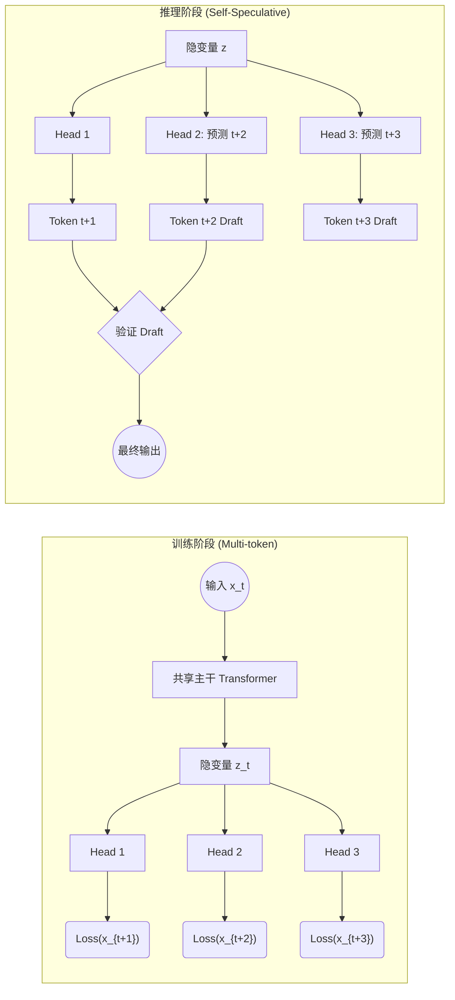

# Paper 27: Better & Faster Large Language Models via Multi-token Prediction

## 1. 一句话概述

Meta AI 提出了一种将“预测下一个 token”扩展为“同时预测未来 n 个 token”的训练范式，在不增加推理时间成本的前提下，显著提升了模型在代码生成等任务上的性能，并利用自推测解码（Self-Speculative Decoding）实现了 3 倍的推理加速。

## 2. Abstract: 论文试图解决什么问题？有什么贡献？

### 核心痛点

当前的大型语言模型（LLMs）主要通过“下一个 token 预测”（next-token prediction）损失进行训练。这种方式虽然有效，但存在严重的**样本效率（sample efficiency）**问题。

> "Consequently, it remains a fact that state-of-the-art next-token predictors call for orders of magnitude more data than human children to arrive at the same level of fluency (Frank, 2023)." 
> 
> 

此外，这种逐词预测的模式倾向于关注**局部模式**（local patterns），而忽视了对全局结构和困难决策点的规划能力。

### 主要贡献

1. **多 Token 预测架构**：提出了一种简单的架构修改，利用共享的主干网络（Trunk）和  个独立的输出头（Heads），同时预测未来的  个 token。
2. **性能提升**：在代码生成任务上表现尤为出色。
> "Our 13B parameter models solves 12% more problems on HumanEval and 17% more on MBPP than comparable next-token models." 
> 
> 


3. **推理加速**：利用训练好的多头结构，可以在推理阶段进行“自推测解码”（Self-Speculative Decoding），无需额外的 draft model 即可加速。
> "As an additional benefit, models trained with 4-token prediction are up to 3x faster at inference, even with large batch sizes." 
> 
> 


## 3. Introduction: 论文的动机是什么？

### 动机：超越局部最优与短视

传统的 Teacher Forcing 训练方式告诉模型每一个位置的“正确答案”，导致模型过于依赖当前上下文的表面统计规律，而缺乏长远的规划能力。作者认为，要求模型预测更远的未来（不仅仅是 ，而是 ），可以迫使模型的主干网络（Shared Trunk）学习到更深层、更全局的语义表征。

> "More precisely, teacher forcing with next-token prediction latches on local patterns and overlooks 'hard' decisions." 
> 
> 

### 逻辑链条

1. **信息论视角**：多 token 预测增加了损失函数中“互信息”（Mutual Information）项的权重，促使模型关注那些对未来文本生成有长远影响的“关键决策点”（Choice Points），而非那些无关紧要的填充词。
2. **算法推理能力**：实验表明，多 token 预测有助于模型更快地形成“归纳头”（Induction Heads）和算法推理能力。
3. **规模效应**：这种方法的收益随着模型规模的增大而增加。小模型（如 300M）可能收益甚微甚至倒退，但大模型（13B+）收益显著。
> "The method is increasingly useful for larger model sizes, and keeps its appeal when training for multiple epochs." 
> 
> 


## 4. Method: 解决方案是什么？

### 核心架构：Shared Trunk + Independent Heads

不同于简单的增加模型深度，作者提出在共享的主干网络（Shared Trunk）之上，并行使用  个独立的输出头。

* **输入**：上下文序列 。
* **共享主干**：，提取潜在表征。
* **多头预测**：第  个头（）负责预测 。


其中  是独立的 Transformer 层， 是共享的 unembedding 矩阵。

### 损失函数

总损失是所有预测头交叉熵损失的加权和（通常直接求和）：


> "This leads to the following factorization of the multi-token prediction cross-entropy loss: " 
> 
> 

### 关键工程优化：内存高效实现

如果简单地并行计算所有头的 logits，显存占用会随着  线性增长（，其中  是词表大小）。作者设计了一种**顺序前向/后向（Sequential Forward/Backward）**策略：

1. 计算主干输出 。
2. 依次计算 Head 1 的 Loss 和梯度，释放 Logits 显存。
3. 依次计算 Head 2...Head 。
4. 在主干处累积所有头的梯度。
这使得峰值显存占用从  降低到 ，几乎没有额外显存开销。

### 训练与推理全链路



## 5. Experiment: 实验结果与分析

### 主实验：代码生成 (MBPP & HumanEval)

作者在 300M 到 13B 参数量的模型上进行了从头预训练（scratch）实验。

* **结论**：随着模型规模增加，Multi-token 优势扩大。对于 13B 模型，4-token 预测在 MBPP Pass@1 上比 Baseline 高出 4.5%（绝对值），相对提升约 17%。
* **图表证据**：
> "MBPP Pass@1 gains with 4-token prediction ... 13B: +4.5" 
> 
> 


### 推理速度：自推测解码

利用训练好的附加头作为“Draft Model”进行推测解码。

* **结果**：在代码任务上实现了 3.0 倍加速，在文本任务上实现了 2.7 倍加速。
> "We observe a speedup of 3.0x on code with an average of 2.5 accepted tokens out of 3 suggestions on code" 
> 
> 


### 消融与分析实验

1. **最佳 n 值**：实验表明  通常是最佳选择。
> "Results in table 1 show that training with 4-future tokens outperforms all the other models consistently" 
> 
> 


2. **字节级（Byte-level）模型**：在极端情况下（基于字节预测），8-byte 预测比 next-byte 预测解决了多出 67% 的问题，证明了多 token 预测能有效捕捉长程依赖。
3. **小模型上的归纳能力**：在小模型（<300M）上，多 token 预测能加速 Induction Head 的形成，但在极小模型上可能因任务过难而导致性能下降。

## 6. Numpy 与 Torch 对照实现

### 代码分析与说明

提供的 Numpy 代码实现了一个简化的 **RNN（循环神经网络）版本** 的多 Token 预测模型，而非论文中的 Transformer 架构。这有助于理解“多头预测”的基本逻辑，但无法复现论文中的并行化优势。

* **对应部分**：论文 Section 2 (Method) 中的  计算逻辑。
* **关键张量 Shape**：
* `input_seq`: shape `(Sequence_Length,)`（Numpy 代码按逐个 token 循环处理，相当于 Batch Size=1）。
* `h`: `(Hidden_Dim, 1)`。
* `W_out` (in heads): `(Vocab, Hidden)`。
* `logits`: `(Vocab, 1)`。


* **假设与差异**：
* **架构差异**：代码用的是 RNN (`tanh(Wx + Wh + b)`)，论文用的是 Transformer trunk。
* **Batch 处理**：Numpy 代码是单样本循环（For-loop over sequence），PyTorch 实现将优化为 Batch 并行 + 序列向量化处理。
* **损失计算**：Numpy 代码手动累加了未来  步的 Loss。


### 代码对照 (Code Group)

::: code-group

```python [Numpy]
class MultiTokenRNN:
    """RNN with multi-token prediction"""
    def __init__(self, vocab_size, embedding_dim, hidden_dim, num_future_tokens=3):
        self.vocab_size = vocab_size
        self.embedding_dim = embedding_dim
        self.hidden_dim = hidden_dim
        self.num_future_tokens = num_future_tokens
        
        # Shared embeddings and RNN
        self.W_embed = np.random.randn(vocab_size, embedding_dim) * 0.01
        self.W_xh = np.random.randn(hidden_dim, embedding_dim) * 0.01
        self.W_hh = np.random.randn(hidden_dim, hidden_dim) * 0.01
        self.b_h = np.zeros((hidden_dim, 1))
        
        # Multiple output heads (one per future position)
        self.output_heads = []
        for i in range(num_future_tokens):
            W_out = np.random.randn(vocab_size, hidden_dim) * 0.01
            b_out = np.zeros((vocab_size, 1))
            self.output_heads.append((W_out, b_out))
    
    def forward(self, input_seq):
        """
        Forward pass
        Returns: predictions for next N tokens at each position
        """
        h = np.zeros((self.hidden_dim, 1))
        multi_predictions = []  # List of (pred_t+1, pred_t+2, ..., pred_t+N)
        hidden_states = []
        
        for token_idx in input_seq:
            # Embed
            x = self.W_embed[token_idx].reshape(-1, 1)
            
            # RNN step
            h = np.tanh(np.dot(self.W_xh, x) + np.dot(self.W_hh, h) + self.b_h)
            
            # Predict next N tokens using separate heads
            position_preds = []
            for W_out, b_out in self.output_heads:
                logits = np.dot(W_out, h) + b_out
                probs = softmax(logits.T)
                position_preds.append(probs.flatten())
            
            multi_predictions.append(position_preds)
            hidden_states.append(h.copy())
        
        return multi_predictions, hidden_states

```

```python [Torch]
import torch
import torch.nn as nn
import torch.nn.functional as F

class MultiTokenRNN_Torch(nn.Module):
    """
    高效 PyTorch 实现：支持 Batch 并行与序列向量化
    对应 Numpy 类：MultiTokenRNN
    """
    def __init__(self, vocab_size, embedding_dim, hidden_dim, num_future_tokens=3):
        super().__init__()
        self.vocab_size = vocab_size
        self.num_future_tokens = num_future_tokens
        
        # 1. Shared Backbone (对应 Numpy: W_embed, W_xh, W_hh)
        self.embedding = nn.Embedding(vocab_size, embedding_dim)
        # 使用 nn.RNN 实现向量化的序列处理，替代 Numpy 中的 for token_idx 循环
        self.rnn = nn.RNN(input_size=embedding_dim, 
                          hidden_size=hidden_dim, 
                          batch_first=True)
        
        # 2. Multiple Output Heads (对应 Numpy: self.output_heads)
        # 使用 ModuleList 管理多个独立线性层
        self.heads = nn.ModuleList([
            nn.Linear(hidden_dim, vocab_size) 
            for _ in range(num_future_tokens)
        ])
        
    def forward(self, input_seq, h_0=None):
        """
        Args:
            input_seq: (Batch, Seq_Len)
            h_0: Initial hidden state
        Returns:
            multi_predictions: (Batch, Seq_Len, Num_Heads, Vocab)
            hidden_states: (Batch, Seq_Len, Hidden)
        """
        # Embed: (B, L, E)
        x = self.embedding(input_seq)
        
        # Shared Trunk Forward: 一次性计算整个序列的 Hidden States
        # out: (B, L, H) - 对应 Numpy 中 loop 累积的 hidden_states
        rnn_out, h_n = self.rnn(x, h_0)
        
        head_outputs = []
        # Independent Heads Forward: 对应 Numpy 中的 for loop over heads
        for head in self.heads:
            # head(rnn_out) -> (B, L, V)
            # 这里的 head 相当于预测 x_{t+k}
            head_logits = head(rnn_out)
            head_probs = F.softmax(head_logits, dim=-1)
            head_outputs.append(head_probs)
            
        # Stack predictions: (B, L, n, V)
        # 对应 Numpy return 的 multi_predictions 列表结构
        multi_predictions = torch.stack(head_outputs, dim=2)
        
        return multi_predictions, rnn_out

# 辅助函数：计算 Multi-token Loss
def compute_multi_token_loss(model, input_seq):
    """
    向量化计算 Loss，替代 Numpy 中的 train_multi_token 循环
    """
    n = model.num_future_tokens
    # Forward pass
    # preds: (B, L, n, V)
    preds, _ = model(input_seq)
    
    # 我们需要预测 seq[t+1], seq[t+2]...
    # 输入序列长度为 L，我们在位置 t (0..L-n-1) 进行预测
    # 有效预测长度: L_effective = L - n
    
    total_loss = 0
    # 对每一个头进行 Loss 计算
    for i in range(n):
        # Head i 预测的是 t + (i+1) 步后的 token
        # 预测值取: [:, 0 : L-n, i, :]
        # 真实值取: [:, i+1 : L-n+i+1]
        
        curr_preds = preds[:, :-(n), i, :]     # (B, L_eff, V)
        curr_targets = input_seq[:, i+1:]      # (B, L_eff + (n-1-i)) -> 需截断
        curr_targets = curr_targets[:, :curr_preds.size(1)] # 确保长度对齐
        
        # 交叉熵需要 Log-Softmax (PyTorch CrossEntropyLoss 包含 LogSoftmax)
        # 这里为了演示数值等价性，假设 preds 已经是 prob，加 log
        loss_i = F.nll_loss(torch.log(curr_preds + 1e-8).transpose(1, 2), curr_targets)
        total_loss += loss_i
        
    return total_loss / n

```

:::

### 对照讲解

1. **向量化 vs 循环**：
* **Numpy**: 使用 Python `for` 循环逐个处理 token (`for token_idx in input_seq`)。
* **Torch**: 使用 `nn.RNN` 一次性处理整个 `(Batch, Seq_Len)` 张量。这利用了底层的 CUDA/C++ 优化，速度远快于 Python 循环。


2. **多头管理**：
* **Numpy**: 使用 `list` 存储 `(W, b)` 元组，手动执行 `np.dot`。
* **Torch**: 使用 `nn.ModuleList` 包装 `nn.Linear`。这不仅管理权重，还能自动处理 `to(device)` 和保存/加载模型权重。


3. **维度处理 (Shape Semantics)**：
* **Numpy**: 输出是 List of List of Arrays。
* **Torch**: 输出被堆叠为 4D 张量 `(Batch, Seq_Len, Num_Heads, Vocab_Size)`。这在计算 Loss 时非常关键，因为可以利用张量切片（Slicing）一次性提取所有目标，避免了 Numpy 实现中复杂的索引操作。


4. **易错点提示**：
* **Loss 对齐**：在 Multi-token 预测中，第  个头在位置  预测的是 。在代码中对齐 `preds` 和 `targets` 时极易出错（Off-by-one error）。Torch 代码中演示了如何通过切片 `input_seq[:, i+1:]` 来自动对齐目标。
* **Softmax 维度**：Numpy 代码需手动指定 `axis` 并处理 `keepdims`。PyTorch 的 `F.softmax` 或 `CrossEntropyLoss` 自动处理数值稳定性（Log-Sum-Exp trick），比 Numpy 手写 `np.exp` 更安全。