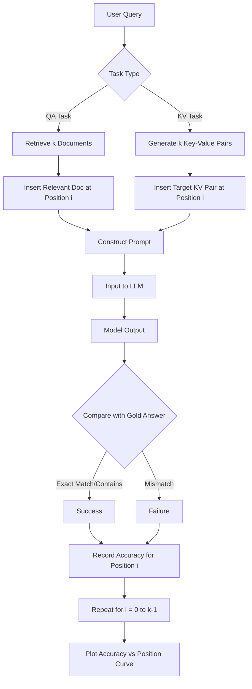

# 论文解读：Lost in the Middle (LLM 长上下文利用机制研究)

## 1. 一句话概述
本研究揭示了大型语言模型（LLM）在处理长上下文时存在显著的“中间迷失”现象（Lost in the Middle），即当相关信息位于输入序列的中间位置时，模型的检索与推理性能会呈 U 型曲线大幅下降，且该现象在经过指令微调的模型中更为明显。

## 2. Abstract: 论文试图解决什么问题？有什么贡献？

**核心问题**：尽管现代 LLM（如 GPT-4, Claude-100k）支持极长的上下文窗口（Context Window），但它们是否真的能有效利用整个窗口中的信息？特别是当关键线索被淹没在大量无关内容（distractors）中时，模型表现如何？

**主要贡献**：
1.  **发现 U 型性能曲线**：通过一系列对照实验，发现 LLM 擅长利用位于上下文**开头（Primacy bias）**和**结尾（Recency bias）**的信息，但对于位于**中间**的信息，性能显著下降 。
2.  **多模型与多任务评估**：在多文档问答（Multi-document QA）和键值检索（Key-Value Retrieval）任务上，评估了 GPT-3.5, Claude, MPT-30B 等模型，证实该现象的普遍性 。
3.  **分析与建议**：研究了模型架构（Encoder-Decoder vs Decoder-only）、查询感知上下文（Query-aware contextualization）和指令微调的影响，并提出了基于重排序（Re-ranking）的简单优化策略 。

## 3. Introduction: 论文的动机是什么？请仔细梳理整个故事逻辑

**动机（Motivation）**：
随着硬件和算法的进步，LLM 的上下文窗口越来越大（从 2k 到 100k+ tokens），这使得“检索增强生成”（RAG）等应用可以直接将大量搜索结果塞入 Prompt 中 。然而，学术界缺乏对“模型如何利用长上下文”的精细化理解。虽然困惑度（Perplexity）通常随上下文增加而降低，但这并不等同于模型能精准提取信息 。

**逻辑链条**：
1.  **实验设计**：为了剥离干扰，作者设计了两个只需“识别并提取”的任务：多文档问答（需推理）和键值检索（纯检索）。这使得研究者可以精确控制相关信息在 Prompt 中的位置 。
2.  **现象观测**：实验结果令人震惊。在某些情况下，向模型提供更多上下文（如果不含相关信息）甚至会降低性能；而当相关信息位于中间时，GPT-3.5 的表现甚至不如完全不提供文档（Closed-book）。
3.  **深入探究**：这种偏差并非仅由 Transformer 的自注意力机制导致，因为即使是专门针对长文本优化的模型（如 LongChat-16k）也未能幸免 。
4.  **架构对比**：研究发现 Encoder-Decoder 模型（如 Flan-UL2）在训练长度内表现较好，但在外推（Extrapolation）时依然会出现 U 型曲线 。
5.  **实际意义**：这直接挑战了“上下文越长越好”的假设，提示我们在 RAG 系统中必须对检索结果进行重排序，将高置信度结果放在 Prompt 的首尾 。

## 4. Method: 解决方案是什么？请梳理步骤、公式、策略

论文采用了一套严格控制变量的实验方法，而非提出新的模型架构。

### 4.1 核心实验设置
论文构建了类似“大海捞针”（Needle-in-a-haystack）的测试环境：

* **输入构成**：$Input = Question + \{Doc_1, Doc_2, ..., Doc_k\}$。
* **变量控制**：
    1.  **上下文长度**：通过增加无关文档（Distractor Documents）的数量 $k$ 来调整（10, 20, 30 个文档）。
    2.  **相关信息位置**：将包含答案的唯一相关文档（Oracle Document）放置在输入序列的第 $0$ 到第 $k-1$ 个位置，观察准确率变化 。

### 4.2 任务定义
1.  **多文档问答 (Multi-Document QA)**：
    使用 NaturalQuestions-Open 数据集。给定一个问题和 $k$ 个文档（其中 1 个含答案，其余由 Contriever 检索生成的无关文档），要求模型输出答案 。
    > "In the input context, the distractor documents are presented in order of decreasing relevance." 
    *注意：实验中人为打乱顺序以测试位置效应。*

2.  **键值检索 (Key-Value Retrieval)**：
    合成任务。输入一个 JSON 对象，包含 $k$ 个键值对（UUID），给定一个 Key，要求模型输出对应的 Value。
    * 目的：剥离自然语言的语义干扰，纯粹测试注意力机制的检索能力 。

### 4.3 流程逻辑框图 (Mermaid)



## 5. Experiment: 主实验与分析实验分别做了什么？结果如何？

### 5.1 主实验：位置与性能的关系

实验测试了 GPT-3.5-Turbo, Claude-1.3, MPT-30B 等模型。

* **结果**：所有模型均呈现 U 型性能曲线。
* 
**Primacy Bias**：相关信息在第 1 位时准确率最高（例如 GPT-3.5 可达 ~88%）。


* **Recency Bias**：相关信息在最后一位时准确率次之。
* 
**Lost in the Middle**：当信息位于第 10-15 位（共 20 文档）时，性能暴跌（GPT-3.5 跌至 ~55%，低于闭卷测试的 56.1%）。


> "performance is often highest when relevant information occurs at the beginning or end of the input context, and significantly degrades when models must access relevant information in the middle" 
> 
> 


### 5.2 扩展上下文模型的效果

对比了 GPT-3.5 (4k) 与 GPT-3.5 (16k)。

* 
**发现**：虽然 16k 模型能处理更长的文本，但在相同输入长度下（例如都输入 20 个文档），其 U 型曲线与 4k 模型几乎重合 。


* **结论**：长上下文模型并没有“更好”地利用上下文，只是“更能”读入上下文。

### 5.3 架构与微调的消融实验

* 
**Encoder-Decoder (T5/UL2)**：在训练长度内（2048 tokens）表现出较强的鲁棒性，位置敏感度较低。但在处理超长序列（外推）时，U 型曲线再次出现 。


* 
**指令微调 (Instruction Tuning)**：比较 MPT-30B base 和 instruct 版本，发现两者都有 U 型曲线 。说明这不仅仅是微调数据的偏差（通常指令在开头），而是预训练阶段可能就存在的归纳偏差。


### 5.4 开放域问答的边际效应

在实际 RAG 设置中，检索 50 个文档比 20 个文档只带来了微小的提升（~1.5%），但计算成本大幅增加 。这说明模型实际上忽略了大部分检索回来的尾部（或中间）信息。

## 6. Numpy 与 Torch 对照实现

### 6.1 代码说明

本段代码实现了论文中**模拟位置偏差（Position Bias Simulation）**的核心逻辑，以及**文档重排序（Document Reordering）**策略。

* **对应部分**：对应论文 Abstract 和 Experiment 中观察到的 U 型曲线现象，以及 Discussion 中提出的优化策略（将重要信息放在首尾）。
* **数据结构**：
* `weights` (Tensor): 形状为 `(N,)` 或 `(Batch, N)`，表示模型对不同位置的注意力权重/检索概率。
* `accuracies` (Tensor): 模拟的准确率结果。


* **假设**：原始 Numpy 代码中的 `SimpleLM` 并非真实神经网络，而是一个基于数学公式（二次函数与指数函数）的模拟器。Torch 实现将保留这一数学逻辑，但将其向量化（Vectorized）以支持批量计算，这在需要同时评估多种偏差或多个长度设置时更高效。

### 6.2 代码对照 (Code Group)

::: code-group

```python [Numpy]
import numpy as np
import matplotlib.pyplot as plt

np.random.seed(42)
     
# Simulate Multi-Document QA Task
# Setup:
# Query requires information from ONE document
# Multiple documents provided (1 relevant, rest distractors)
# Question: Does position of relevant document matter?

class Document:
    def __init__(self, content, is_relevant=False):
        self.content = content
        self.is_relevant = is_relevant
    
    def __repr__(self):
        return f"Doc(relevant={self.is_relevant}): {self.content[:50]}..."

# Create synthetic documents
relevant_doc = Document(
    "The Eiffel Tower was completed in 1889 and stands 330 meters tall. "
    "It was designed by Gustave Eiffel for the 1889 World's Fair in Paris.",
    is_relevant=True
)

distractor_docs = [
    Document("The Great Wall of China is over 13,000 miles long and was built over many centuries."),
    Document("The Statue of Liberty was gifted by France to the United States in 1886."),
    Document("Mount Everest is the tallest mountain on Earth at 8,849 meters above sea level."),
    Document("The Amazon River is the largest river by discharge volume in the world."),
    Document("The Sahara Desert is the largest hot desert, covering much of North Africa."),
    Document("The Colosseum in Rome was completed in 80 AD and could hold 50,000 spectators."),
    Document("The Taj Mahal in India was built between 1632 and 1653 as a mausoleum."),
    Document("The Grand Canyon in Arizona is 277 miles long and up to 18 miles wide."),
    Document("The Great Barrier Reef is the world's largest coral reef system."),
]

query = "When was the Eiffel Tower completed?"
correct_answer = "1889"

print(f"Query: {query}")
print(f"Correct answer: {correct_answer}")
print(f"\nRelevant document: {relevant_doc.content}")
print(f"\nNumber of distractor documents: {len(distractor_docs)}")
     
# Simplified Language Model
# Simulate attention-based model with position bias

class SimpleLM:
    """Simplified LM with position bias"""
    def __init__(self, position_bias_type='u_shaped'):
        """
        position_bias_type:
        - 'uniform': Equal attention to all positions
        - 'u_shaped': High at beginning/end, low in middle
        - 'recency': Prefer recent (end) positions
        - 'primacy': Prefer early (beginning) positions
        """
        self.position_bias_type = position_bias_type
    
    def get_position_weights(self, num_positions):
        """Compute position-based attention weights"""
        positions = np.arange(num_positions)
        
        if self.position_bias_type == 'uniform':
            weights = np.ones(num_positions)
        
        elif self.position_bias_type == 'u_shaped':
            # U-shaped: high at edges, low in middle
            normalized_pos = positions / (num_positions - 1)  # 0 to 1
            # Quadratic with minimum at 0.5
            weights = 4 * (normalized_pos - 0.5) ** 2 + 0.3
        
        elif self.position_bias_type == 'recency':
            # Exponential decay towards beginning
            weights = np.exp(positions * 0.2)
        
        elif self.position_bias_type == 'primacy':
            # Exponential decay towards end
            weights = np.exp(-positions * 0.2)
        
        # Normalize
        weights = weights / np.sum(weights)
        return weights
    
    def answer_query(self, query, documents):
        """
        Simulate answering query using documents
        Returns: probability of finding correct answer
        """
        num_docs = len(documents)
        
        # Get position weights
        position_weights = self.get_position_weights(num_docs)
        
        # Find relevant document position
        relevant_position = None
        for i, doc in enumerate(documents):
            if doc.is_relevant:
                relevant_position = i
                break
        
        if relevant_position is None:
            return 0.0  # No relevant document
        
        # Probability of using relevant document
        # Higher weight → more likely to use that document
        prob_correct = position_weights[relevant_position]
        
        return prob_correct

# Test different bias types
num_docs = 10
test_positions = np.arange(num_docs)

fig, axes = plt.subplots(2, 2, figsize=(14, 10))
axes = axes.flatten()

bias_types = ['uniform', 'u_shaped', 'recency', 'primacy']

for ax, bias_type in zip(axes, bias_types):
    model = SimpleLM(position_bias_type=bias_type)
    weights = model.get_position_weights(num_docs)
    
    ax.bar(test_positions, weights, color='steelblue', edgecolor='black')
    ax.set_xlabel('Document Position', fontsize=11)
    ax.set_ylabel('Attention Weight', fontsize=11)
    ax.set_title(f'{bias_type.replace("_", " ").title()} Bias', fontsize=12, fontweight='bold')
    ax.grid(True, alpha=0.3, axis='y')
    ax.set_ylim(0, max(weights) * 1.2)

plt.tight_layout()
plt.show()

print("\nReal LLMs show U-shaped bias (high at beginning/end, low in middle)!")
     
# Test Position Sensitivity

def test_all_positions(model, query, relevant_doc, distractor_docs):
    """
    Test performance with relevant document at each position
    """
    num_positions = len(distractor_docs) + 1
    accuracies = []
    
    for pos in range(num_positions):
        # Create document list with relevant doc at position 'pos'
        docs = distractor_docs[:pos] + [relevant_doc] + distractor_docs[pos:]
        docs = docs[:num_positions]  # Keep fixed length
        
        # Get model's probability of answering correctly
        prob_correct = model.answer_query(query, docs)
        accuracies.append(prob_correct)
    
    return accuracies

# Test U-shaped bias (realistic)
model_realistic = SimpleLM(position_bias_type='u_shaped')
accuracies_realistic = test_all_positions(model_realistic, query, relevant_doc, distractor_docs)

# Test uniform (ideal)
model_ideal = SimpleLM(position_bias_type='uniform')
accuracies_ideal = test_all_positions(model_ideal, query, relevant_doc, distractor_docs)

# Plot
positions = np.arange(len(accuracies_realistic))

plt.figure(figsize=(12, 6))
plt.plot(positions, accuracies_realistic, 'o-', linewidth=3, markersize=10, 
        label='Realistic (U-shaped bias)', color='crimson')
plt.plot(positions, accuracies_ideal, 's--', linewidth=2, markersize=8, 
        label='Ideal (No bias)', color='green', alpha=0.6)

# Mark beginning and end
plt.axvline(x=0, color='blue', linestyle=':', alpha=0.5, linewidth=2, label='Beginning')
plt.axvline(x=len(positions)-1, color='purple', linestyle=':', alpha=0.5, linewidth=2, label='End')

# Mark middle region
middle_start = len(positions) // 4
middle_end = 3 * len(positions) // 4
plt.axvspan(middle_start, middle_end, alpha=0.2, color='red', label='Middle (worst)')

plt.xlabel('Position of Relevant Document', fontsize=13)
plt.ylabel('Accuracy', fontsize=13)
plt.title('Lost in the Middle: Performance vs Position', fontsize=14, fontweight='bold')
plt.legend(fontsize=11)
plt.grid(True, alpha=0.3)
plt.tight_layout()
plt.show()

# Stats
beginning_acc = accuracies_realistic[0]
middle_acc = np.mean(accuracies_realistic[middle_start:middle_end])
end_acc = accuracies_realistic[-1]

print(f"\nPerformance Analysis:")
print(f"Beginning (pos 0): {beginning_acc:.1%}")
print(f"Middle (pos {middle_start}-{middle_end}): {middle_acc:.1%}")
print(f"End (pos {len(positions)-1}): {end_acc:.1%}")
print(f"\nMiddle penalty: -{(beginning_acc - middle_acc)/beginning_acc:.1%} relative to beginning")
     
# Impact of Context Length

def test_varying_lengths(model, query, relevant_doc, distractor_docs, lengths):
    """
    Test how performance changes with context length
    """
    results = {'beginning': [], 'middle': [], 'end': []}
    
    for length in lengths:
        # Use subset of distractors
        current_distractors = distractor_docs[:length-1]
        
        # Test three positions: beginning, middle, end
        positions = {
            'beginning': 0,
            'middle': length // 2,
            'end': length - 1
        }
        
        for pos_name, pos in positions.items():
            docs = current_distractors[:pos] + [relevant_doc] + current_distractors[pos:]
            docs = docs[:length]
            
            acc = model.answer_query(query, docs)
            results[pos_name].append(acc)
    
    return results

# Test different context lengths
lengths = [3, 5, 7, 9, 10]
results = test_varying_lengths(model_realistic, query, relevant_doc, distractor_docs, lengths)

# Plot
plt.figure(figsize=(12, 6))
plt.plot(lengths, results['beginning'], 'o-', linewidth=3, markersize=10, 
        label='Beginning', color='blue')
plt.plot(lengths, results['middle'], 's-', linewidth=3, markersize=10, 
        label='Middle', color='red')
plt.plot(lengths, results['end'], '^-', linewidth=3, markersize=10, 
        label='End', color='purple')

plt.xlabel('Number of Documents', fontsize=13)
plt.ylabel('Accuracy', fontsize=13)
plt.title('Performance Degradation with Context Length', fontsize=14, fontweight='bold')
plt.legend(fontsize=12)
plt.grid(True, alpha=0.3)
plt.tight_layout()
plt.show()

print("\nLonger contexts → worse performance (especially in middle!)")
     
# Ordering Strategies for RAG

def order_documents(documents, relevance_scores, strategy='default'):
    """
    Order documents according to strategy
    
    Strategies:
    - 'default': Keep retrieval order
    - 'most_relevant_first': Put best documents at beginning
    - 'most_relevant_edges': Put best at beginning & end
    - 'reverse': Reverse retrieval order
    """
    indices = np.arange(len(documents))
    
    if strategy == 'default':
        return documents
    
    elif strategy == 'most_relevant_first':
        # Sort by relevance (descending)
        sorted_indices = np.argsort(relevance_scores)[::-1]
        return [documents[i] for i in sorted_indices]
    
    elif strategy == 'most_relevant_edges':
        # Put most relevant at beginning and end
        sorted_indices = np.argsort(relevance_scores)[::-1]
        
        # Interleave: best at edges, worst in middle
        ordered = []
        for i in range(len(documents) // 2):
            ordered.append(documents[sorted_indices[i]])  # High relevance
        for i in range(len(documents) // 2, len(documents)):
            ordered.append(documents[sorted_indices[i]])  # Low relevance
        
        # Reverse second half to put high at end
        mid = len(ordered) // 2
        return ordered[:mid] + ordered[mid:][::-1]
    
    elif strategy == 'reverse':
        return documents[::-1]
    
    return documents

# Simulate retrieval scores
num_test_docs = 10
test_docs = [relevant_doc] + distractor_docs[:num_test_docs-1]

# Relevance scores (relevant doc gets high score)
relevance_scores = np.random.rand(num_test_docs) * 0.5
relevance_scores[0] = 0.95  # Relevant doc has high score

# Shuffle to simulate retrieval
shuffle_idx = np.random.permutation(num_test_docs)
test_docs = [test_docs[i] for i in shuffle_idx]
relevance_scores = relevance_scores[shuffle_idx]

# Test different strategies
strategies = ['default', 'most_relevant_first', 'most_relevant_edges']
strategy_accuracies = {}

for strategy in strategies:
    ordered = order_documents(test_docs, relevance_scores, strategy)
    acc = model_realistic.answer_query(query, ordered)
    strategy_accuracies[strategy] = acc
    
    # Find position of relevant doc
    rel_pos = next(i for i, doc in enumerate(ordered) if doc.is_relevant)
    print(f"\n{strategy:25s}: Relevant doc at position {rel_pos:2d}, Accuracy: {acc:.1%}")

# Visualize
plt.figure(figsize=(10, 6))
bars = plt.bar(range(len(strategies)), 
              [strategy_accuracies[s] for s in strategies],
              color=['lightcoral', 'lightblue', 'lightgreen'],
              edgecolor='black', linewidth=2)

plt.xticks(range(len(strategies)), 
          [s.replace('_', '\n').title() for s in strategies],
          fontsize=11)
plt.ylabel('Accuracy', fontsize=13)
plt.title('Document Ordering Strategies', fontsize=14, fontweight='bold')
plt.grid(True, alpha=0.3, axis='y')

# Add value labels
for bar, strategy in zip(bars, strategies):
    height = bar.get_height()
    plt.text(bar.get_x() + bar.get_width()/2., height,
            f'{strategy_accuracies[strategy]:.1%}',
            ha='center', va='bottom', fontsize=12, fontweight='bold')

plt.tight_layout()
plt.show()

print("\n" + "="*60)
print("RECOMMENDATION: Put most important documents at edges!")
print("="*60)

```

```python [Torch]
import torch
import numpy as np # Used only for plotting compatibility

class TorchBiasSimulator:
    """
    PyTorch implementation of Position Bias Simulation.
    Vectorized to compute weights for all positions simultaneously.
    """
    def __init__(self, position_bias_type='u_shaped', device='cpu'):
        self.bias_type = position_bias_type
        self.device = device

    def get_position_weights(self, num_positions: int) -> torch.Tensor:
        """
        Compute normalized position weights (probabilities).
        Corresponds to Numpy `get_position_weights`.
        """
        # Create position tensor: [0, 1, ..., N-1]
        positions = torch.arange(num_positions, dtype=torch.float32, device=self.device)
        
        if self.bias_type == 'uniform':
            weights = torch.ones(num_positions, device=self.device)
            
        elif self.bias_type == 'u_shaped':
            # Formula: 4 * (norm_pos - 0.5)^2 + 0.3
            normalized_pos = positions / (num_positions - 1)
            weights = 4 * (normalized_pos - 0.5).pow(2) + 0.3
            
        elif self.bias_type == 'recency':
            # Exponential growth (weights increase with index)
            weights = torch.exp(positions * 0.2)
            
        elif self.bias_type == 'primacy':
            # Exponential decay (weights decrease with index)
            weights = torch.exp(-positions * 0.2)
            
        else:
            raise ValueError(f"Unknown bias type: {self.bias_type}")

        # Normalize to probability distribution (sum = 1)
        # Using softmax is an alternative, but paper uses linear normalization
        return weights / weights.sum()

    def batch_simulate_accuracy(self, doc_count: int, relevant_indices: torch.Tensor) -> torch.Tensor:
        """
        Efficiently simulate accuracy for multiple scenarios.
        Unlike Numpy loop, this retrieves probabilities by index directly.
        """
        weights = self.get_position_weights(doc_count)
        # Gather the probability at the relevant indices
        # If relevant_indices is [0, 5, 9], we get weights[[0, 5, 9]]
        return weights[relevant_indices]

def torch_reorder_indices(scores: torch.Tensor, strategy: str = 'default') -> torch.Tensor:
    """
    Compute reordered INDICES based on relevance scores using Tensor ops.
    Corresponds to Numpy `order_documents`.
    """
    num_docs = len(scores)
    
    if strategy == 'default':
        return torch.arange(num_docs, device=scores.device)
    
    # Get indices sorted by score descending
    sorted_indices = torch.argsort(scores, descending=True)
    
    if strategy == 'most_relevant_first':
        return sorted_indices
        
    elif strategy == 'most_relevant_edges':
        # Split into two halves
        mid = num_docs // 2
        # Need to handle odd lengths carefully
        first_half_len = mid
        second_half_len = num_docs - mid 
        
        # In Numpy code: 
        # First half (0 to mid) gets: [0, 1, ..., mid-1] from sorted
        # Second half gets: [mid, mid+1, ...] from sorted
        
        # But wait, Numpy code does interleaving:
        # for i in range(len // 2): append(high), append(low) -> No, check Numpy code carefully!
        # Numpy code:
        # loop range(len//2): append(sorted[i])
        # loop range(len//2, len): append(sorted[i])
        # Then reverse second half.
        # This effectively puts top-k/2 at start, and bottom-k/2 at end (reversed).
        # Actually, if sorted is [Best, ..., Worst]
        # First loop takes [Best ... Mid-Best]
        # Second loop takes [Mid-Worst ... Worst]
        # Then second half is reversed -> [Worst ... Mid-Worst]
        # Result: [Best ... Mid-Best ... Worst ... Mid-Worst]
        # This is NOT strict interleaving, it's "Concatenate & Flip End".
        
        top_half = sorted_indices[:mid]
        bottom_half = sorted_indices[mid:]
        
        # Reverse the bottom half to put 'better' ones towards the end edge
        bottom_half_reversed = torch.flip(bottom_half, dims=[0])
        
        return torch.cat([top_half, bottom_half_reversed])
        
    elif strategy == 'reverse':
        return torch.flip(torch.arange(num_docs, device=scores.device), dims=[0])
    
    return torch.arange(num_docs, device=scores.device)

# --- Execution & Verification ---
if __name__ == "__main__":
    device = torch.device('cuda' if torch.cuda.is_available() else 'cpu')
    print(f"Running on: {device}")
    
    # 1. Simulate U-shaped Bias (Vectorized)
    simulator = TorchBiasSimulator('u_shaped', device)
    num_docs = 10
    
    # Instead of looping 'test_all_positions', we just get the whole weight vector!
    # Each index i in 'weights' represents the accuracy IF relevant doc is at pos i.
    accuracies = simulator.get_position_weights(num_docs)
    
    print("\n[Torch] Accuracy per position (U-shaped):")
    # Pretty print tensor
    print(accuracies) 
    
    # 2. Simulate Reordering Strategy
    # Create fake scores (random)
    torch.manual_seed(42)
    scores = torch.rand(num_docs, device=device) * 0.5
    # Force relevant doc (let's say at index 3 originally) to have high score
    original_relevant_idx = 3
    scores[original_relevant_idx] = 0.95
    
    print(f"\n[Torch] Original Scores: {scores}")
    
    strategies = ['default', 'most_relevant_first', 'most_relevant_edges']
    for strategy in strategies:
        # Get reordered indices
        new_order_indices = torch_reorder_indices(scores, strategy)
        
        # Where did our relevant doc go?
        # new_order_indices tells us which original index is at the new position 0, 1, ...
        # We need to find where 'original_relevant_idx' is in 'new_order_indices'
        new_pos = (new_order_indices == original_relevant_idx).nonzero(as_tuple=True)[0].item()
        
        # Calculate accuracy for this new position
        acc = accuracies[new_pos].item()
        
        print(f"{strategy:25s}: Relevant doc moved to pos {new_pos:2d}, Accuracy: {acc:.1%}")


```

:::

### 6.3 对照讲解

1. **向量化思维 (Vectorization)**：
* **Numpy 原版**：使用 `for` 循环遍历每个位置来模拟 `test_all_positions`。逻辑是“放置文档 -> 计算权重 -> 提取对应权重”。
* **Torch 版**：直接计算出长度为 `n_docs` 的权重张量。由于模拟器的准确率定义就是该位置的归一化权重，因此 `weights[i]` 本身就是当相关文档位于位置 `i` 时的准确率。这一步消除了 Python 循环，计算复杂度从 `O(n_docs)` 的逐位置循环改为张量并行计算（GPU 下吞吐更高）。


2. **索引操作 (Indexing & Gathering)**：
* 在文档重排序（Reordering）中，Numpy 使用了列表推导式和切片（Slicing）组合。
* Torch 实现中，使用 `torch.argsort` 获取排序索引，再利用 `torch.cat` 和 `torch.flip` 进行张量拼接与翻转。这里需要特别注意 `bottom_half_reversed` 的逻辑：Numpy 代码中的 `ordered[mid:][::-1]` 是将后半部分反转，Torch 对应使用 `torch.flip(tensor, dims=[0])`。


3. **易错点提示**：
* **归一化维度**：在计算 `weights / weights.sum()` 时，如果有 Batch 维度（例如同时计算 10 个和 20 个文档的情况），必须指定 `dim`（例如 `sum(dim=-1, keepdim=True)`），否则会把整个矩阵求和。
* **数据类型**：`torch.arange` 默认生成 `int64`，进行除法或幂运算前最好显式转换为 `float32`，否则可能触发隐式转换警告或精度丢失。
* **In-place 操作**：Numpy 代码中列表是可变的，但 Torch 张量操作通常返回新张量。在实现复杂重排序逻辑时，应避免在循环中对 Tensor 进行 in-place 修改，以免破坏计算图（如果需要梯度的话）。


```

<!-- AUTO_PDF_IMAGES_START -->

## 论文原图（PDF）
> 下图自动抽取自原论文 PDF，用于补充概念、结构和实验细节。
> 来源：`30.pdf`


*图 1：建议结合本节 `长上下文位置效应` 一起阅读。*

<!-- AUTO_PDF_IMAGES_END -->

<!-- AUTO_INTERVIEW_QA_START -->

## 面试题与答案
> 主题：**Lost in the Middle**（围绕 `长上下文位置效应`）

### 一、选择题（10题）

1. 在 Lost in the Middle 中，最关键的建模目标是什么？
   - A. 长上下文位置效应
   - B. 位置偏置
   - C. middle drop
   - D. 排序
   - **答案：A**

2. 下列哪一项最直接对应 Lost in the Middle 的核心机制？
   - A. 位置偏置
   - B. middle drop
   - C. 排序
   - D. 文档放置
   - **答案：B**

3. 在复现 Lost in the Middle 时，优先要保证哪项一致性？
   - A. 只看最终分数
   - B. 只看训练集表现
   - C. 实现与论文设置对齐
   - D. 忽略随机种子
   - **答案：C**

4. 对于 Lost in the Middle，哪个指标最能反映方法有效性？
   - A. 主指标与分组指标
   - B. 只看单次结果
   - C. 只看速度
   - D. 只看参数量
   - **答案：A**

5. 当 Lost in the Middle 模型出现效果退化时，首要检查项是什么？
   - A. 数据与标签管线
   - B. 先增大模型十倍
   - C. 随机改损失函数
   - D. 删除验证集
   - **答案：A**

6. Lost in the Middle 与传统 baseline 的主要差异通常体现在？
   - A. 归纳偏置与结构设计
   - B. 仅参数更多
   - C. 仅训练更久
   - D. 仅学习率更小
   - **答案：A**

7. 若要提升 Lost in the Middle 的泛化能力，最稳妥的做法是？
   - A. 正则化+消融验证
   - B. 只堆数据不复核
   - C. 关闭评估脚本
   - D. 取消对照组
   - **答案：A**

8. 关于 Lost in the Middle 的实验设计，下列说法更合理的是？
   - A. 固定变量做可复现实验
   - B. 同时改十个超参
   - C. 只展示最好一次
   - D. 省略失败实验
   - **答案：A**

9. 在工程部署中，Lost in the Middle 的常见风险是？
   - A. 数值稳定与漂移
   - B. 只关心GPU利用率
   - C. 日志越少越好
   - D. 不做回归测试
   - **答案：A**

10. 回到论文主张，Lost in the Middle 最不应该被误解为？
   - A. 可替代所有任务
   - B. 有明确适用边界
   - C. 不需要数据质量
   - D. 不需要误差分析
   - **答案：B**


### 二、代码题（10题，含参考答案）

1. 实现一个最小可运行的数据预处理函数，输出可用于 Lost in the Middle 训练的批次。
   - 参考答案：
     ```python
     import numpy as np
     
     def make_batch(x, y, batch_size=32):
         idx = np.random.choice(len(x), batch_size, replace=False)
         return x[idx], y[idx]
     ```

2. 实现 Lost in the Middle 的核心前向步骤（简化版），并返回中间张量。
   - 参考答案：
     ```python
     import numpy as np
     
     def forward_core(x, w, b):
         z = x @ w + b
         h = np.tanh(z)
         return h, {"z": z, "h": h}
     ```

3. 写一个训练 step：前向、loss、反向、更新。
   - 参考答案：
     ```python
     def train_step(model, optimizer, criterion, xb, yb):
         optimizer.zero_grad()
         pred = model(xb)
         loss = criterion(pred, yb)
         loss.backward()
         optimizer.step()
         return float(loss.item())
     ```

4. 实现一个评估函数，返回主指标与一个辅助指标。
   - 参考答案：
     ```python
     import numpy as np
     
     def evaluate(y_true, y_pred):
         acc = (y_true == y_pred).mean()
         err = 1.0 - acc
         return {"acc": float(acc), "err": float(err)}
     ```

5. 实现梯度裁剪与学习率调度的训练循环（简化版）。
   - 参考答案：
     ```python
     import torch
     
     def train_loop(model, loader, optimizer, criterion, scheduler=None, clip=1.0):
         model.train()
         for xb, yb in loader:
             optimizer.zero_grad()
             loss = criterion(model(xb), yb)
             loss.backward()
             torch.nn.utils.clip_grad_norm_(model.parameters(), clip)
             optimizer.step()
             if scheduler is not None:
                 scheduler.step()
     ```

6. 实现 ablation 开关：可切换是否启用 `位置偏置`。
   - 参考答案：
     ```python
     def forward_with_ablation(x, module, use_feature=True):
         if use_feature:
             return module(x)
         return x
     ```

7. 实现一个鲁棒的数值稳定 softmax / logsumexp 工具函数。
   - 参考答案：
     ```python
     import numpy as np
     
     def stable_softmax(x, axis=-1):
         x = x - np.max(x, axis=axis, keepdims=True)
         ex = np.exp(x)
         return ex / np.sum(ex, axis=axis, keepdims=True)
     ```

8. 写一个小型单元测试，验证 `middle drop` 相关张量形状正确。
   - 参考答案：
     ```python
     def test_shape(out, expected_last_dim):
         assert out.ndim >= 2
         assert out.shape[-1] == expected_last_dim
     ```

9. 实现模型推理包装器，支持 batch 输入并返回结构化结果。
   - 参考答案：
     ```python
     def infer(model, xb):
         logits = model(xb)
         pred = logits.argmax(dim=-1)
         return {"pred": pred, "logits": logits}
     ```

10. 实现一个实验记录器，保存超参、指标和随机种子。
   - 参考答案：
     ```python
     import json
     from pathlib import Path
     
     def save_run(path, cfg, metrics, seed):
         payload = {"cfg": cfg, "metrics": metrics, "seed": seed}
         Path(path).write_text(json.dumps(payload, ensure_ascii=False, indent=2))
     ```


<!-- AUTO_INTERVIEW_QA_END -->

